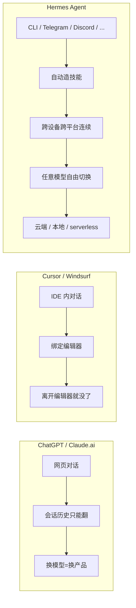

# 0. Hermes 是什么

## 一句话版本

> **Hermes 是一个会自己进化的 AI agent。它在使用中不断总结经验、生成技能、搜索自己的历史对话、跨会话建立对你的理解。它不绑定你的笔记本,也不绑定任何一个模型提供商。**

## 三句话版本

1. **它从 Nous Research 来**。Nous Research 是最早做开源 LLM 微调的团队之一(Hermes 系列模型就是他们的代表作)。这个 agent 叫 Hermes,也是他们对「理想 agent」形态的公开实现。
2. **它的独特之处是自学习闭环**:用得越多,它积累的「技能」(skills)、「记忆」(memory)、「会话索引」(FTS5 搜索)越丰富。这是目前几乎没有别的 agent 做到的。
3. **它是真正「跑在哪里都行」的**:你的笔记本、$5 VPS、Docker 容器、云端 serverless(Modal / Daytona,闲时近零成本)、GPU 集群、甚至 Android 手机(Termux)。你可以在 Telegram 里给它发消息,它在云端 VM 上干活。

## 它跟 ChatGPT / Claude.ai / Cursor 有什么不同



核心差异一句话对比:

| 维度 | ChatGPT 等聊天产品 | Cursor 等编程助手 | **Hermes** |
|---|---|---|---|
| **主入口** | 网页 / 桌面 app | 特定 IDE | CLI + 16+ 消息平台 + 本地 Web Dashboard |
| **模型选择** | 供应商锁定 | 有限可选 | **200+ 模型任意切换** |
| **运行位置** | 云端 | 本地 IDE | **本地 / VPS / serverless / 集群** |
| **学习能力** | 无(或浅) | 无 | **技能 + 记忆 + 会话搜索 + 用户建模** |
| **调度能力** | 无 | 无 | **内置 cron 定时任务** |
| **可扩展性** | 官方插件 | 官方插件 | **MCP + 自定义技能 + 自定义工具** |
| **代码开源** | 否 | 部分 | **完全开源(MIT)** |

## 它是给谁用的

!!! info "Hermes 适合的人群"

    === "爱折腾的个人用户"
        想把 AI 接进自己的 Telegram/Discord、定时跑任务、在云端 VM 持续干活 —— Hermes 天生为你设计。

    === "工程师 / 开发者"
        需要一个能跑在 Docker/SSH/远程 VM 上的 CLI agent,处理跨机器任务。Hermes 的多终端后端是一等公民。

    === "团队运营 / 自动化爱好者"
        想做日报机器人、监控机器人、文档助手机器人 —— 一个 Hermes 网关进程就搞定所有平台。

    === "AI 研究者"
        做 agent 轨迹生成、RL 训练、工具调用模型评估 —— Hermes 有 Atropos 环境和批处理管线。

!!! warning "Hermes 可能不适合的人群"

    - **只想要聊天框**:用 ChatGPT 网页版更省事,Hermes 的价值在「跑在自己基础设施」
    - **企业合规严格**:开源项目,需要自己做审计和合规认证
    - **完全不想碰命令行**:虽然有 TUI,但初始安装和配置仍需终端操作
    - **不想自己管模型密钥**:Hermes 不托管模型,你需要自备 OpenRouter / OpenAI 等 API Key

## 它的基本用法长什么样

三种最常见的使用形态:

=== "形态 1 · CLI 终端对话"

    ```bash
    $ hermes
    ╭─── Hermes Agent ──────────────────╮
    │   ☤  v0.10.0  · anthropic/claude... │
    ╰────────────────────────────────────╯

    > 帮我看下这个 Python 项目的结构,挑出最可能有 bug 的文件
    ⠋ 琢磨中...
    ┊ list_dir: /Users/me/myproject
    ┊ grep: "TODO|FIXME|XXX" ...
    ┊ ...
    ```

    像 Claude Code / Aider,但带完整多模型支持和技能系统。

=== "形态 2 · Telegram 远程指挥"

    你在地铁上,给自己的 Telegram bot 发:
    > "帮我检查一下 prod 环境的错误日志,如果有异常就总结给我"

    云端 VM 上的 Hermes 网关收到消息,调用 `terminal` 工具 SSH 到 prod,抓日志分析,结果回到你手机。

    **你的笔记本可以没开机**。

=== "形态 3 · 定时自动运行"

    ```bash
    $ hermes cron add --at "08:00" --deliver telegram \
        "把我昨天的 GitHub 活动总结成一段 200 字的日报"
    ```

    每天早 8 点自动运行,结果推送到 Telegram。`hermes cron list` 管理所有任务。

## 它的版本和发展

当前本指南基于 **Hermes Agent v0.10.0**。

项目迭代非常快,历史发布节奏大致是每 1-2 个月一个 minor 版本:

| 版本 | 发布时间 | 重要新特性 |
|---|---|---|
| v0.2.0 | 2025 夏 | 初始公开发布 |
| v0.3-0.5 | 2025 秋 | 消息网关扩展、MCP 集成、Profile |
| v0.6-0.7 | 2025 冬 | 皮肤系统、Honcho 集成、RL 环境 |
| v0.8.0 | 2026 初 | context compaction、`/compress <focus>` |
| **v0.9.0** | **2026-04-13** | **Web Dashboard、Fast Mode (`/fast`)、iMessage/WeChat、Termux/Android、16 平台、`hermes backup/import`、`/debug`、xAI/MiMo providers、可插拔 Context Engine** |
| **v0.10.0** | **2026-04-16** | **Nous Tool Gateway —— Portal 订阅用户免额外 key 直接用 web 搜索 / 图像生成 / TTS / 浏览器自动化(当前版本)** |

所以读这本书时,如果某个命令行为跟描述不一致,先用 `hermes --version` 检查版本。

!!! success "v0.9 - v0.10 的五大值得关注"
    1. **本地 Web Dashboard** —— 浏览器里配置 / 监控 / 管理 agent,不碰配置文件
    2. **`/fast` Fast Mode** —— OpenAI / Anthropic 优先队列,延迟显著降低
    3. **Nous Tool Gateway** —— 付费 Portal 订阅自带工具集,零额外 key
    4. **Termux 一等公民** —— Android 手机原生支持,装机路径正式化
    5. **新 providers 大扩展** —— xAI (Grok) / Xiaomi MiMo / NVIDIA NIM / Ollama Cloud / Google Gemini CLI OAuth 全部原生支持

!!! tip "想在最新功能上尝鲜?"
    克隆 GitHub 主分支装开发版:
    ```bash
    git clone https://github.com/NousResearch/hermes-agent.git
    cd hermes-agent
    uv venv venv --python 3.11
    source venv/bin/activate
    uv pip install -e ".[all,dev]"
    ```

---

OK,大局观建立完毕。下一章我们来讲**五大支柱心智模型** —— 这是整本书最重要的 15 分钟。

下一章:[1. 五大支柱心智模型 →](01-the-five-pillars.md)
