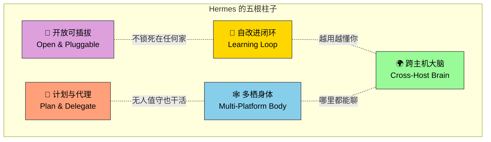
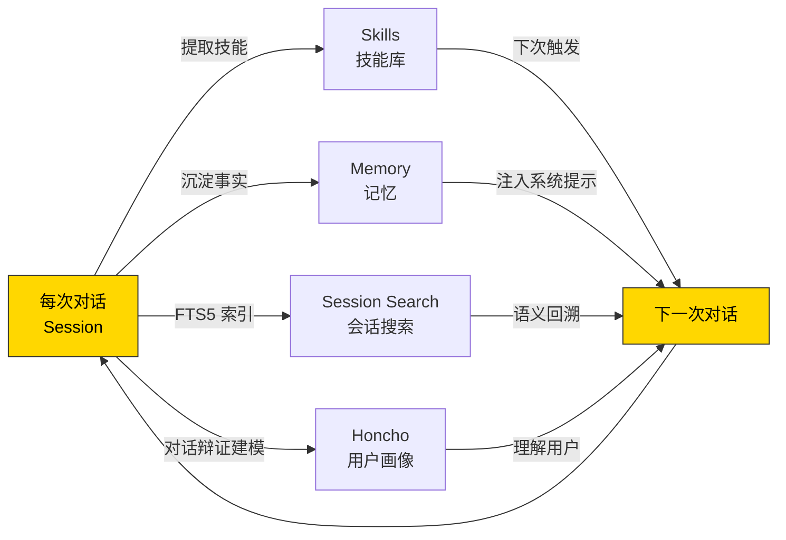
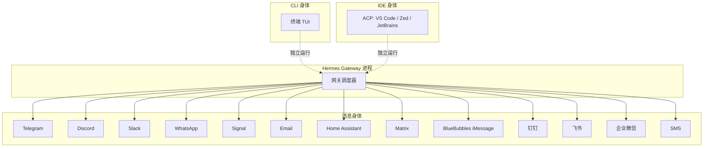
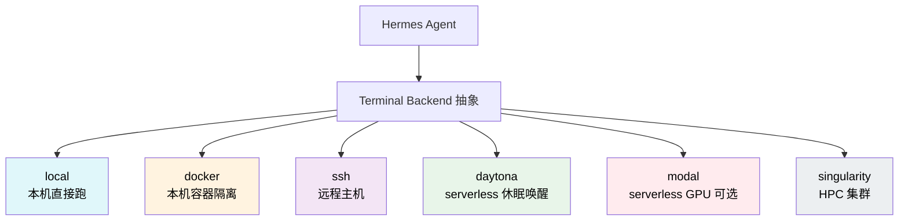
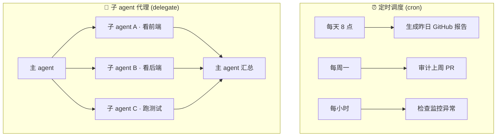
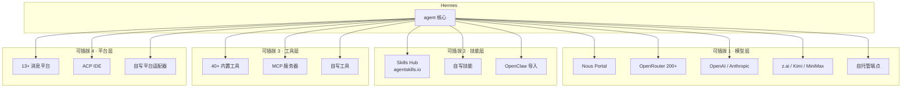

# 1. 五大支柱心智模型

!!! tip "这一章是整本书最重要的 15 分钟"
    读懂这五个词,后面所有章节都能对号入座。读不懂,后面章节会变成散落的知识碎片。

## 全景图



记住这五个词 —— **闭环 · 身体 · 大脑 · 计划 · 可插拔**。下面逐个拆解。

---

## 支柱一 · 🧠 自改进闭环(Learning Loop)

**一句话**:Hermes 从每次对话里抽取经验,转成下次能用的工具。

### 闭环的四个部件



| 部件 | 存什么 | 存在哪 | 怎么用 |
|---|---|---|---|
| **Skills** | 可复用的「手艺」(prompt + 上下文模板) | `~/.hermes/skills/` | `/<skill-name>` 主动触发,或 agent 自己调用 |
| **Memory** | 跨会话事实(你是谁、偏好、约定) | `~/.hermes/memory/MEMORY.md` | 自动注入系统提示 |
| **Session Search** | 所有历史对话的全文索引 | `~/.hermes/sessions.db` (SQLite FTS5) | `session_search` 工具;agent 主动回溯 |
| **Honcho** | 对用户的辩证模型(谁 / 目标 / 风格) | Honcho 服务 | 系统提示附加用户画像段 |

### 它为什么是闭环

!!! info "不是「保存记录」那么简单"
    很多产品都有「记忆」功能 —— 但 Hermes 的关键词是**使用中改进**:

    - Agent 完成复杂任务后,会**主动提议**把过程总结成新技能
    - 技能在**被调用时**也会被细化(加例外、加边界条件、加更优方案)
    - 记忆有**定期"推一推"机制**(periodic nudges),提醒 agent 保持存档新鲜

    → 这是**闭环**。不是单向写入,而是在写和读之间反复打磨。

### 这条闭环跟你有什么关系

- 写代码时,你教它一次你们团队的 PR 规范 → 下次它自己按规范写
- 读论文时,你让它总结一篇 → 它记住你爱的总结格式,以后同类请求自动套用
- 每周一次例行任务 → 用得多了它能熟练到几乎不用你指挥

---

## 支柱二 · 🕸️ 多栖身体(Multi-Platform Body)

**一句话**:同一个 Hermes 大脑,长在 13+ 个身体里。你在哪就在哪和它说话。

### 身体形态



所有身体共享:
- **同一套 slash 命令**(`/model`、`/personality`、`/memory`、`/compress`...)
- **同一个会话存储**(跨平台对话连续性 —— 在 Telegram 里聊的下午在 Discord 接着聊)
- **同一套工具**(网关默认禁用一些高危工具,但可配置)

!!! warning "并非完全对等"
    CLI 是**主体**,网关是**投影**。一些命令 CLI 独有(比如 `/platforms`、`Ctrl+C` 中断),一些网关独有(比如 `/sethome` 设置工作目录)。详细区别见 [CLI vs 消息快速参考](../appendix/index.md)。

### 这跟你有什么关系

- **早上通勤**:地铁上 Telegram 发一句「帮我跑一下 git pull 和测试」
- **中午吃饭**:Discord 服务器里让 bot 查一下昨晚的部署日志
- **下午开会**:Slack 里问 bot 帮总结一份会议纪要
- **晚上回家**:CLI 里接着上午未完的对话,agent 记得之前的所有上下文

→ **一个 agent,全天候跟你一起**。

---

## 支柱三 · 🌍 跨主机大脑(Cross-Host Brain)

**一句话**:agent 不绑定运行在任何一台机器上。本地、Docker、SSH、serverless、集群 —— 挑最合适的。

### 六种终端后端(Terminal Backends)



| 后端 | 何时用 | 成本 |
|---|---|---|
| **local** | 默认 · 你自己的笔电 | 免费 |
| **docker** | 想让 agent 改东西但又怕弄脏本机 | 免费(要装 Docker) |
| **ssh** | agent 跑在 $5 VPS 上 | VPS 费用 |
| **daytona** | 想要 serverless 持久化环境 —— 闲时休眠,用时秒唤醒 | **闲时接近免费** |
| **modal** | 需要 GPU/大算力临时任务 | 按用量付费 |
| **singularity** | HPC 集群(学术环境常见) | 集群使用费 |

### 为什么这是杀手锏

!!! success "Daytona 后端的魔力"
    - agent 在 Daytona 上有**完整环境持久化**(装的依赖、写的文件、git 状态都在)
    - 闲置时**休眠**,不收费
    - 你发消息时**自动唤醒**,1-2 秒重新可用
    - 成本趋近零,能力保持在位

    这意味着你可以**低成本拥有一个一直在线的私人助手**,不需要维护 VPS、不需要担心账单。

### 这跟你有什么关系

你可以选择**你当下最省力的位置**来跑 agent:
- 在家 → local
- 出差 → Telegram + Daytona 云端 agent
- 重型任务 → 临时跑 Modal GPU

**agent 跟你走,不跟机器走**。

---

## 支柱四 · 📅 计划与代理(Plan & Delegate)

**一句话**:Hermes 不需要你一直盯着。它能定时干活,能把大任务拆给子 agent 并行跑。

### 两个能力



### Cron:定时任务

```bash
# 每天早 8 点运行,结果推到 Telegram
hermes cron add --at "08:00" --deliver telegram \
    "帮我总结昨天的 GitHub 活动"

# 每周一审计上周 PR
hermes cron add --at "Mon 09:00" --deliver discord \
    "列出上周我们仓库合并的所有 PR"

# 管理
hermes cron list
hermes cron remove <id>
```

**全部自然语言任务,全部可被任意平台接收**。

### Delegate:子 agent

主 agent 通过 `delegate` 工具 spawn 子 agent:
- 每个子 agent **独立上下文**(不占主 agent 的 token)
- **并行执行**(多个子 agent 同时跑)
- 子 agent 用完即销毁,结果以总结形式回到主 agent

!!! info "为什么这很重要"
    没有 delegate 时,agent 做大任务会不断把中间结果塞进自己的 context,context 很快撑满。有了 delegate,主 agent 可以做「指挥官」,把脏活累活外包,自己始终保持清醒的高层视野。

### 这跟你有什么关系

- **无人值守场景**:早报、监控、定期任务 → 不需要你在场
- **复杂场景**:「审计整个仓库的安全问题」→ agent 自己拆成 10 个子任务并行跑

---

## 支柱五 · 🔌 开放可插拔(Open & Pluggable)

**一句话**:模型、技能、工具、平台 —— 每一样都不锁死。

### 四个可插拔点



### 最关键的:MCP(Model Context Protocol)

Hermes 是 **MCP 客户端**(~1050 行 `tools/mcp_tool.py`),可以连接任何符合 MCP 协议的服务器 —— GitHub、Notion、Google Drive、Linear、Slack(官方)、Postgres、Stripe 等等。

**你装一个 MCP 服务器,Hermes 就多一组工具可调**。这是 agent 生态最重要的开放协议。

### 这跟你有什么关系

- **今天喜欢 Claude,明天想试 GPT-5**:一行 `hermes model` 切换,对话历史不丢
- **社区有个好技能**:Skills Hub 一键安装
- **公司内部系统**:用 MCP 协议包一层,Hermes 就能用
- **想贡献一个新平台适配器**(比如新公司的 IM):照着 `gateway/platforms/ADDING_A_PLATFORM.md` 走

→ **你永远不会被锁死在任何一家的生态里**。

---

## 把五根柱子串起来

!!! question "思考:如果把 Hermes 总结成一句话?"

    <div markdown>
    读完这章你应该能自己说出来。试着想 30 秒再往下看。

    ---

    <details>
    <summary>我的答案</summary>

    > **Hermes 是一个会自改进的、跟你走的、跑在哪里都行的、能无人值守干活的、不锁死在任何生态里的 AI agent。**

    或者更短:**一个长在所有地方、连上所有东西、越用越懂你的 agent**。

    </details>
    </div>

## 记忆锚点

把这五个词背下来,后面读任何章节时在脑子里回一下对应哪根柱子:

| 柱子 | 关键词 | 最小触发记忆的问题 |
|---|---|---|
| 🧠 **闭环** | skill / memory / session search / honcho | 「agent 会不会变聪明?」|
| 🕸️ **身体** | cli / gateway / 13 platforms | 「能在哪跟它说话?」|
| 🌍 **大脑** | local / docker / ssh / daytona / modal | 「agent 跑在哪?」|
| 📅 **计划** | cron / delegate / subagent | 「无人值守?并行?」|
| 🔌 **插拔** | model / mcp / skills / platform | 「能不能换 / 扩展?」|

---

心智模型建好。下一章上手装机。

下一章:[2. 安装 →](02-install.md)
