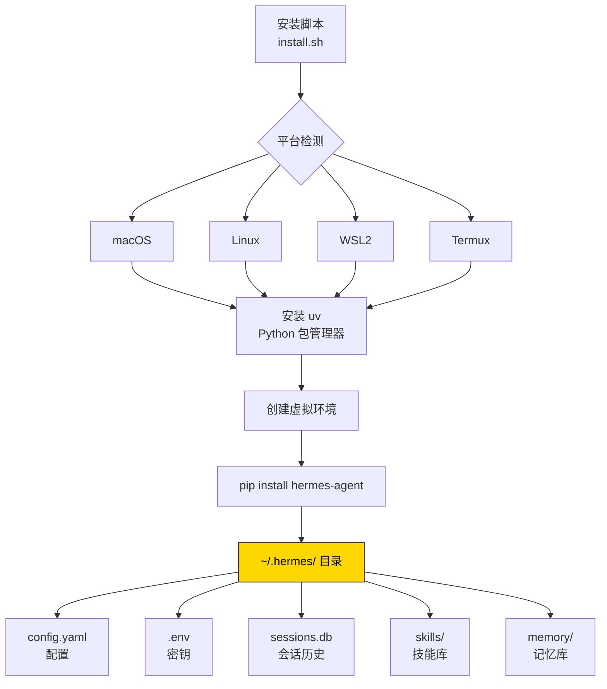

# 2. 安装

## 心智模型:Hermes 是怎么装上的



关键点:
- **安装脚本不写死 Python 版本** —— 它会装 [uv](https://github.com/astral-sh/uv)(超快的 Python 包管理器),然后用 uv 建 3.11 虚拟环境
- **所有用户数据都在 `~/.hermes/`** —— 清理、备份、迁移都在这一个目录
- **不碰系统 Python** —— 不会搞坏你现有的 Python 环境

---

## 最小实践:一行装好

!!! success "官方推荐的一键安装"

    ```bash
    curl -fsSL https://raw.githubusercontent.com/NousResearch/hermes-agent/main/scripts/install.sh | bash
    ```

    支持 **Linux / macOS / WSL2 / Android (Termux)**。脚本会:

    1. 检测平台
    2. 装 uv(如果没装)
    3. 创建虚拟环境
    4. 装 hermes-agent(带相应平台的 extras)
    5. 把 `hermes` 命令加到你的 shell PATH

装完后:

```bash
source ~/.bashrc   # zsh 用户:source ~/.zshrc
hermes --version   # 验证安装
```

看到版本号输出,装好了。

---

## 分平台细节

=== "🍎 macOS"

    **先决条件**:
    - macOS 12+(Intel / Apple Silicon 都支持)
    - 命令行工具(没装的话,执行 `xcode-select --install`)

    装完后,**首次运行可能遇到 Gatekeeper 警告** —— 没影响,Hermes 是 Python 源码包,不走 Apple 签名体系。

    ```bash
    # 推荐路径(一行)
    curl -fsSL https://raw.githubusercontent.com/NousResearch/hermes-agent/main/scripts/install.sh | bash

    # 验证
    hermes --version
    hermes doctor
    ```

=== "🐧 Linux"

    **发行版无关**,只要有 Python 3.11+ 或让 uv 帮你装。

    **先决条件**:
    - `curl`(一般都自带)
    - 能访问 GitHub(国内用户可能要用代理)

    ```bash
    curl -fsSL https://raw.githubusercontent.com/NousResearch/hermes-agent/main/scripts/install.sh | bash
    source ~/.bashrc
    hermes doctor
    ```

    !!! tip "在服务器上跑?"
        $5 VPS 完全可以跑 Hermes。最低配推荐:1 vCPU / 1 GB RAM。推荐用 `tmux` 或 `screen` 保持会话。

=== "🪟 Windows"

    !!! danger "不支持原生 Windows"
        请装 [WSL2](https://learn.microsoft.com/en-us/windows/wsl/install),然后在 WSL2 里按 Linux 路径安装。

    ```powershell
    # PowerShell (管理员)
    wsl --install

    # 进入 Ubuntu (WSL2 会默认安装 Ubuntu)
    wsl

    # 在 WSL2 里运行
    curl -fsSL https://raw.githubusercontent.com/NousResearch/hermes-agent/main/scripts/install.sh | bash
    ```

    装完后,**WSL2 终端里直接跑 `hermes`** 即可。如果想在 Windows 侧方便触发,可以做个 PowerShell 别名。

=== "📱 Android / Termux"

    Termux 是 Android 上的终端模拟器,能跑完整的 Linux 工具链。Hermes 有**专门的 Termux 安装路径**(避免部分依赖拉 Android 不兼容的 wheel)。

    ```bash
    # 在 Termux 里
    pkg install python git
    curl -fsSL https://raw.githubusercontent.com/NousResearch/hermes-agent/main/scripts/install.sh | bash
    ```

    详细手动路径见 [Termux 官方指南](https://hermes-agent.nousresearch.com/docs/getting-started/termux)。

    !!! warning "Termux 限制"
        - 默认装的是 `.[termux]` extra,**不含语音功能**(faster-whisper 在 Android 不兼容)
        - 手机上跑 agent 电量消耗较大,建议只做轻量任务或通过网关中转

---

## 从源码装(开发者路径)

如果你打算**修改 Hermes 源码、给项目提 PR、或者想跑最新主分支**,走这条:

```bash
# 1. 克隆
git clone https://github.com/NousResearch/hermes-agent.git
cd hermes-agent

# 2. 装 uv(如果没有)
curl -LsSf https://astral.sh/uv/install.sh | sh

# 3. 建虚拟环境
uv venv venv --python 3.11
source venv/bin/activate

# 4. 装开发依赖(all = 全部可选功能,dev = 测试工具)
uv pip install -e ".[all,dev]"

# 5. 运行测试(约 3 分钟,3000+ 个测试)
python -m pytest tests/ -q
```

!!! tip "RL 训练的可选依赖"
    如果你要研究 RL / Atropos 环境:
    ```bash
    git submodule update --init tinker-atropos
    uv pip install -e "./tinker-atropos"
    ```

---

## 验证安装

安装完成后,**必须跑一下 doctor**:

```bash
hermes doctor
```

输出类似:

```
[✓] Python 3.11.9
[✓] uv 0.5.12
[✓] hermes 0.8.0
[✓] ~/.hermes/ exists
[!] No API keys configured (run `hermes setup` to add)
[✓] 42 tools available
[!] Telegram gateway not configured (optional)
```

`[✓]` 是正常,`[!]` 是**提示**(通常不是错误,只是该项没配置),`[✗]` 是**错误**(要修)。

!!! tip "doctor 做什么"
    它会检查:
    - Python 版本 ≥ 3.11
    - uv / pip 可用
    - `~/.hermes/` 目录和子目录结构
    - 已配置的 API key 能否 ping 通
    - 工具可用性(哪些缺依赖/缺 key)
    - 消息网关配置状态

    装完第一次看到一堆 `[!]` 是正常的 —— 下一章 `hermes setup` 会帮你把它们都变成 `[✓]`。

---

## 常见坑

### 坑 1 · 国内网络访问 GitHub 慢

`install.sh` 和 `pip` 都要访问 github.com 和 pypi.org,国内直连慢或失败。

**对策**:
```bash
# 方案 A:用镜像(pypi)
export UV_INDEX_URL=https://pypi.tuna.tsinghua.edu.cn/simple
curl -fsSL https://raw.githubusercontent.com/NousResearch/hermes-agent/main/scripts/install.sh | bash

# 方案 B:用代理
export https_proxy=http://127.0.0.1:7890
curl -fsSL https://raw.githubusercontent.com/NousResearch/hermes-agent/main/scripts/install.sh | bash
```

### 坑 2 · `hermes: command not found`

装完后命令找不到,通常是因为**shell 还没重新加载 PATH**。

**对策**:
```bash
# bash
source ~/.bashrc

# zsh
source ~/.zshrc

# 或者直接新开终端
```

如果重载还不行,检查 `~/.bashrc` / `~/.zshrc` 里有没有类似:
```bash
export PATH="$HOME/.hermes/venv/bin:$PATH"
```
没有的话手动加上。

### 坑 3 · Python 版本冲突

`install.sh` 要求 Python 3.11+。如果系统 Python 太老,uv 会自己下载 3.11 —— 但**需要联网**。

**对策**:
```bash
# 手动装 Python 3.11
# macOS:
brew install python@3.11

# Ubuntu:
sudo apt install python3.11 python3.11-venv
```

### 坑 4 · macOS 上装 voice extra 失败

`faster-whisper` 依赖 `ctranslate2`,在部分 M1/M2 上编译失败。

**对策**:如果不需要本地语音转文字,**跳过 voice extra 就行**。默认安装不会装它。如果一定要,考虑用 ElevenLabs 云端转写替代:
```bash
uv pip install -e ".[tts-premium]"  # 不含 faster-whisper
```

### 坑 5 · 装完后磁盘膨胀

Hermes 的 virtual env 大概 600MB 左右(Python + 所有依赖)。如果 `.[all]` 还要更多(浏览器自动化、MCP 等)。

**对策**:
- 空间紧张:只装核心 `uv pip install -e "."`(不带 extras),需要哪个功能单独加
- 清理 pip 缓存:`uv cache clean`

---

## 检查清单

安装完成后,对照勾一下:

- [ ] `hermes --version` 能输出版本号
- [ ] `hermes doctor` 能跑完不报错(`[!]` 可以有,`[✗]` 不能有)
- [ ] `~/.hermes/` 目录已创建
- [ ] shell 重载后 `hermes` 命令全局可用

全部勾上,进入下一章。

---

下一章:[3. 第一次对话 →](03-first-conversation.md)
