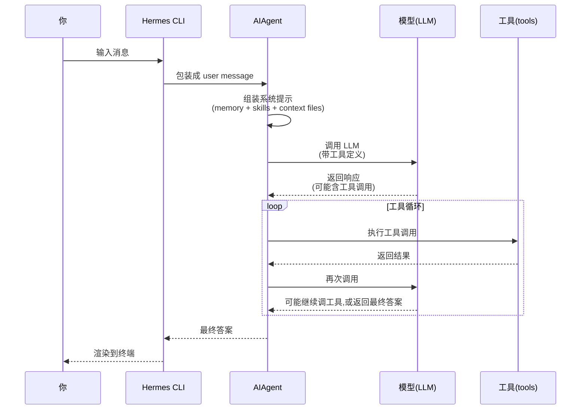

# 3. 第一次对话

## 心智模型:一次对话里发生了什么



**几个关键点**:

- **一次对话可能有多轮 LLM 调用**(每次工具调用都会回到模型)
- **系统提示自动组装**(你不用管,memory/skills/context 都是自动注入的)
- **工具是「循环」不是「单次」**(模型可能连续调多个工具直到任务完成)
- **上下文有缓存**(Anthropic prompt caching,省钱加速,不要做破坏缓存的事)

---

## 最小实践:setup 向导 + 第一次对话

### Step 1 · 跑 setup 向导

```bash
hermes setup
```

这会启动交互式向导,引导你配置:

1. **选模型提供商**(OpenRouter / OpenAI / Anthropic / Nous Portal / z.ai / ...)
2. **输入 API Key**(如果你没有,向导会给链接让你申请)
3. **选默认模型**(推荐从 Claude Sonnet 4.6 或 GPT-4o 起步)
4. **工具开关**(先全部默认,后续可改)
5. **消息网关**(新手跳过,先只用 CLI)

!!! tip "API Key 哪里拿"

    === "OpenRouter(推荐新手)"
        - 网址:[openrouter.ai/keys](https://openrouter.ai/keys)
        - 优点:一个 key 用 200+ 模型,充值 $5 能用很久
        - 装上后直接切模型:`hermes model openrouter/anthropic/claude-sonnet-4-6`

    === "Anthropic 官方"
        - 网址:[console.anthropic.com](https://console.anthropic.com)
        - 优点:原生 prompt caching 最稳
        - 适合:专门用 Claude 的重度用户

    === "OpenAI 官方"
        - 网址:[platform.openai.com/api-keys](https://platform.openai.com/api-keys)
        - 适合:专门用 GPT 系列的场景

    === "Nous Portal(作者家)"
        - 网址:[portal.nousresearch.com](https://portal.nousresearch.com)
        - 优点:支持 Nous 自家的 Hermes 微调模型(适合对 agent 工具调用优化过)

!!! warning "API Key 存在哪"
    `hermes setup` 把 key 存在 `~/.hermes/.env`(明文)。**这个文件不要:**

    - 提交到 git
    - 在公共频道分享
    - 放在未加密的云盘

    如果你的系统有 keyring / macOS Keychain,可以后续手动迁移(高级用法,入门阶段先这样)。

### Step 2 · 第一次对话

向导跑完,输入:

```bash
hermes
```

你会看到:

```
╭─ Hermes Agent ──────────────────────────────╮
│  ☤  v0.8.0                                   │
│  Model: anthropic/claude-sonnet-4-6          │
│  Platform: cli · Profile: default            │
╰──────────────────────────────────────────────╯

> _
```

试试三条消息:

=== "消息 1 · 打招呼"

    ```
    > 你好,介绍一下你自己
    ```

    期待输出:Hermes 会简单介绍它是什么、能做什么。这一步验证**模型连通性**。

=== "消息 2 · 试工具"

    ```
    > 列出当前目录下的文件,统计一下 Python 文件的总行数
    ```

    期待输出:你会看到 agent 调用工具:
    ```
    ┊ list_dir: .
    ┊ grep: "*.py" ...
    ┊ execute_code: wc -l ...
    ```
    然后给你一个总结。这一步验证**工具循环工作**。

=== "消息 3 · 试记忆"

    ```
    > 记住一下:我叫 [你的名字],我喜欢用 Python 写后端。
    ```

    期待输出:agent 会调用 `memory` 工具,把这条信息存进 `~/.hermes/memory/MEMORY.md`。这一步验证**学习闭环开始工作**。

退出对话:`/exit` 或 `Ctrl+D`。

### Step 3 · 验证记忆生效

```bash
cat ~/.hermes/memory/MEMORY.md
```

应该能看到刚才的事实被记下来了。

再开一次 `hermes`,问:

```
> 我是谁?我喜欢用什么写后端?
```

Agent 应该能回答。这证明**跨会话记忆工作**。

---

## 常用交互技巧

=== "多行输入"
    - 默认 Enter 直接发送
    - 想换行:**Esc → Enter**(或 **Alt+Enter**,平台依赖)

=== "中断当前任务"
    - **Ctrl+C** —— 打断 agent 正在做的事,但保留对话
    - 打断后你可以**发新消息改道**("先别做那个了,先看看另一件事")

=== "滚动历史"
    - **鼠标滚轮** 或 **PgUp/PgDown**
    - 终端默认行为,跟别的 CLI 工具一样

=== "退出"
    - `/exit` 或 `/quit`
    - **Ctrl+D**(EOF)
    - **Ctrl+C 两次**(紧急退出)

---

## 换个模型试试

```bash
# 在对话外
hermes model                                         # 交互式选择
hermes model openrouter/google/gemini-2.5-flash      # 直接切

# 对话中
> /model openrouter/deepseek/deepseek-chat
```

切换**不会清空对话历史**。你可以在同一对话里,中途把「便宜模型」换成「强模型」,让强模型处理最关键的部分。

!!! tip "省钱小技巧"
    - 日常闲聊:`gemini-2.5-flash` / `deepseek-chat`(便宜)
    - 写代码:`claude-sonnet-4-6`(贵但准)
    - 复杂推理:`claude-opus-4-6`(最贵,最强)

    `hermes model` 命令让你随时按需切换,不锁死。

---

## 给 agent 一点个性:`/personality`

```bash
> /personality
```

会列出内置个性(严谨工程师、调皮助手、禅意顾问...)。选一个:

```bash
> /personality code-reviewer
```

或者自己写一个 —— `~/.hermes/personalities/my-style.md` 放 markdown,下次 `/personality my-style` 就能用。

!!! info "个性 vs 技能 vs 记忆 —— 三者区别"
    - **个性**(personality):调整 agent 的**说话风格和思考倾向**。一段系统提示的附加段。
    - **技能**(skill):一组**具体做事的步骤模板**。`/skill-name` 触发。
    - **记忆**(memory):关于**你是谁、你们约定什么**的事实。自动注入。

    → 见 [五大支柱 · 闭环](01-the-five-pillars.md) 的细化部分。

---

## 常见坑

### 坑 1 · 模型调用报错 401 / 403

API Key 问题。

**排查**:
```bash
# 检查 .env
cat ~/.hermes/.env

# 重跑 setup 只修 key 部分
hermes config set
```

### 坑 2 · 工具没被调用,只是文字回答

Agent 觉得"不需要工具"。有些模型(比如较小的 chat 模型)不擅长主动调工具。

**对策**:
- 换更大的模型(Sonnet / Opus 级别)
- 明确说"请用 list_dir 工具看看"
- 或在配置里 enable 更多工具(`hermes tools`)

### 坑 3 · 响应很慢

两种可能:
1. **模型慢**(尤其 Opus 系列)—— 耐心等,或换 Haiku / Flash 级别
2. **工具在跑大任务**(比如全仓库搜索)—— 看活动栏 `┊`,了解它正在干啥

### 坑 4 · 记忆没生效

你说"记住",agent 也说"好的",但下次重启没反应。

**排查**:
```bash
ls ~/.hermes/memory/
```

如果 MEMORY.md 没变,可能是:
- agent 没真的调 `memory` 工具(模型能力不够)
- 你用了 `--skip-memory` flag
- Profile 隔离:当前 profile 不是 default

**对策**:明确说"**请用 memory 工具记下:...**",强制触发。

---

## 你现在应该能做的

- [x] 跑通 `hermes setup` 配好 key
- [x] 发出第一条消息并得到回复
- [x] 看到 agent 调用至少一个工具
- [x] 用 `/model` 切换模型
- [x] 用 `/personality` 换风格
- [x] 让 agent 记住一件事,下次重启后能引用

全部能做到?你已经是**合格的基础用户**。下一章我们把所有常用命令系统性过一遍。

---

下一章:[4. 必学命令清单 →](04-key-commands.md)
