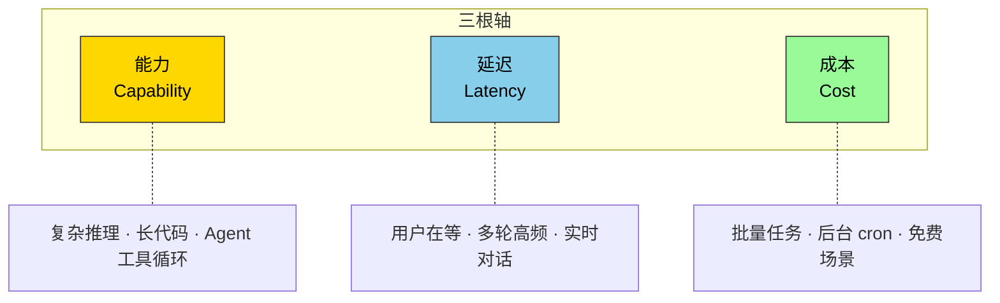
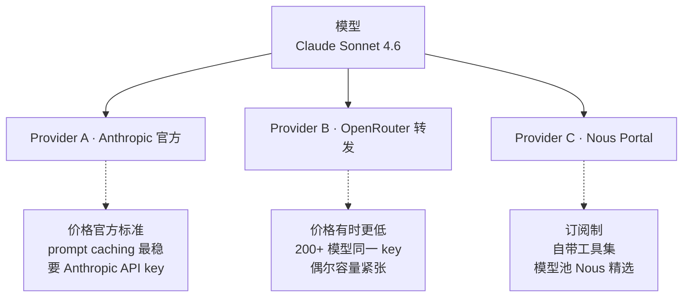

# 5. 模型选择策略

## 心智模型:三根轴决定一切



选模型的本质是**在这三根轴之间做权衡**。没有「最好的模型」,只有「在 X 场景下最合适的模型」。

!!! info "重要心智:你不是在选一个模型,你是在组一套模型"
    Hermes 允许你在**同一对话里**随时 `/model` 切换。所以最佳策略不是「找一个全能的」,而是**「轻任务用便宜快的,重任务切到贵强的」**,并且用 auxiliary model 处理压缩、总结、会话搜索这类辅助环节。

---

## 决策矩阵

选哪个?对着下表找就够了。

| 场景 | 推荐模型 | 为什么 |
|---|---|---|
| **日常问答 / 闲聊** | `gemini-2.5-flash` 或 `deepseek-chat` | 便宜、够快、够用 |
| **写代码 / 重构** | `claude-sonnet-4-6` 或 `kimi-k2.5` | 写代码最稳,工具调用最可靠 |
| **调试复杂 bug / 架构决策** | `claude-opus-4-7` | 推理最深,敢换多条思路 |
| **长上下文精读**(PDF、长论文) | `gemini-2.5-pro`(1M 窗口) | 最长窗口,相对便宜 |
| **多轮 agent 工具循环** | `claude-sonnet-4-6` | 工具调用收敛,不乱绕 |
| **本地 / 离线** | `ollama` + 本地模型 | 数据不出本机 |
| **中文场景** | `kimi-k2.5` 或 `glm-4.6` | 中文语料训练更厚 |
| **视觉 / OCR** | `gpt-4o` 或 `claude-sonnet-4-6` | 视觉理解第一梯队 |
| **免费试用** | OpenRouter 上的 `:free` 变体(如 `gemini-2.5-flash:free`) | 每日配额免费 |
| **Nous Portal 订阅用户** | 任意 Nous Portal 模型 | 模型 + 工具(web/图像/TTS/浏览器)一套搞定 |

---

## 最小实践:三档切换法

### 组一套你的 Hermes

推荐大多数人用这个组合:

```bash
# 默认:中档,日常主力
hermes model openrouter/anthropic/claude-sonnet-4-6

# 便宜档:闲聊、试错、重复任务用
# 用法:对话里 /model openrouter/google/gemini-2.5-flash

# 重磅档:卡住了、要做真正决策时切
# 用法:对话里 /model openrouter/anthropic/claude-opus-4-7
```

实战例子 —— 调试一个 bug:

```text
> /model openrouter/google/gemini-2.5-flash
> 帮我看看这个日志里最显眼的错误
[ Flash 秒回,定位到异常栈 ]

> /model openrouter/anthropic/claude-sonnet-4-6
> 根据刚才的错误,读下 auth.py 和 db.py,推测根因
[ Sonnet 读文件 + 推理,给出两个假设 ]

> /model openrouter/anthropic/claude-opus-4-7
> 两个假设都有道理,我们设计一个实验区分它们
[ Opus 设计实验,给精确步骤 ]
```

三次切换,总成本大概只花了**全程 Opus 的 1/4**,但效果接近。

---

## Auxiliary Model · 被忽略的第二个模型

Hermes 除了主模型,还有一个 **auxiliary model**(辅助模型),用于:
- 上下文自动压缩(`/compress`)
- 会话搜索结果的总结(`session_search`)
- 其他内部总结类子任务

**auxiliary 默认是便宜快的**(如 Gemini Flash)。v0.10 起,默认改为 "auto" —— 自动沿用主模型(如果主模型就够便宜)。

### 怎么配置

```bash
# 在 hermes model 里有个 "Configure auxiliary models" 选项
hermes model
# 选 "Configure auxiliary models"
# 可以单独指定压缩、总结用什么模型
```

!!! tip "auxiliary 用便宜模型能省多少"
    长对话触发一次压缩,大概要总结 10k-50k tokens 的上下文。用 Sonnet 压缩一次 $0.10+,用 Gemini Flash 压缩一次 <$0.01。一天几次压缩 → 一年省几十美金。

---

## 模型 vs Provider 的关系

很多人混:**模型**是 AI 本身,**provider** 是给你接口的服务商。



**同一个 Claude Sonnet 4.6,三个 provider 可能价格、延迟、缓存行为都不同**。Hermes 的 `/model` 格式是 `provider/model_id` 正是这个原因。

### 我该选哪个 provider

=== "🎯 只想用一个模型厂"
    用该厂官方 provider(`anthropic/...`、`openai/...`)。
    - 优点:最稳定,第一方 caching
    - 缺点:lock-in,每家都要注册 key

=== "🎯 想灵活切换多个模型"
    用 **OpenRouter**(`openrouter/...`)。
    - 一个 key 用 200+ 模型
    - 充值 $5 能撑很久
    - 新手首选

=== "🎯 付费订阅党"
    用 **Nous Portal**(`nous/...`)。
    - 订阅自带模型池 + 工具集(v0.10 Tool Gateway)
    - 适合高频用户,算总账更便宜

=== "🎯 完全自主"
    用自托管端点(`custom/...`)。
    - Ollama 本地、vLLM、任何 OpenAI-compatible
    - 数据不出你的基础设施

---

## 成本估算的三个核心数字

掌握这三个数就不会「一个月烧掉几百刀」:

1. **每百万 tokens 的输入价格**(input price)—— 发给模型的内容
2. **每百万 tokens 的输出价格**(output price)—— 模型生成的内容
3. **缓存价格**(cache read price)—— 命中 prompt cache 时的折扣价

典型对比(2026-04 大致价位,以 USD / 1M tokens 计):

| 模型 | Input | Output | Cache Read |
|---|---:|---:|---:|
| `gemini-2.5-flash` | $0.15 | $0.60 | $0.04 |
| `deepseek-chat` | $0.27 | $1.10 | $0.07 |
| `kimi-k2.5` | $0.50 | $2.00 | $0.12 |
| `claude-sonnet-4-6` | $3.00 | $15.00 | $0.30 |
| `claude-opus-4-7` | $15.00 | $75.00 | $1.50 |
| `gpt-4o` | $2.50 | $10.00 | $1.25 |

!!! warning "prompt caching 是最大的省钱杠杆"
    注意 Cache Read 列 —— **命中缓存时,Input 便宜 10-20 倍**。这就是为什么 Hermes 的设计原则是:**不破坏缓存比选更便宜的模型更省钱**。

    如果你中途改系统提示、切换 toolset、重载 memory,会**全部缓存失效**。长对话这么一折腾,一次 $0.50 变 $5。

---

## Fast Mode(`/fast`) · v0.9 新增

OpenAI 和 Anthropic 都有「优先队列」—— **多付一点钱,延迟更低**。

```text
> /fast
已启用 Fast Mode:下一轮起走优先队列。
> /fast off
关闭 Fast Mode。
```

适用模型:
- OpenAI Priority Processing 系列(GPT-5.4、Codex)
- Anthropic Fast Tier

!!! tip "什么时候开 Fast Mode"
    - ✅ 在开会 / 面试 / 写作中,等不起
    - ✅ 对话式 UX,用户盯着屏幕
    - ❌ 后台跑 cron 任务
    - ❌ 批量处理,不在乎几秒

---

## 常见坑

### 坑 1 · 切模型后 agent 变"呆"

**现象**:从 Claude 切到一个小模型,agent 开始不主动调工具,只给文字建议。

**原因**:工具调用能力与模型强相关。小模型(7B、13B 级)往往**认不出自己有工具**,就当普通 chat 模型用了。

**对策**:
- 工具调用场景**至少用 Sonnet / Kimi K2.5 级别**
- 如果必须用小模型,在 prompt 里**明确说「请用 xxx 工具」**

### 坑 2 · OpenRouter 某模型突然报错

**现象**:平时用的模型突然 429 / 503。

**原因**:OpenRouter 是**转发层**,背后是第三方,有容量限制。

**对策**:
- **配 fallback 链**:在 config.yaml 里设定 `providers.routing.fallback_model`
- 或手动切到同模型的官方 provider(`openrouter/anthropic/claude-sonnet-4-6` → `anthropic/claude-sonnet-4-6`)

### 坑 3 · 用 DeepSeek / Kimi / GLM 时出现 `<think>` 泄漏

**现象**:输出里看到 `<think>...</think>` 或 `<thought>...</thought>` 段。

**原因**:这些**推理模型**会在输出前内部思考,偶尔标签处理不当会泄到文本。

**对策**:新版 Hermes(v0.9+)已经自动 strip 这些标签。如果你看到漏网之鱼,检查版本 `hermes --version`,老版升级 `hermes update`。

### 坑 4 · 长上下文爆炸

**现象**:聊到一半 `/usage` 显示 190k / 200k tokens,快满了。

**对策**(按顺序试):
1. `/compress` —— 压缩历史,保留关键
2. `/compress <focus>` —— 告诉它保留哪部分最重要
3. `/new` —— 新会话,从 memory 里提取关键事实
4. 切到**更大窗口模型**(Gemini 2.5 Pro 1M、Claude 200k)

### 坑 5 · 所有模型都慢

**现象**:不是某个模型慢,是所有都慢。

**对策**:
- 看 `hermes doctor` —— 可能是 API key 无效反复重试
- 看网络延迟 —— 代理 / VPN 问题
- 看系统资源 —— 本地 CPU / 内存紧张

---

## 进阶

- 第 10 章 [上下文压缩](10-context-compression.md) —— 详解 auxiliary model 压缩策略
- 第 19 章(第三部)—— **Nous Tool Gateway** 订阅详解
- 第 19d 章(第三部)—— **Fast Mode** 深入

---

下一章:[6. 工具总览 →](06-tools-overview.md)
