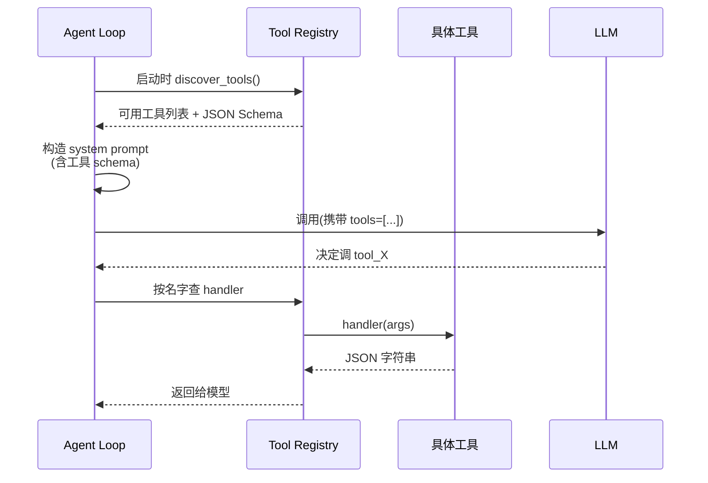
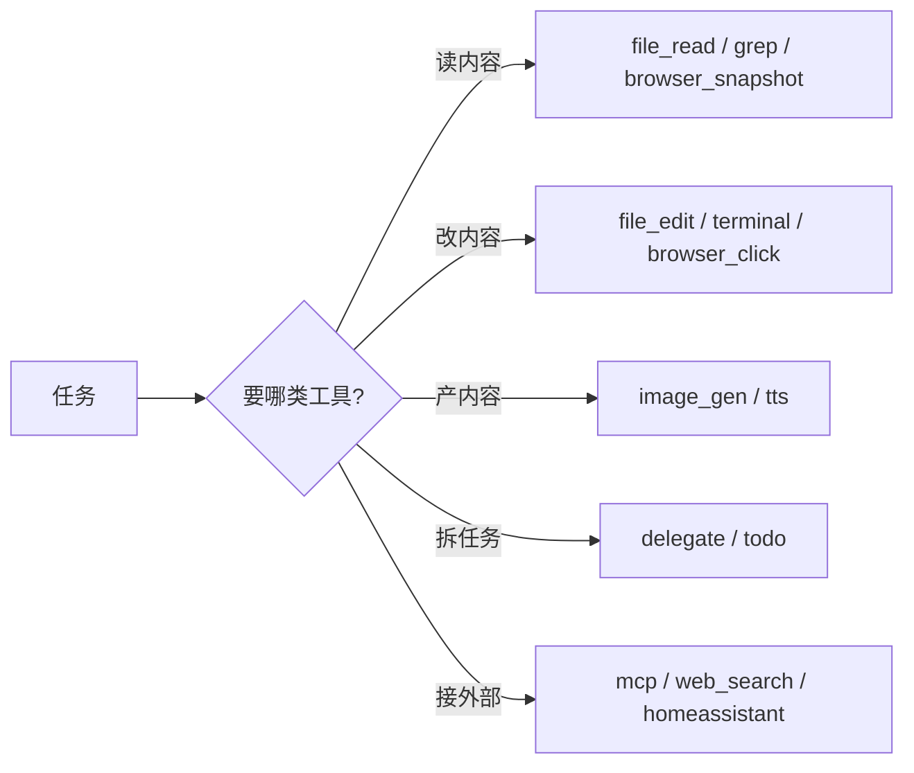

# 6. 工具总览

## 心智模型:工具是 agent 的手和眼

```mermaid
graph TB
    A[Agent 大脑<br/>LLM]

    subgraph "👁️ 看"
        T1[file_read / grep / glob]
        T2[vision / browser_snapshot]
        T3[session_search / memory_read]
    end

    subgraph "✋ 做"
        T4[terminal / execute_code]
        T5[file_write / patch / edit]
        T6[browser_click / type / scroll]
    end

    subgraph "🎨 产"
        T7[image_generation]
        T8[tts / voice]
        T9[send_message]
    end

    subgraph "🧠 想"
        T10[delegate_task<br/>子 agent]
        T11[todo<br/>任务追踪]
        T12[clarify<br/>反向问用户]
    end

    subgraph "🌐 连"
        T13[web_search / web_extract]
        T14[mcp_* · MCP 服务器]
        T15[homeassistant]
    end

    A --> T1 & T2 & T3
    A --> T4 & T5 & T6
    A --> T7 & T8 & T9
    A --> T10 & T11 & T12
    A --> T13 & T14 & T15

    style A fill:#FFD700,stroke:#333,color:#000
```



工具不是越多越好 —— **给 agent 的工具越多,每轮上下文里就多一份 schema**,消耗 token。所以 Hermes 默认只开一套精选,按需扩展。

---

## 最小实践:查看你有哪些工具

```bash
# 在 CLI 里
hermes tools
```

会弹出按**平台分类**的交互界面:

```
┌─────────────────────────────────────────────┐
│ 按平台配置工具开关(空格切换,Enter 保存)      │
│                                              │
│ [CLI]        [Messaging]    [Cron]           │
│ ────────     ──────────     ──────           │
│ ☑ terminal   ☐ terminal    ☑ terminal       │
│ ☑ file_read  ☑ file_read   ☑ file_read      │
│ ☑ browser    ☑ browser     ☐ browser        │
│ ☑ image_gen  ☑ image_gen   ☑ image_gen      │
│ ...          ...           ...               │
└─────────────────────────────────────────────┘
```

**同一工具在不同平台可以开关不同** —— 这是 Hermes 安全设计的核心:消息平台里默认不让跑 `terminal`,避免有人给 bot 发 `rm -rf /`。

或者在对话里随时查:

```text
> /tools
```

---

## 9 大工具类别

下面按**什么场景用**的视角拆。每类给 2-3 个真实例子。

### 1. 📄 文件操作类

| 工具 | 做什么 |
|---|---|
| `file_read` | 读文件内容(支持按行偏移,大文件分页) |
| `file_write` | 整文件写入 |
| `file_edit` | 按字符串精确替换(不重读全文) |
| `grep` / `glob` | 搜内容 / 搜文件名,ripgrep 速度 |
| `file_patch` | 应用 diff 风格补丁 |
| `multi_edit` | 同一文件多处编辑一次完成 |

**实战场景**:

=== "场景 · 重构一个函数名"
    ```text
    > 把这个项目里所有 `getUserData` 重命名成 `fetchUserProfile`,
    > 但不要碰测试文件里的断言字符串
    ```
    agent 会:`grep getUserData` → 按文件列出 → `multi_edit` 每个文件 → 跳过测试文件。

=== "场景 · 修一个 bug"
    ```text
    > src/auth.py:45 有个空指针,改成先 check 再解引用
    ```
    agent 会:`file_read auth.py 40-55` → 看清上下文 → `file_edit` 精准替换。

---

### 2. 💻 终端 / 代码执行类

| 工具 | 做什么 |
|---|---|
| `terminal` | 跑 shell 命令(支持前台/后台,6 种后端) |
| `execute_code` | 一次性代码片段执行(sandbox 或临时目录) |

**实战场景**:

=== "场景 · 跑测试并修到绿"
    ```text
    > pytest tests/ 一下,挂了的话帮我修
    ```
    agent 会:`terminal pytest` → 看失败 → `file_edit` 修源码 → 再跑 → 循环直到绿。

=== "场景 · 后台跑长任务"
    ```text
    > npm run build 跑一下,装好告诉我
    ```
    agent 会用 `terminal(background=true, watch_patterns=["error", "built"])` 后台启动,**监控输出里是否出现 error/built 关键词**,命中才打断喊你。

!!! tip "`watch_patterns` 是 v0.9 新增的宝"
    以前 agent 跑后台命令要不停 `terminal status` 轮询,浪费 token。现在可以**指定关键词触发通知**,效率高很多。

---

### 3. 🌐 浏览器 / Web 类

| 工具 | 做什么 |
|---|---|
| `browser_navigate` | 打开 URL |
| `browser_snapshot` | 截图 + 元素树(给 agent 看页面) |
| `browser_click` / `browser_type` | 点按 / 输入 |
| `browser_scroll` / `browser_back` | 滚动 / 返回 |
| `browser_vision` | 视觉模型看页面 |
| `browser_console` | JS console 读写 |
| `web_search` | 搜索引擎查询 |
| `web_extract` | 抓一个 URL 的内容并总结 |

**实战场景**:

=== "场景 · 填一个复杂表单"
    ```text
    > 打开 https://example.com/signup,帮我填一下注册表单,
    > 用户名 katya,邮箱 test@example.com,密码我等会儿手动输
    ```
    agent 会:`browser_navigate` → `browser_snapshot` 看表单结构 → `browser_click` + `browser_type` 填空。

=== "场景 · 追踪网上某个主题"
    ```text
    > 搜一下最新的 Claude 4.7 发布时间和核心改动
    ```
    agent 会:`web_search` → 拿到几个链接 → `web_extract` 读每个 → 合并总结。

---

### 4. 🧠 记忆 / 会话类

| 工具 | 做什么 |
|---|---|
| `memory` | 读写 MEMORY.md / USER.md(agent 的持久笔记) |
| `session_search` | FTS5 搜索所有历史会话,Flash 总结返回 |

**实战场景**:见第 7 章 [记忆系统深入](07-memory-deep-dive.md) 和第 9 章 [会话搜索](09-session-search.md)。

---

### 5. 🎨 生成类

| 工具 | 做什么 |
|---|---|
| `image_generation` | FAL 多模型图像生成(FLUX 2 Pro、Nano Banana Pro、Recraft V4 Pro) |
| `tts` | 文字转语音(OpenAI TTS / Google Gemini TTS / Edge TTS 免费 / ElevenLabs) |
| `transcription` | 语音转文字(faster-whisper 本地 / OpenAI 云端) |

**实战场景**:

=== "场景 · 生成 blog 头图"
    ```text
    > 帮我生成一张「夜晚的东京涩谷街景,霓虹灯,下雨」作为博客头图
    ```
    agent 调 `image_generation`,选合适模型,保存到指定目录。

=== "场景 · 把日报读成语音"
    ```text
    > 把刚才生成的日报转成语音,存成 daily.mp3
    ```
    agent 调 `tts`,默认用 Edge TTS(免费)。想要人声克隆?切到 ElevenLabs。

---

### 6. 🔀 并行 / 委托类

| 工具 | 做什么 |
|---|---|
| `delegate_task` | spawn 子 agent 并行干活 |
| `mixture_of_agents` | 用多个模型对同一任务投票,质量更高 |
| `todo` | 管理当前会话的任务列表(不走 LLM) |

**实战场景**:见第 [15 章](#) 和 [22 章](#)。

---

### 7. 📬 消息 / 通知类

| 工具 | 做什么 |
|---|---|
| `send_message` | 主动给某个平台发消息(不等用户问) |
| `cronjob_*` | 管理 cron 任务(创建、列出、删除、改) |

**实战场景**:

=== "场景 · agent 自己做完了喊你"
    ```text
    > 后台跑这个 3 小时的训练,跑完 Telegram 我一声
    ```
    agent 起 `terminal(background=true)`,训练完调用 `send_message(platform=telegram)` 发「训练完成」。

---

### 8. 🔒 MCP / 外部集成类

| 工具 | 做什么 |
|---|---|
| `mcp_*` | 连接任何 MCP 服务器(GitHub / Notion / Linear / Postgres...) |
| `homeassistant_*` | Home Assistant 设备控制 |
| `feishu_doc_*` / `feishu_drive_*` | 飞书文档/云盘 |

**实战场景**:

=== "场景 · 让 agent 给 GitHub issue 改状态"
    连上 GitHub MCP 服务器后:
    ```text
    > 把 issue #42 标成 resolved,评论"已修复"
    ```
    agent 调 `mcp_github_update_issue` 工具。

第 19 章 [MCP 集成](../part-3-mastery/index.md)(施工中)详解。

---

### 9. 🛠️ 杂项实用

| 工具 | 做什么 |
|---|---|
| `clarify` | agent 主动反问用户 |
| `checkpoint` | 会话里做存档点,可回滚 |
| `rl_training` | Atropos RL 训练触发(研究用,见第五部) |
| `osv_check` | 依赖漏洞扫描(OSV 数据库) |
| `vision` | 视觉理解(非浏览器上下文) |

---

## 工具发现:agent 怎么知道能调什么



所有工具都在 `tools/registry.py` 注册。每个工具有:
- **schema** —— 告诉模型怎么调
- **handler** —— 实际执行的函数
- **check_fn** —— 当前环境是否可用(有没有装依赖、有没有 API key)
- **requires_env** —— 需要哪些环境变量

工具**按需注册**。没装的可选依赖、没配的 API key 对应的工具,自动不出现在列表里。

!!! info "想自己加工具?"
    见 [第四部 · 23 章 · 工具注册机制](../part-4-internals/index.md)。最小增加只需 3 个文件改动。

---

## Nous Tool Gateway(v0.10) · 不带钥匙也能用

付费 Nous Portal 订阅用户,**不需要自己配任何 API key**,就能用:

| 工具类 | 免你自配 key |
|---|---|
| **web 搜索** | Firecrawl 后端,用 Nous 的 key |
| **图像生成** | FAL / FLUX 2 Pro,用 Nous 的 key |
| **TTS** | OpenAI TTS,用 Nous 的 key |
| **浏览器自动化** | Browser Use,用 Nous 的 key |

开启方式:
```bash
hermes model
# 选 Nous Portal
# 选要启用的工具(per-tool opt-in)
```

对应 config 叫 `use_gateway.web_search: true` 这样的结构。

!!! tip "订阅账本"
    如果你已经月付 $20 Nous Portal,加上这些工具折算下来,单独买 Firecrawl + FAL + ElevenLabs 至少 $50/月。算账合不合适自己看。

---

## 常见坑

### 坑 1 · 工具太多吃 context

**现象**:你开了所有工具,每次对话上下文已经吃掉 10k+ tokens 只是 schema。

**对策**:
- `hermes tools` 关掉你用不上的(比如不做 RL 训练就关 `rl_training`)
- 按平台差异化开关(CLI 全开,messaging 只开几个必要的)

### 坑 2 · agent 不知道自己有某工具

**现象**:你知道装了 browser,agent 却说"我没法打开网页"。

**排查**:
```bash
hermes doctor --verbose
```
看对应工具有没有 `[✓]`。常见原因:
- API key 没配(比如 browserbase 的 `BROWSERBASE_API_KEY`)
- 当前 toolset 里没启用
- 当前平台关了这个工具

### 坑 3 · 工具调用不收敛

**现象**:agent 进入循环,反复调同一个工具。

**对策**:
- 看 `max_iterations`(默认 90)有没有撞到 —— 撞了说明任务真的复杂
- Ctrl+C 打断,**明确告诉它「别再调 X 工具了,改用 Y」**
- 切更大的模型,推理能力往往决定收敛速度

### 坑 4 · MCP 服务器挂了不知道

**现象**:你连了个 Postgres MCP,但数据库重启了,agent 一直报错。

**对策**:
```text
> /reload-mcp
```
重新连接所有 MCP 服务器,**不用重启 Hermes**。

---

## 记忆锚点

记住这个排序,下次面对任务时先问自己:

> **我要让 agent 看、做、产、想、连 —— 是哪一种?**



---

下一章:[7. 记忆系统深入 →](07-memory-deep-dive.md)
