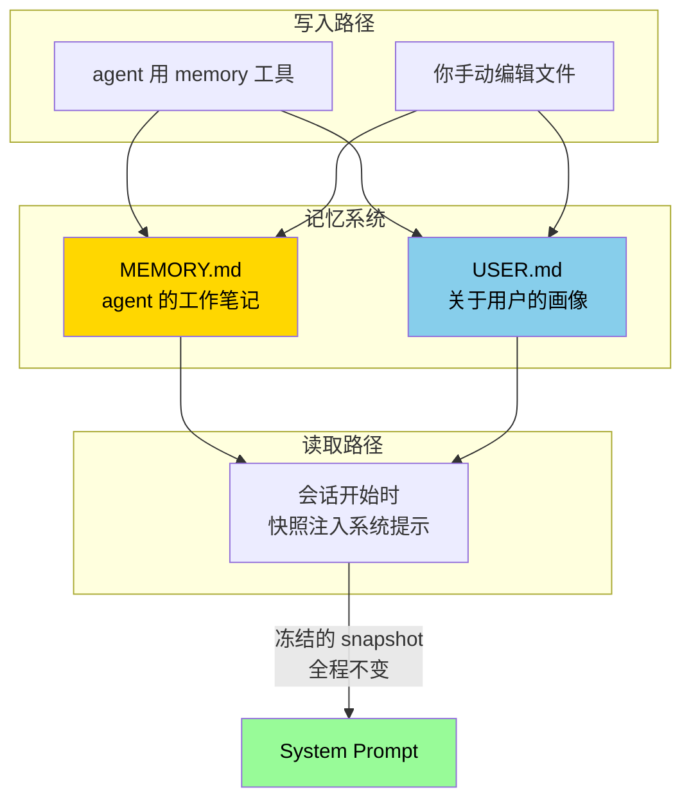

# 7. 记忆系统深入

## 心智模型:两本笔记本

Hermes 的「记忆」不是黑盒向量库,而是**两个纯文本 markdown 文件**,你可以随时打开看、改、删。



**两个存储,各司其职**:

| | MEMORY.md | USER.md |
|---|---|---|
| **存什么** | agent 观察到的事实 / 项目约定 / 环境怪癖 | 关于你的画像 / 偏好 / 风格 |
| **视角** | 「我(agent)学到了什么」 | 「我(agent)认识的这个人是谁」 |
| **例子** | 「这个项目用 uv 不用 pip」 | 「用户偏好简洁回答,不喜欢 emoji」 |
| **文件位置** | `~/.hermes/memories/MEMORY.md` | `~/.hermes/memories/USER.md` |

!!! info "「冻结快照」是什么意思?为什么重要"
    会话启动时,Hermes 把这两个文件的当前内容**一次性塞进系统提示**。之后**整个会话里系统提示不变** —— 即使 agent 中途用 `memory` 工具写入新条目,**本次对话的系统提示也不更新**。

    为什么这样设计?**保 prompt cache**。如果每次 memory 更新就重建 system prompt,每轮 API 调用都会打爆缓存,成本爆炸。

    所以你会发现:agent 说「我记下了」,文件也确实写了,但**本次对话里 agent 并不"知道"新写的那条** —— 它要**下次新会话**才能看到。这不是 bug,是设计。

---

## 文件格式:`§` 分隔的条目

打开你的 MEMORY.md,长这样:

```markdown
项目 hermes-agent 用 uv 做 Python 包管理,不要用 pip。
§
~/.hermes/ 是数据目录,不是代码目录,不要往这里塞源码。
§
测试命令是 `python -m pytest tests/ -q`,约 3000 个测试,跑完要 3 分钟。
§
用户在 /Users/katya/Files/ 下放所有项目,按项目名开目录。
```

设计选择:
- **`§` (section sign) 当分隔符** —— 内容里几乎不会出现,天然 unique
- **每条可以多行** —— 不是「一条一行」的限制
- **按字符计数,不是 token** —— 模型无关
- **默认 10k 字符上限**,超了要整理

---

## 最小实践:怎么让 agent 记东西

### 方法 1 · 直接说

```text
> 记住:这个项目的测试命令是 `npm run test:ci`,不是 `npm test`。
```

agent 会调 `memory` 工具:
```
┊ memory(action="add", target="MEMORY", content="...")
```

下次开新会话,agent 自动知道这件事。

### 方法 2 · 主动让 agent 记

```text
> 我们刚才试错了半天,根因是 CORS 配置忘了加 credentials。
> 把这个坑记到 MEMORY 里,下次不要再犯。
```

### 方法 3 · 直接改文件

```bash
vim ~/.hermes/memories/MEMORY.md
```

手动加 / 删 / 改。**agent 下次启动会读到**。

### 方法 4 · 写用户画像

```text
> 记到 USER.md:我是后端工程师,Python 和 Go 都用,偏好 Go。
> 回答时代码示例优先 Go,其次 Python。
```

### 查看当前记了什么

```bash
# 对话里
> /memory

# shell 里
cat ~/.hermes/memories/MEMORY.md
cat ~/.hermes/memories/USER.md
```

---

## 什么该记、什么不该记

这是 memory 系统**最容易犯错**的地方。默认 LLM 倾向于「记得越多越好」,但记忆**消耗系统提示空间 + 每次都花钱读**。

### ✅ 该记的

- **环境事实**:这台机器上的路径、版本、工具命令
- **项目约定**:用什么语言、什么包管理器、什么 linter、什么 CI
- **已踩过的坑**:避免重蹈覆辙
- **用户偏好**:回答风格、代码风格、不喜欢什么
- **跨会话身份**:你是谁、在做什么项目、目标是什么

### ❌ 不该记的

- **临时状态**:"正在调试 bug X" —— 明天就过时了
- **具体任务细节**:"TODO 改 auth.py:45" —— 这是 todo 不是 memory
- **能从代码推断的**:文件结构、函数名、类层级 —— agent 可以现场 `grep`
- **一次性事实**:"今天是周二" —— 无意义
- **敏感信息**:API key、密码、token —— **绝对不能进 memory**(会进系统提示)

!!! danger "Memory 是会进 LLM 系统提示的 —— 敏感信息不能放"
    Hermes 会扫描 memory 内容里的 `.env`、`authorized_keys`、`KEY/TOKEN/SECRET` 等模式**自动阻止**,但不是 100% 可靠。**自觉别往 memory 里写密码和 token**。

---

## 定期整理:memory 也要做减法

用一段时间后 MEMORY.md 会长成这样:

```
§ 项目用 uv
§ 项目用 uv(重复)
§ 测试命令 pytest -q
§ 测试命令 pytest -q --timeout 60
§ 之前试过 pip 报 SSL 错误 ← 现在已经换 uv 了,这条过时
§ ...
```

**重复、过时、无用的条目会污染新会话的系统提示**,浪费 token、分散注意力。

### 定期整理的三种节奏

=== "🧹 轻整理(每周)"
    ```text
    > 帮我看看 MEMORY.md,挑出过时、重复、写得啰嗦的条目,给我一个精简建议
    ```
    agent 读,给你 diff 建议,你看过批准再改。

=== "🧹 中整理(每月)"
    ```text
    > 整理 MEMORY.md 和 USER.md,按主题重组条目,合并重复的,删掉过时的。
    > 改之前告诉我你打算删哪些。
    ```

=== "🧹 大整理(换项目 / 换主题)"
    - 直接备份当前:`cp MEMORY.md MEMORY.md.$(date +%Y%m%d).bak`
    - 然后人工重写,留精华

---

## USER.md 的特别用法

USER.md 是用来**对齐 agent 和你**的关键文件。写得好 vs 写得差,agent 的"顺手度"差一倍。

### 写得差的 USER.md(反面例子)

```
用户的名字是 Katya。
用户用 Mac。
用户喜欢编程。
```

→ 全是模型本来就能推断的。没信息量。

### 写得好的 USER.md(正面例子)

```
我是 Katya,十年后端工程师,当前主要用 Go + Python。
§
回答风格偏好:直接给答案,不要先铺垫「这是个好问题」这种客套。
代码示例优先 Go,其次 Python。不需要解释太基础的语法。
§
我在折腾 Hermes Agent 的中文指南,定位是「由浅入深从零到精通」。
写作上偏好:三段式结构(心智模型 + 最小实践 + 坑点)、admonition 多用、
mermaid 图能画就画、避免翻译腔。
§
不喜欢:冗长的开场白、emoji 滥用、PPT 式的分点堆砌、「让我们一起来探索」这类口吻。
喜欢:有判断、有观点、敢说「不」、吐槽点到为止。
§
当前工作目录通常在 /Users/katya/Files/<project-name>/。
```

→ **agent 读到这样的 USER.md 后,风格和你严丝合缝**。

---

## 坑点

### 坑 1 · memory 写了但当前对话没生效

**现象**:你说「记住 X」,agent 也说「好的」,但紧接着问它 X,它好像不知道。

**原因**:**冻结快照**机制 —— 本次对话的系统提示已经定格,新写的 memory 要下次会话才进。

**对策**:
- 如果你**本轮就需要这件事生效**,不要靠 memory,直接**在 user message 里告诉它**
- 或者 `/new` 开新会话,让新系统提示加载新 memory

### 坑 2 · 新会话里 agent "忘了"

**现象**:上周记的东西,这周开新会话 agent 不知道。

**排查**:
```bash
cat ~/.hermes/memories/MEMORY.md
```

如果文件是空的 / 丢了,可能是:
- **切了 Profile**:每个 profile 有独立 memory(查 `hermes -p <name>` 用的哪个)
- **误删了**:看 `~/.hermes/` 目录有没有备份
- **agent 没真的写**:检查当时它有没有真的调 `memory` 工具

**对策**:
- 重要的 memory 定期 `hermes backup -o ~/backup.tar.gz`(v0.9 新命令)
- 用 Git 管 `~/.hermes/memories/` 目录(简单可靠)

### 坑 3 · memory 太长超限

**现象**:`memory add` 报「memory content is too long」。

**原因**:MEMORY.md 默认有 10k 字符上限。

**对策**:
- 整理:`/memory` 让 agent 自己合并重复
- 扩容:`hermes config set memory.memory_max_chars 20000`(代价是每轮系统提示更大)

### 坑 4 · memory 被无意污染

**现象**:MEMORY.md 里突然多了几条奇怪的、似乎被别人诱导写入的内容。

**原因**:有人在 agent 对话里**故意触发 memory 写入恶意内容**(prompt injection)。

**对策**:
- Hermes 有内置的威胁模式扫描(识别 `ignore previous instructions`、exfil 模式等),会阻止
- 不要让不信任的用户直接与你的 Hermes 对话
- 定期 review MEMORY.md —— 把它当成一个会被别人写的文件对待

### 坑 5 · Profile 切换后 memory 不见了

**现象**:`hermes -p work` 时 memory 是空的,切回默认又出来了。

**原因**:**这是正常的**。每个 profile 完全隔离 —— 包括 memory。

**对策**:
- 如果你想**共享** memory,可以手动 symlink:
  ```bash
  ln -s ~/.hermes/memories/USER.md ~/.hermes/profiles/work/memories/USER.md
  ```
- 或者通用事实写 USER.md(profile 独立),项目特定写项目目录的 AGENTS.md 或 context 文件

---

## 跟 skill / context files 的区别

Memory 不是万能储存。跟另外两个系统容易混:

| | Memory | Skill | Context Files |
|---|---|---|---|
| **作用** | 跨会话事实 | 可复用做事的步骤 | 项目级背景 |
| **注入点** | 系统提示 | 被调用时才展开 | 会话初始 user message |
| **生命周期** | 永久,跨所有项目 | 永久,跨所有项目 | 当前项目目录 |
| **粒度** | 1-3 句 | 1-几页 | 几页 |
| **更新频率** | 低,偶尔 | 中,打磨 | 每项目一次 |

**记忆锚点**:

```text
我是谁、我爱什么、我项目的通用约定 → MEMORY / USER.md
怎么做 X 任务(有流程的) → Skill
这个项目是干嘛的、架构是什么 → AGENTS.md / CLAUDE.md 在项目根
```

---

## 进阶

- 第 8 章 [技能系统深入](08-skills-deep-dive.md) —— memory 记不住的流程,用 skill
- 第 [16b](../part-3-mastery/index.md) 章(第三部)—— `hermes backup / import` 详解
- 官方文档 [Memory Best Practices](https://hermes-agent.nousresearch.com/docs/user-guide/features/memory) —— 更多最佳实践

---

下一章:[8. 技能系统深入 →](08-skills-deep-dive.md)
