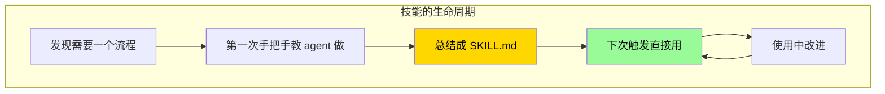
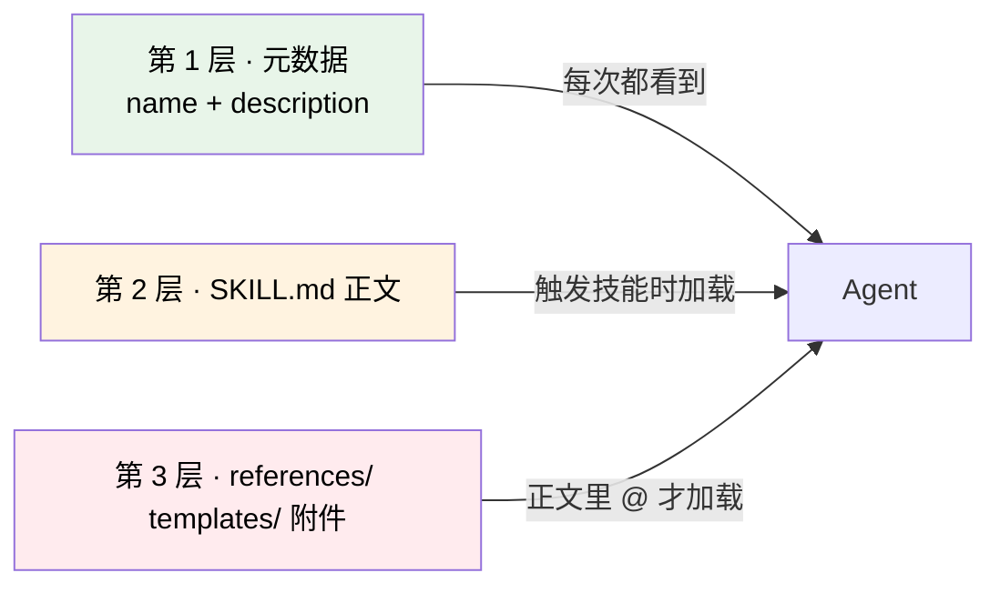

# 8. 技能系统深入

## 心智模型:技能是可复用的「手艺」



**技能 ≠ 记忆**。一句话对比:

| | Memory | Skill |
|---|---|---|
| **它是什么** | 事实 | 流程 |
| **例子** | 「用户喜欢 Go」 | 「怎么审查一个 PR」(5 步) |
| **什么时候用** | 每次都注入系统提示 | 只在 `/skill-name` 被触发时展开 |
| **代价** | 消耗系统提示空间 | 零代价(不用就不出现) |

→ **有流程、需要步骤的事 → 做成 skill**。**零散事实 → 写 memory**。

---

## 技能的文件格式

一个技能就是一个**目录**,最小配置只需一个 `SKILL.md`:

```
~/.hermes/skills/
├── my-pr-review/
│   └── SKILL.md                # 必需:主指令
├── my-daily-report/
│   ├── SKILL.md
│   ├── references/             # 可选:支持文档
│   │   └── format.md
│   ├── templates/              # 可选:输出模板
│   │   └── report-template.md
│   └── assets/                 # 可选:资源文件
│       └── header.png
```

### SKILL.md 的头部(YAML frontmatter)

```markdown
---
name: my-pr-review
description: Systematically review a pull request — style, logic, tests, security.
version: 1.0.0
license: MIT
platforms: [macos, linux]    # 可选:限制 OS
metadata:
  hermes:
    tags: [code-review, git]
    related_skills: []
---

# PR Review Skill

## Overview
你是一个 code reviewer。当用户说「审查这个 PR」时,按下面步骤...

## Prerequisites
- Git 仓库
- `git diff` 可用

## Workflow
1. ...
```

**关键字段**:
- `name`:≤64 字符,**全局唯一**,就是 `/<name>` 用的名字
- `description`:≤1024 字符。**描述很重要** —— 模型靠它决定要不要自动用这个技能
- `version` / `license` / `platforms`:兼容 [agentskills.io](https://agentskills.io) 标准

### 渐进式披露(Progressive Disclosure)

Hermes 的技能系统借鉴了 Anthropic 的 Claude Skills 设计。**最精妙的一点是分三层**:



**省 token 的诀窍**:
- **元数据**永远在列表里(`/skills`)—— 很小
- **正文**只在用户说 `/my-skill` 或 agent 觉得该用时才加载
- **附件**(references/templates)只在正文 `@` 引用时才加载

这意味着**你可以有 100 个技能也不会占 context**。

---

## 最小实践:30 分钟写一个技能

### 场景:我想要一个「PR review」技能

**Step 1 · 建目录**

```bash
mkdir -p ~/.hermes/skills/my-pr-review
cd ~/.hermes/skills/my-pr-review
```

**Step 2 · 写 SKILL.md**

```markdown
---
name: my-pr-review
description: 系统化审查一个 pull request — 风格、逻辑、测试、安全四维打分,给出修改建议。
version: 1.0.0
metadata:
  hermes:
    tags: [code-review, git, pr]
---

# PR Review Skill

## Overview

按四个维度审查 PR:**风格、逻辑、测试、安全**。每维度打 0-10,给具体证据,末尾总结 Blocker / Warning / Suggestion 三档修改建议。

## Prerequisites

- 当前目录是 git 仓库
- 有 PR 分支或 `git diff <base>..HEAD` 可跑

## Workflow

### 1. 收集 diff
- 如果用户给了 PR URL:`gh pr view <N> --json files,title,body`
- 如果用户说「审查当前分支」:`git diff main...HEAD`
- 整理成「文件列表 + 每个文件变动行数」

### 2. 按四维扫描

**风格**
- 命名是否一致(函数、变量、文件)
- 缩进 / 行宽 / trailing whitespace
- 注释是否必要(提醒:只有 WHY 非显然时才写注释)

**逻辑**
- 新增分支是否覆盖边界(null / 空 / 越界)
- 是否有重复逻辑可提取
- 是否改了共享状态(mutation)

**测试**
- 新逻辑是否有对应测试
- 测试是否覆盖 happy path + 至少一个 edge
- 测试名称是否表达意图

**安全**
- 是否读写敏感文件路径
- 是否有 shell injection / SQL injection 风险
- 是否暴露 secret / credential

### 3. 生成报告

按下面模板输出(在正文 @ 了 template):

@templates/review-report.md

## Output

按 template 渲染到 stdout。如果 Blocker > 0,结尾大声提醒用户。
```

**Step 3 · 写 template**

```bash
mkdir templates
cat > templates/review-report.md << 'EOF'
# PR Review: {{title}}

## 四维打分

| 维度 | 分数 | 简评 |
|---|---:|---|
| 风格 | X/10 | ... |
| 逻辑 | X/10 | ... |
| 测试 | X/10 | ... |
| 安全 | X/10 | ... |

## 修改建议

### 🚨 Blocker(必须修)
...

### ⚠️ Warning(建议修)
...

### 💡 Suggestion(可选)
...
EOF
```

**Step 4 · 用**

```bash
hermes
```

```text
> /my-pr-review
> 审查一下当前分支相对 main 的改动
```

agent 会:
1. 看到 `/my-pr-review` 触发 → 加载完整 SKILL.md
2. 看到 `@templates/review-report.md` → 加载 template
3. 按 workflow 走一遍
4. 用 template 渲染输出

---

## 常见技能模式

### 模式 A · 「按流程走」

适合:有清晰步骤的任务(PR review、发布流程、文档生成)

```markdown
## Workflow
### Step 1
...
### Step 2
...
### Step N
最后输出 ...
```

### 模式 B · 「反向问答」

适合:需要先澄清才能做的任务(写简历、制定计划、命名)

```markdown
## Workflow

### Step 1 · Clarify

先反问用户以下问题,all-at-once 列表式:
- 目标读者是谁?
- 长度偏好?
- 风格:正式 / 半正式 / 口语?
- 必须提到的关键词?

等用户回答后再进 Step 2。

### Step 2 · Draft
...
```

### 模式 C · 「知识库式参考」

适合:需要调用 reference 的任务(API 集成、框架使用指南)

```markdown
## Workflow

遇到需要 OAuth 流程时,参考 @references/oauth-flow.md
遇到需要构造 webhook 时,参考 @references/webhook-schema.md

## References
- @references/oauth-flow.md
- @references/webhook-schema.md
- @references/error-codes.md
```

agent 看到 `@` 才加载那个 reference 文件,不污染 context。

---

## Skills Hub · 用社区技能

[agentskills.io](https://agentskills.io) 是社区技能市场,Hermes 原生接入。

### 搜索和安装

```text
> /skills
```

弹出交互面板:

```
┌─────────────────────────────────────────┐
│ Skills Hub (agentskills.io)             │
│                                          │
│ [search] slack-summarize                 │
│                                          │
│ ▶ slack-summarize            ⭐ 234      │
│   Summarize a Slack channel's recent...  │
│ ▶ slack-action-items         ⭐ 89       │
│   Extract action items from a Slack...   │
│                                          │
│ Enter=install  /=search  q=quit          │
└─────────────────────────────────────────┘
```

选中按 Enter,agent 帮你下载到 `~/.hermes/skills/` 下。

### 改造社区技能

装完后 `ls ~/.hermes/skills/slack-summarize/` 你会看到完整文件。**想改随便改**:
- 改 SKILL.md 里的流程
- 改 template 里的输出格式
- 加你自己项目的约定

**改完的是你自己的技能,跟 Skills Hub 脱钩。** 想分享回去就提 PR。

---

## 让 agent 为你写技能

最懒的办法 —— **让 agent 自己观察,自己提议**。

当你跟 agent 做了一次**有流程的复杂任务**,收尾时说:

```text
> 刚才这个流程以后还会做很多次。
> 帮我把它抽成一个 skill,存到 ~/.hermes/skills/my-<好名字>/。
> 流程清晰,带一个 template,description 要让其他模型一眼看懂什么时候该用。
```

agent 会:
1. 读会话历史
2. 抽取流程
3. 建目录 + 写 SKILL.md + 可能的 template
4. 告诉你生成了什么,要不要改名 / 改 description

---

## 版本化你的技能

技能目录本质是文件夹,**非常适合用 Git 管**:

```bash
cd ~/.hermes/skills
git init
git add .
git commit -m "初始技能集"

# 有个私有仓库存起来
git remote add origin git@github.com:you/hermes-skills.git
git push -u origin main
```

好处:
- 跨机器同步:新机器上装完 Hermes,`git clone` 一下就有所有自己的技能
- 历史追溯:看自己的 skill 怎么进化
- 协作:团队内部共享某些技能

!!! tip "团队共享技能的做法"
    一个真实的模式:
    - 每人私有 `skills/personal/` —— 个人的
    - 团队共享 `skills/team-xxx/` —— 一个 git submodule 指向团队仓库
    - 开源 Skills Hub 下载的在 `skills/community-imports/`

    这样**三层隔离**,不串味。

---

## 坑点

### 坑 1 · 技能不被触发

**现象**:你写了个 skill,`/skills` 能看到,但 agent 平时就是不自动用。

**原因**:`description` 写得太模糊。

**对策**:把 description 写成**「一句话告诉其他模型:什么情况该用我」**。
```yaml
# 差
description: A helpful tool for code things.

# 好
description: 当用户说「审查这个 PR」或要求系统化 code review 时使用。按风格/逻辑/测试/安全四维度打分,输出 Blocker/Warning/Suggestion 三档建议。
```

### 坑 2 · 技能撞名

**现象**:`/my-skill` 提示名字冲突 / 调错了。

**原因**:
- 本地技能和 Skills Hub 下载的技能重名
- 名字超过 32 字符被 Telegram/Discord 截断,撞到别的技能

**对策**:
- skill 名字保持在 **32 字符内**
- 按**前缀分组**(`my-pr-review`、`my-daily-report`、`team-deploy`)

### 坑 3 · 技能内容太长 agent 不读完

**现象**:SKILL.md 写了 500 行,agent 只看了开头就开始动手。

**对策**:**用渐进式披露** —— SKILL.md 保持精简骨架,细节拆到 references/ 里用 `@` 按需加载。

```markdown
## Workflow
### Step 1: Gather
操作:跑 `git diff main...HEAD`
格式规范见 @references/diff-format.md  ← 这里 agent 才加载

### Step 2: Score
四个维度,每个维度的具体检查点见 @references/checklist.md
```

### 坑 4 · 技能里的路径写死了

**现象**:技能里写了 `~/Documents/work/`,别人用就报错。

**对策**:
- 用**用户传参**:workflow 里说「ask user for `output_dir`, default to `./output`」
- 用**环境变量**:`${PROJECT_ROOT}` 这种
- 绝对不要写 `/Users/你/xxx`

### 坑 5 · `hermes skills reset` 把我改的 bundled skill 覆盖了

**现象**:Hermes 自带的技能(比如 `dogfood`)被你改了,跑 `hermes skills reset` 后你的改动没了。

**原因**:`hermes skills reset`(v0.9 新命令)**就是用来恢复内置技能到出厂版**的。

**对策**:
- **不要直接改 bundled skill**。复制一份出来改:`cp -r ~/.hermes/skills/dogfood ~/.hermes/skills/my-dogfood`
- 或者 Git 版本化你的 `~/.hermes/skills/`,重置后 `git restore` 回来

---

## 进阶

- [agentskills.io](https://agentskills.io) 标准文档 —— 写跨工具兼容的技能
- 第 20b 章(第三部)—— **Plugins 系统**,比 skill 更深的定制
- 第 [23 章](../part-4-internals/index.md)(第四部)—— 读 Hermes 自带技能的源码,学写作套路

---

下一章:[9. 会话搜索与上下文 →](09-session-search.md)
