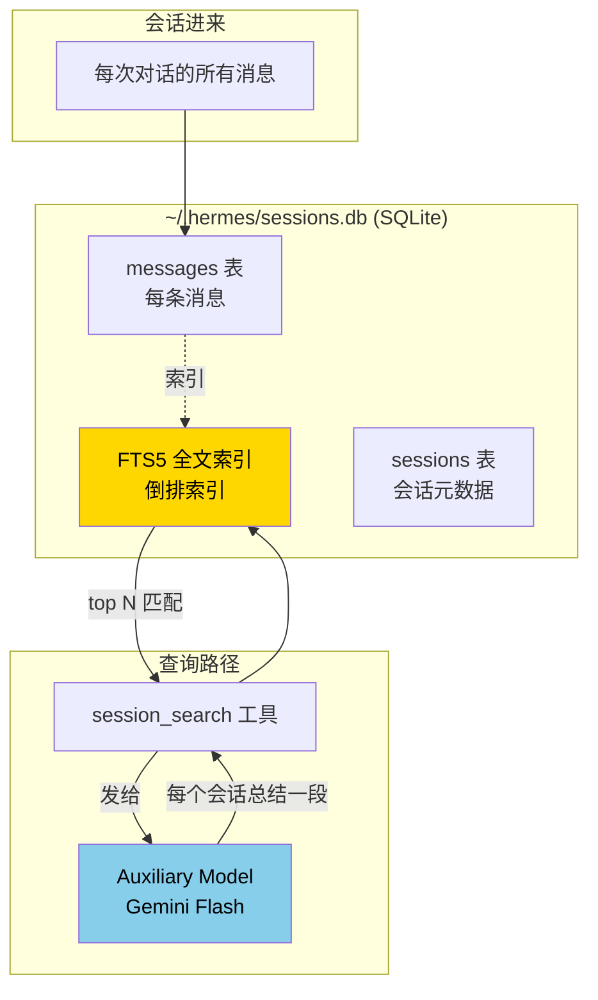
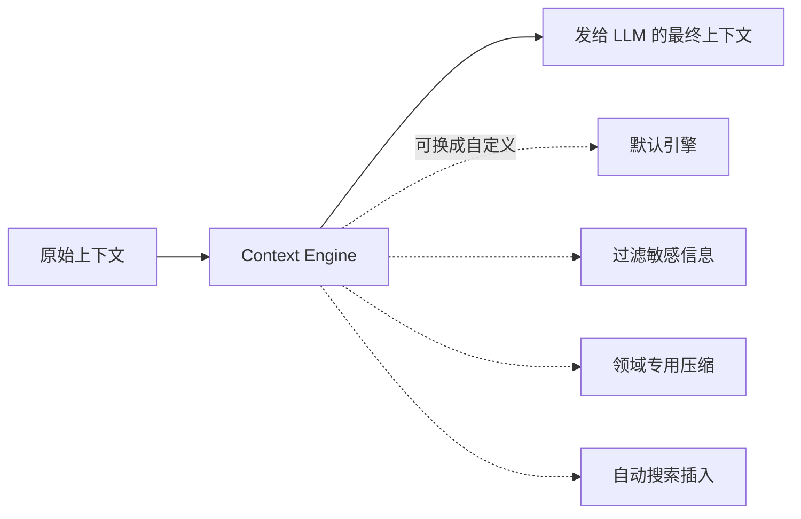

# 9. 会话搜索与上下文

## 心智模型:agent 的长期记忆是 SQLite



**三个关键设计**:

1. **所有会话都存在本地 SQLite**(`~/.hermes/sessions.db`)—— 不是云,隐私可控
2. **用 SQLite FTS5 全文索引** —— 秒级搜索几千次历史会话
3. **返回的不是原文,是「用便宜模型总结的每个会话摘要」** —— 主模型不用吃一堆原始转录

---

## 最小实践:三种用法

### 用法 1 · 让 agent 自己回忆

```text
> 我记得几周前跟你讨论过一个关于 OAuth 刷新 token 的 bug,能回忆一下当时的结论吗?
```

agent 会调用 `session_search`:
```
┊ session_search(query="OAuth refresh token bug")
  → 找到 3 个相关会话
  → Gemini Flash 总结每个
  → 返回带日期的摘要列表
```

agent 读摘要后,**基于它们回答你的问题**。

### 用法 2 · 显式触发

```text
> /session_search "OAuth refresh token"
```

这会**直接**调工具,不走 LLM 决策。适合你确定要搜时。

### 用法 3 · 带时间范围 + 过滤

Agent 调用时可以传:
```python
session_search(
    query="postgres migration",
    days_back=30,          # 近 30 天
    max_sessions=5,        # 最多 5 个匹配会话
    platform="telegram",   # 只看 Telegram 会话
)
```

在对话里大多数时候你不用自己指定 —— agent 看你的话意会自动调合适参数。

---

## 搜索返回的是什么

Agent 拿到的**不是原始转录**,而是**每个命中会话的结构化摘要**:

```json
[
  {
    "session_id": "abc123",
    "date": "April 2, 2026 at 3:14 PM",
    "platform": "cli",
    "title": "OAuth refresh token debugging",
    "summary": "讨论了 refresh token 90 天后失效的问题。
                根因:token rotation 策略未实现。
                结论:改用 offline_access scope + 刷新逻辑守护。
                代码改动在 auth/oauth.py:45-82。",
    "match_count": 12
  },
  ...
]
```

这是**FTS5 命中 + Gemini Flash 总结**后的产物,主模型读起来高效且不污染 context。

---

## FTS5 在后面做了什么

懂 SQLite 的可以直接看底层:

```bash
sqlite3 ~/.hermes/sessions.db

sqlite> .schema messages_fts
CREATE VIRTUAL TABLE messages_fts USING fts5(
    content,
    session_id UNINDEXED,
    role UNINDEXED,
    tokenize = 'unicode61 remove_diacritics 2'
);

sqlite> SELECT session_id, rank FROM messages_fts
        WHERE messages_fts MATCH 'oauth refresh'
        ORDER BY rank LIMIT 10;
```

**FTS5 特点**:
- **unicode61 tokenizer** —— 中英混合都能分词(中文按字或 bigram,看 tokenizer 配置)
- **rank 排序** —— 按 BM25 相关度,命中多的前排
- **查询支持布尔** —— `"oauth AND refresh"`、`"oauth NOT provider"`

---

## 什么时候 session_search 很有用

### ✅ 最有用的场景

1. **时隔几周想起一件事,问 agent**
   > 「我记得上个月跟你聊过那个部署脚本的 bug,我们最后是怎么修的?」
   agent 调 search,找到那次对话,给你结论。

2. **新项目,想参考以前类似项目怎么做的**
   > 「之前 FastAPI 项目我们是怎么组织 auth 的?」
   agent 搜出过去的 FastAPI auth 讨论,汇总给你模板。

3. **做年度回顾 / 复盘**
   > 「总结一下这个月我跟你主要讨论了哪些大主题」
   agent 用 search + 汇总,给你月报式总结。

### ❌ 不适合的场景

- **信息就在当前对话里** —— 翻上文即可,没必要搜
- **信息在 memory / USER.md 里** —— 直接 `/memory` 查
- **太宽泛的主题** —— 比如「我们聊过什么编程?」—— 返回太多摘要也不实用

---

## 本地搜 vs memory 的区别

两个常被混淆:

| | Memory | Session Search |
|---|---|---|
| **存什么** | 你想让 agent 记住的事实 | 原始对话 |
| **访问方式** | 每次会话注入系统提示 | 按需调用 `session_search` |
| **规模** | ~10k 字符 | 无上限,几年的对话都在 |
| **适合查** | 「我偏好什么」 | 「几周前我们怎么讨论的 X」 |
| **成本** | 占用系统提示空间 | 触发时才消耗 |

**记忆锚点**:
- **你主动归纳的结论 → memory**
- **原始的讨论过程 → session search 能回溯**

---

## Context Engine · v0.9 新增的定制机制

Hermes 的 context engine 是**可插拔的**(通过 `hermes plugins`):



默认的 context engine 已经够用,但你可以写自己的插件:
- **自动插入 session_search 结果**:在每次对话前,根据 user message 自动搜过去的相关会话,塞进 context
- **过滤敏感字段**:比如自动脱敏日志里的 IP 地址
- **总是附带某个文档**:某项目里每次对话都需要的 schema

**注意**:这是高级功能,写自己的 context engine 属于**插件开发**。第 20b 章(第三部)详解。

---

## 实战场景

### 场景 1 · 月度回顾

```text
> /new
> 搜一下过去一个月我们主要讨论了哪些项目。
> 按项目分组,每个项目给 2-3 句话总结最重要的进展或结论。
```

agent 会:
- `session_search(query="*", days_back=30, max_sessions=20)` 宽搜
- 读回来一堆摘要
- 按主题聚类
- 生成你的月报

### 场景 2 · 跨设备找回

你在家 CLI 跟 agent 讨论了一个复杂部署方案,**忘了截图**。第二天公司 Telegram 问:

```text
> 昨晚我在家讨论了一个蓝绿部署方案,帮我回忆一下关键决策
```

因为 Hermes 的 session 存储**跨平台共享**,Telegram 的 agent 也能搜到家里 CLI 的会话。

!!! warning "前提是同一个 Hermes 实例"
    如果你家和公司装的是**两台独立 Hermes**(各自 `~/.hermes/sessions.db`),搜不到。

    想跨设备同步,有两种做法:
    - **agent 住在云端 VM**,各客户端都连这个 VM 的 gateway
    - **sessions.db 放同步目录**(Dropbox / iCloud)—— 但并发访问有锁问题,不推荐

### 场景 3 · 做成知识库

把过去几年的学习讨论当个人知识库:

```text
> 搜一下我以前跟你讨论过的关于 distributed systems 的内容,
> 按经典主题(consensus / clock / replication / partitioning)分类,
> 列出我提过但没深入的问题。
```

agent 用 search 扒一遍,给你一份**个人认知地图**。

---

## 坑点

### 坑 1 · 中文搜索返回烂

**现象**:明明聊过某个中文主题,搜不出来。

**原因**:FTS5 tokenizer 默认 `unicode61`,对中文分词弱(实际按字或 bigram)。

**对策**:
- 搜中文时**尽量用 2-3 字的短语**,不要单字
- 加英文关键词混搜(技术名词、代码标识符)
- 进阶:如果真的需要好中文分词,编译 SQLite 带 [simple tokenizer](https://github.com/wangfenjin/simple)(需要动手能力)

### 坑 2 · 搜出来全是无关会话

**现象**:搜「memory」返回 20 个会话,大部分其实没在讨论 memory 功能。

**原因**:常见词命中太广。

**对策**:
- 用更具体的短语:「memory tool MEMORY.md」
- 带时间:`days_back=7`
- 带平台:只看 CLI 的,不看 Telegram 的

### 坑 3 · 会话太多搜索变慢

**现象**:FTS5 搜 10k+ 会话几秒才回。

**对策**:
- 其实 10k 会话 FTS5 还在秒级 —— 慢的是**后续 Gemini Flash 的总结调用**(每会话一次)
- 减少 `max_sessions`(默认 3,降到 2)
- 用更便宜的 auxiliary model

### 坑 4 · 敏感会话不想被搜到

**现象**:某次对话里有敏感信息(auth token 错误粘贴),你不想它被 session_search 找到。

**对策**:
- **删除整个会话**:
  ```bash
  sqlite3 ~/.hermes/sessions.db "DELETE FROM sessions WHERE id='xxx'"
  ```
  (会级联删消息)
- 或者对话内实时处理:当你看到自己粘了 token,立刻 `/new` 开新会话,把敏感那条的 session 删掉

### 坑 5 · Profile 间互搜

**现象**:默认 profile 能搜到 work profile 的对话?或者反过来?

**不会**。每个 profile 有独立的 `sessions.db`。想跨 profile 查得**手动合并**。

---

## 维护你的 sessions.db

```bash
# 看多大了
du -h ~/.hermes/sessions.db

# 多少会话 / 多少消息
sqlite3 ~/.hermes/sessions.db "SELECT COUNT(*) FROM sessions; SELECT COUNT(*) FROM messages;"

# 定期 vacuum(回收空间)
sqlite3 ~/.hermes/sessions.db "VACUUM;"

# 备份(配合 hermes backup 更简单)
cp ~/.hermes/sessions.db ~/.hermes/sessions.db.$(date +%Y%m%d).bak
```

用 `hermes backup`(v0.9+)更便捷:

```bash
hermes backup -o ~/hermes-full-$(date +%Y%m%d).tar.gz
# 包含 sessions.db + memory + skills + config
```

---

## 进阶

- 第 10 章 [上下文压缩](10-context-compression.md) —— 长对话里压缩 vs 搜索的权衡
- 第 20b 章(第三部)—— 自定义 Context Engine 插件
- [SQLite FTS5 官方文档](https://www.sqlite.org/fts5.html) —— 理解底层查询语法

---

下一章:[10. 上下文压缩 →](10-context-compression.md)
