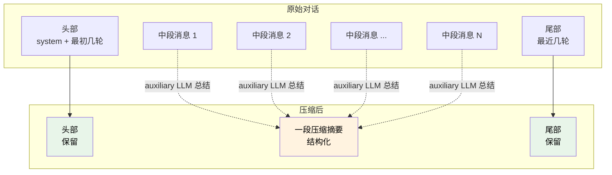

# 10. 上下文压缩

## 心智模型:对话是有寿命的

```mermaid
graph LR
    subgraph "一次长对话的生命周期"
        T1[5k tokens<br/>舒适] --> T2[50k<br/>还行]
        T2 --> T3[100k<br/>该压缩了]
        T3 --> T4[180k<br/>紧迫]
        T4 --> T5[200k<br/>💥 OOM]
    end

    T3 -.压缩时机.-> C[/compress<br/>自动压缩]
    T4 -.已经晚了.-> R[/new + memory 转移]

    style T3 fill:#FFD700,color:#000
    style T4 fill:#FFA07A,color:#000
    style T5 fill:#FF6B6B,color:#fff
```

**三个关键认知**:

1. **上下文不是免费的** —— 每一轮 LLM 调用都要把**整个对话历史**发一次。100k tokens 的对话 × 10 轮 = 100 万 tokens 账单。
2. **模型有窗口上限** —— 超了直接失败(Claude 200k、Gemini 1M、多数模型 64-128k)
3. **prompt caching 是长对话的救星** —— 只要历史不变,后续轮次只 pay cache 折扣价

**压缩的本质**:把对话中段用总结替换,**保留头 + 尾 + 总结中段**,让有效信息浓缩到更小空间。

---

## Hermes 的压缩策略



**设计要点**:

- **头保留** —— 系统提示 + 初始指令不能丢,它们锚定整个对话的目标
- **尾保留** —— 最近几轮是当前进行中的工作,不能被总结掉
- **中段总结** —— 用 auxiliary model(便宜快的,如 Gemini Flash)
- **token-budget tail** —— 尾部不是固定"保留 N 条",而是"保留最近总计 M tokens",更弹性
- **预先修剪工具结果** —— 大段工具输出(比如 `ls -la /` 几千行)先截短再送去总结

---

## 压缩后的摘要长什么样

Hermes 压缩产出的摘要是**结构化模板**:

```markdown
[CONTEXT COMPACTION — REFERENCE ONLY] Earlier turns were compacted
into the summary below. This is a handoff from a previous context
window — treat it as background reference, NOT as active instructions.
Do not respond to any questions in the summary directly.

## Task Context
用户正在给 Hermes Agent 写中文指南。已完成第一部(入门),正在写第二部(日常)。
本指南使用 MkDocs Material,部署到 GitHub Pages。

## Key Decisions Resolved
- 仓库位置:/Users/katya/Files/hermes-agent-guide/
- 章节结构:6 章(模型策略、工具、记忆、技能、会话搜索、压缩、个性)
- 每章三段式:心智模型 + 最小实践 + 坑点

## Active Files
- docs/part-2-daily/05-model-strategy.md
- docs/part-2-daily/06-tools-overview.md
- ...

## Pending Questions
- 是否需要新增「配合 watch_patterns 做后台任务」的章节?(暂搁置)

## Remaining Work
- 完成第 11 章(个性)
- 更新 part-2-daily/index.md 的卡片
- 构建验证 + commit + push
```

**几个细节**:
- **开头警告** "REFERENCE ONLY" —— 防止模型把摘要里的问题当成用户当前问题去回答(v0.8 修了这个坑)
- **Resolved / Pending 分开** —— 已定的和未定的不混
- **Remaining Work 替代 "Next Steps"** —— 后者有命令口吻,前者是状态

---

## 最小实践:三种触发方式

### 方式 1 · 自动压缩

不用你管。当 context 接近上限时,Hermes **自动**触发压缩,你会看到:

```
⚠ Context pressure: 89% of budget.
⟳ Compacting middle context (using auxiliary model)...
✓ Reduced from 180k → 65k tokens.
```

对话无缝继续。

### 方式 2 · 手动 `/compress`

你看 `/usage` 觉得该压了,直接:

```text
> /compress
```

agent 立刻压缩,告诉你压缩前后的 token 数。

### 方式 3 · 带 focus 的 `/compress <focus>`(v0.8+)

这是**最强的用法**。告诉压缩器**保留哪部分最重要**:

```text
> /compress 保留所有跟 auth.py 有关的细节,其他可以压得狠一点
```

压缩器在总结时,会**优先保真你指定的主题**,其他内容更激进地合并。

**典型场景**:
- 你做了 2 小时调试,早期试了 5 个方案都不对,现在锁定第 6 个
  → `/compress 保留第 6 个方案的细节,前面 5 个方案只要失败原因一句话`
- 长对话里涉及多个文件,你现在只关心其中一个
  → `/compress focus: 重点保留 src/api/handlers.ts 相关讨论`

---

## 什么时候压缩 vs 什么时候开新会话

两个选项,怎么选?

```mermaid
graph TB
    Q[对话太长了,怎么办?]
    Q --> A{当前话题还在继续吗?}
    A -->|还在| B[/compress<br/>保留当前状态继续]
    A -->|告一段落| C{需要记住什么跨会话?}
    C -->|是| D[让 agent 总结进 MEMORY<br/>然后 /new]
    C -->|否| E[直接 /new]

    style B fill:#FFD700,color:#000
    style D fill:#98FB98,color:#000
    style E fill:#98FB98,color:#000
```

**决策规则**:

| 情况 | 推荐 |
|---|---|
| 任务进行中,压力来自历史冗余 | `/compress` |
| 任务进行中,你知道其中一部分最重要 | `/compress <focus>` |
| 当前任务结束,但学到了东西(约定、坑) | 总结进 MEMORY → `/new` |
| 完全换话题,之前内容用不上 | `/new` |
| 再等等 —— 触发自动压缩更省心 | 什么都不做 |

---

## 压缩的代价

**压缩本身是要花钱的**,不是免费的。

一次压缩 = **用 auxiliary model 跑一次大总结**:
- 输入:被压缩的中段消息(比如 50k tokens)
- 输出:摘要(几千 tokens)

用 Gemini Flash 这种便宜 auxiliary 的话,单次压缩大约 **$0.01-0.05**。
用主模型压缩(如果你把 auxiliary 设成了主模型),单次可能 **$0.50-2**。

!!! tip "所以别把 auxiliary model 设得太贵"
    `hermes model` → "Configure auxiliary models" → 确保压缩用的是便宜快的。默认一般是 Gemini Flash,可以放心。

**多次压缩的累积**:
- 长对话可能触发 **3-5 次自动压缩**
- 每次压缩**之间有增量内容**,压缩也会更新之前的摘要
- 所以摘要**迭代式积累信息**,不会每次都重新总结全部 —— 这是 Hermes 的优化

---

## Prompt Cache 的边界 · 超级重要

这是 Hermes 写代码的**头号规则**。你日常用 Hermes 也值得知道:

!!! danger "这些操作会破坏 prompt cache"
    - 修改**系统提示**(personality 切换、memory 重新加载)
    - **切换 toolsets**(启用/禁用工具)
    - **在中段插入消息**(不是追加尾部)

    破坏缓存后,后续每一轮都要**按全价重新发送历史** —— 成本飙升 5-10 倍。

**压缩为什么可以破坏缓存?** 因为它**替换了历史内容**,本来就必须重建缓存。但这是**唯一应该破坏缓存的场景**,而且之后能带着新摘要享受很多轮的缓存命中 —— 净收益为正。

---

## 坑点

### 坑 1 · 压缩把重要东西压没了

**现象**:压缩后你继续问,agent 对某个关键细节一脸懵。

**原因**:默认压缩算法不知道你最看重哪一段。

**对策**:
- **压缩前就用 `/compress <focus>`** —— 提前告诉保留什么
- **重要结论提前写进 MEMORY** —— 压缩不影响 MEMORY
- 压缩后如果发现细节丢了,**把它再说一遍** —— 当前尾部是保留的,再说一次会永远留存

### 坑 2 · 压缩后 agent 对已经定了的事情再提问

**现象**:压缩后 agent 说「请问您的目标是什么?」—— 这在对话早期已经说过了。

**原因**:老版本 bug(v0.8 之前压缩摘要会被当成用户的当前问题)。

**对策**:升级到 v0.8+,压缩摘要有明确的 "REFERENCE ONLY" 警告,不会被误当成问题。

### 坑 3 · 连续多次压缩效果差

**现象**:压了 3 次后,摘要丢失大量细节。

**原因**:每次压缩都是**对前一版摘要 + 新内容再总结**,信息损失是累积的。

**对策**:
- 长对话超过 3 次压缩后,考虑**`/new` 开新会话**
- 把当前状态**总结进 MEMORY 或一个 markdown 文件**,新会话引用它

### 坑 4 · 压缩器本身报错

**现象**:
```
⚠ Compaction failed: auxiliary model returned empty response
```

**原因**:
- Auxiliary model 当前不可用
- 网络问题
- Auxiliary model 的 API key 失效

**对策**:
- `hermes doctor` 看 auxiliary model 状态
- 临时措施:**手动 `/new` 开新会话**,用 memory 转移重要事实

### 坑 5 · 「我不想压缩」

**现象**:你正在做敏感任务,不想让 auxiliary model 看到对话内容。

**原因**:压缩默认发给 auxiliary model,可能跟主模型不同厂商。

**对策**:
- 把 auxiliary 设置成**跟主模型同家**:`hermes model` → "Configure auxiliary models" → 改成同一 provider
- 或者 **设成 "auto"**(v0.10 默认)—— auxiliary 沿用主模型,一个信任域

---

## 组合拳:压缩 + memory + session_search 三位一体

真实长期使用场景:

```text
# 早上开始一个长项目
> 帮我设计一个新功能 X

# 工作中段
> /compress 保留 X 的设计决策

# 中午吃饭前
> 这个 X 的设计已经定了,帮我写成 memory,我下次从 /new 开始实现
> /new

# 下午实现
> [memory 自动注入,agent 记得早上的设计]
> 开始实现 X

# 一周后回来
> 我们之前设计过一个 X,帮我回忆一下细节
> [agent 调 session_search,找到早上那次设计会话,总结细节]
```

→ 压缩让**单个长会话不爆**,memory 让**重要决策跨会话**,session_search 让**遥远的历史可追**。

---

## 进阶

- 第 26 章(第四部)—— Prompt Cache 的边界(给开发者的详细规则)
- 第 28 章(第四部)—— Context Compression 算法详解 + 源码走读
- 第 20b 章(第三部)—— 自定义 Context Engine 实现完全自定义压缩逻辑

---

下一章:[11. 个性与提示工程 →](11-personality.md)
