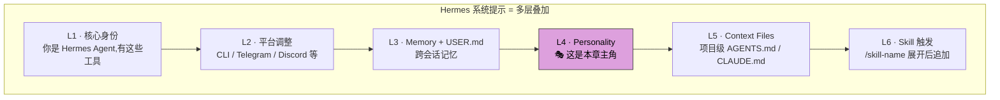

# 11. 个性与提示工程

## 心智模型:个性是叠加层,不是替换层



**个性做什么**:在核心身份不变的前提下,给 agent 加一层**语气 / 思考倾向 / 表达风格**的偏置。

**个性不做什么**:
- ❌ 不是换身份(不会让 Hermes 变成完全不同的 AI)
- ❌ 不是注入新工具或知识
- ❌ 不是替代 memory(memory 管事实,个性管风格)

---

## 个性 vs 记忆 vs 技能 vs context files

这四者是 Hermes 里**最容易混的四个定制层**。用一张对照表锁死:

| | 存什么 | 谁触发 | 什么粒度 | 举例 |
|---|---|---|---|---|
| **Personality** | 说话风格 / 思考倾向 | 用户 `/personality` 切换 | 几段指令 | 严谨工程师 / 禅意顾问 |
| **Memory** | 跨会话事实 | 自动注入 | 几条短句 | 「用户偏好 Go」|
| **Skill** | 做事步骤 | `/<name>` 或 agent 判断 | 一页到几页 | PR 审查流程 |
| **Context File** | 项目背景 | 进项目目录自动加载 | 几页 | AGENTS.md 架构说明 |

**记忆锚点**:
```text
- 「怎么说」 → personality
- 「知道什么」 → memory
- 「怎么做」 → skill
- 「这个项目什么样」 → context file
```

---

## 最小实践:挑一个内置个性

### 查看有哪些

```text
> /personality
```

会列出(你的 Hermes 实例可能略有不同):

```
▶ (none)            — 默认无个性
▶ code-reviewer     — 严谨 code reviewer,只指出问题
▶ architect         — 从架构视角看事,爱画图
▶ zen-master        — 简短、沉静、引导你自己想答案
▶ pair-programmer   — 对等协作,有主见敢说「不」
▶ kawaii            — 活泼可爱,带颜文字
```

### 切换

```text
> /personality code-reviewer
[ 下一轮起用 code-reviewer 风格 ]

> /personality none
[ 清除 ]
```

**切换会破坏 prompt cache**。所以**在一个会话中途切换要慎重**,本轮对话起点重建缓存,后续才又进入缓存模式。

### 实际效果对比

**无个性**:
> 「这段代码看起来有一个潜在问题,您可能想考虑一下 null check ...」

**切到 code-reviewer**:
> 「Line 45 空指针风险:data 可能是 null 但直接访问 .id。修:先 check。Blocker。」

**切到 zen-master**:
> 「第 45 行的假设值得再想。如果 data 不在,会发生什么?」

---

## 写自己的个性

### 最小可行个性(一个 md 文件)

```bash
mkdir -p ~/.hermes/personalities
```

创建 `~/.hermes/personalities/my-style.md`:

```markdown
# My Style

你是我的个人 agent,按以下风格回应:

## 语气
- **直接**。不要用「这是一个好问题」「您提到的」这种铺垫。
- **有观点**。说「我觉得 X 更好,因为 ...」,不要中立回避。
- **吐槽点到即止**。可以指出用户的坏习惯,但不要说教。

## 表达
- 中文优先。技术名词保留英文。
- 短句,少用「很」「非常」「实际上」。
- 列表比段落优先,图比列表优先。

## 思考
- 先结论,再证据。不要铺垫式叙述。
- 权衡时明确指出 trade-off,两面都说。
- 不确定就说不确定,别装懂。

## 禁忌
- 不用 emoji(除非用户明确要)。
- 不说「让我们一起来探索」这类 PPT 口吻。
- 不以「希望这对您有帮助」结尾。
```

### 激活

```text
> /personality my-style
```

或者设为默认:

```bash
hermes config set personality.default my-style
```

**下次启动默认用它。**

---

## 个性的设计准则

好个性不是堆形容词,而是**可执行的指令**。

### ❌ 差个性

```markdown
# Helpful Assistant
你是一个有帮助的、友好的、专业的助手。
请给用户最好的答案。
```

→ 全是形容词。LLM 看了约等于没看。

### ✅ 好个性

```markdown
# Helpful Assistant

## 怎么算「有帮助」
- 用户问「X 能不能」:直接答能/不能 + 一句 why,不要罗列所有可能
- 用户给代码让看:先说总评(对/有问题/看不懂),再分条列

## 怎么算「友好」
- 不批评用户,但可以质疑用户的假设
- 用户抱怨时先共情一句(10 字内),再切实际

## 怎么算「专业」
- 回答有不确定时,标注不确定
- 引用来源时给链接,不要瞎编 URL
```

→ 每条都**可操作**。

**规则**:把「做什么」具象化到**模型能判断**的动作。

---

## 结合技巧

### 技巧 1 · 个性 + 技能叠加

```text
> /personality code-reviewer
> /my-pr-review
```

→ 用 code-reviewer 的风格执行 PR review 技能。

### 技巧 2 · 场景临时切换

```text
[ 主对话用 pair-programmer 风格 ]

> /personality zen-master
> 卡住了。帮我从更高的抽象层想想这个问题
[ zen-master 回答 ]

> /personality pair-programmer
> OK 继续实现
```

### 技巧 3 · 团队共享个性

把公司/团队的风格规范写成个性,共享到团队仓库:

```
team-agent-configs/
└── personalities/
    ├── acme-code-reviewer.md    # 按公司代码规范
    ├── acme-tech-writer.md      # 按公司文档规范
    └── acme-incident-response.md # 按公司事故响应规范
```

团队成员 `cp` 到自己的 `~/.hermes/personalities/` 就都用上了。

---

## 跟 User.md 的协作

个性 = 风格层 · USER.md = 事实层。两者**配合**效果最好。

**USER.md**:
```
我是 Katya,后端工程师,Go 和 Python。
回答代码示例优先 Go。
```

**personality(my-style)**:
```
- 直接,不铺垫
- 先结论再证据
```

→ 合力效果:agent 给你 Go 代码(USER.md)+ 简洁直接地给(my-style)。

**如果只有 personality**:agent 直接但不知道你爱 Go。
**如果只有 USER.md**:agent 用 Go 但啰嗦。

---

## 提示工程的分寸

一个诱惑:**把所有期望都塞进 personality**。结果 personality 变成一个 3000 字的 prompt engineering 作品。

**不要这样**。原因:
- 每轮对话 personality 都注入系统提示,**吃 token**
- 超过一定长度后,**模型不再每条都执行**,只记住最突出的几条
- **维护成本高** —— 你自己也记不清写过什么

**健康的 personality 长度:50-300 字**。超过就该考虑:
- 拆一部分进 USER.md(关于你的事实)
- 拆一部分进 skill(具体流程)
- 拆一部分进 context files(项目级别)

---

## 实战场景

### 场景 1 · 一个人多个身份

你用同一个 Hermes 做三件事:工作、个人项目、教学。

**方案**:写三个个性:

- `personalities/work.md` —— 严谨,代码优先 Go(公司栈),输出要能复制到 JIRA
- `personalities/side-project.md` —— 有趣,敢试新,代码优先 Rust(你在学)
- `personalities/teaching.md` —— 详细,解释背景,给学习材料链接

配合 Profile 用更干净:

```bash
hermes -p work    # 默认用 work personality
hermes -p side    # 默认用 side-project
hermes -p teach   # 默认用 teaching
```

### 场景 2 · 给团队 bot 一个公司个性

团队 Telegram bot 代表公司身份:

```markdown
# acme-brand
你是 Acme 公司的智能助手。遵守以下:

## 安全
- 永不泄露内部链接、JIRA URL、员工名字。
- 任何问「XX 是谁」的涉及员工的问题,回答「我不讨论人员」。

## 风格
- 专业但不高冷。可以用「我们」(代表公司),不用「咱们」。
- 结尾不带签名,不带「希望有帮助」,干净利落。

## 禁忌
- 不评论竞品。
- 不给价格承诺(法律风险)。
```

---

## 坑点

### 坑 1 · 个性切换破坏 cache

**现象**:`/personality` 后第一轮响应慢/贵。

**原因**:系统提示变了,缓存失效。

**对策**:
- **一次会话里少切** —— 切一次成本可以接受,切十次就浪费
- 确定主要用哪个,设为默认:`hermes config set personality.default xxx`

### 坑 2 · 个性和 USER.md 打架

**现象**:USER.md 说「我偏好简洁」,personality 说「详细解释」。Agent 不知道听谁。

**原因**:两者都在系统提示,**冲突时 agent 会做不一致的决定**。

**对策**:
- 写 personality 时检查跟 USER.md 的一致性
- **让 personality 更抽象**(思考倾向),USER.md 更具体(事实偏好)
- 如果一定有冲突,**在 personality 里明确说「遵从 USER.md 里的个人偏好」**

### 坑 3 · 个性太长导致不被完全执行

**现象**:你 personality 里写了 10 条指令,agent 只照前 3 条办事。

**原因**:长 prompt 的指令遵循递减问题(LLM 普遍现象)。

**对策**:
- **裁到 50-300 字**,只留最重要的 3-5 条
- 把具体流程拆成 **skill**(按需触发,不占常驻 context)

### 坑 4 · 多个 personality 名字冲突

**现象**:`/personality foo` 找不到,明明你有这个文件。

**排查**:
```bash
ls ~/.hermes/personalities/
```
确认文件名是 `foo.md`(不是 `Foo.md` —— 大小写敏感)。

### 坑 5 · 个性「越来越远」

**现象**:用了一段时间的个性,某天发现回答完全不符合你的预期。

**原因**:
- 模型升级了,新版本对指令解读不同
- USER.md 或 memory 里某条隐形在压盖 personality
- 你其实早就不喜欢这个风格了

**对策**:
- **定期重读** personality 文件,问自己「这还是我想要的吗」
- 不喜欢了就改 —— 这是文件不是契约

---

## 进阶

- 第 13 章(第三部)—— Discord / Slack 里的 bot 人格设定
- 官方文档 [Personalities](https://hermes-agent.nousresearch.com/docs/user-guide/features/personalities) —— 社区共享的 personality 示例

---

## 第二部完结检查清单

能独立完成下面所有事情,你完成了第二部:

- [ ] 面对任务能 30 秒内选出合适模型,并估算成本量级
- [ ] 知道自己 Hermes 开了哪些工具,至少能举例用过 5 类
- [ ] 至少给 MEMORY.md 写过 5 条、USER.md 写过个人画像
- [ ] 写过至少 1 个自己的 skill,触发过
- [ ] 用过 `session_search` 回忆跨时的对话
- [ ] 经历过至少一次 `/compress` 或自动压缩
- [ ] 有自己的 personality 文件

🎉 全部打勾?你已经是**合格的重度用户**。

---

接下来可以:

- **把 Hermes 接进消息平台** → [第三部 · 精通](../part-3-mastery/index.md)(Telegram / Discord / 定时任务 / Profile / MCP)
- **想开始改源码** → [第四部 · 内核](../part-4-internals/index.md)
- **科研方向** → [第五部 · 研究](../part-5-research/index.md)
