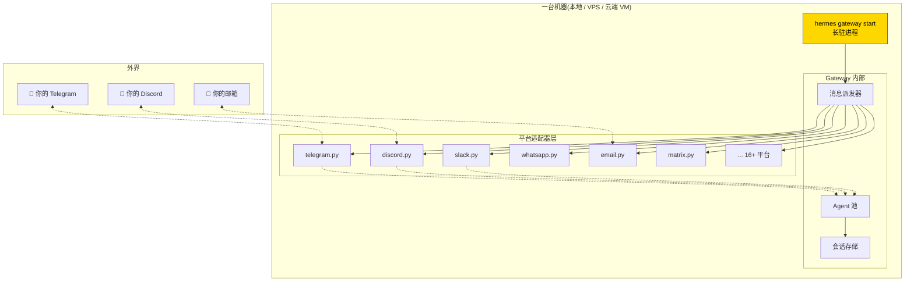
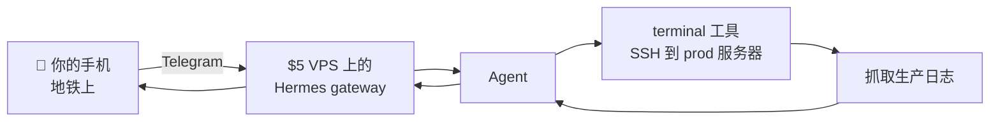

# 12. 消息网关总览 + Telegram

## 心智模型:一个进程,多个身体



**三个关键点**:

1. **一个进程,多平台** —— `hermes gateway start` 启一次,所有已配置的平台同时上线
2. **会话跨平台连续** —— 同一用户在 Telegram 下午聊到一半,晚上在 Discord 接着聊(同一 session)
3. **工具按平台独立开关** —— Telegram 不让跑 `terminal`,但 CLI 可以

---

## Gateway 的生命周期

```bash
hermes gateway setup       # 首次配置,交互式选平台 + 填 key
hermes gateway start       # 启动(前台)
hermes gateway start -d    # 启动(后台 daemon)
hermes gateway status      # 看运行状态 + 各平台连接情况
hermes gateway stop        # 停止
hermes gateway restart     # 重启(升级后用)
hermes gateway logs        # 看日志
```

!!! tip "生产环境用 systemd 管理"
    长驻进程不要裸跑 `hermes gateway start`。推荐用 systemd(Linux)或 launchd(macOS)。

    第 14 章末尾给 systemd 配置样本。

---

## 最小实践:30 分钟搭好 Telegram bot

### Step 1 · 找 @BotFather 造 bot

在 Telegram 里搜 **@BotFather**,发:

```
/newbot
```

按提示给 bot 起名 + 选 username(要以 `bot` 结尾,如 `myhermes_bot`)。

BotFather 返回一个 **token**,长这样:

```
123456789:ABCdefGHIjklMNOpqrSTUvwxYZ0123456789
```

**保密!** 这个 token 拥有完全操纵 bot 的权限。

### Step 2 · 告诉 Hermes

```bash
hermes gateway setup
```

选 **Telegram**,粘贴 token。可选配置:

- **allowed users** —— 填你自己的 Telegram username / user ID(**强烈推荐**,不填任何人都能用)
- **home channel** —— agent 主动发消息时默认发到哪
- **proxy** —— 如果国内需要走代理(v0.9 新增 `TELEGRAM_PROXY` 专门变量)

配完保存,**key 存在 `~/.hermes/.env`** 里。

### Step 3 · 启动 gateway

```bash
hermes gateway start
```

看到类似:

```
✓ Telegram gateway connected (bot @myhermes_bot)
✓ Listening for messages...
```

### Step 4 · 在 Telegram 测试

给你的 bot 发:

```
/start
```

bot 应该回应欢迎语。再试:

```
你好,你是谁?
```

bot 会转给 Hermes agent 处理,返回响应。

成了。

---

## Bot 命令菜单

Telegram 有个**侧边命令菜单**(长按输入框出现)。Hermes 自动把 slash 命令注册进去 —— 你可以**看不打字**触发 `/new`、`/model`、`/help` 等。

命令菜单由 `COMMAND_REGISTRY` 自动生成,**没开的命令不会出现**(gateway_config_gate 机制)。

---

## 进阶配置

### 允许多用户

```yaml
# ~/.hermes/config.yaml
messaging:
  telegram:
    allowed_users:
      - katya            # username
      - 123456789        # 或 numeric ID
      - "@yourfriend"    # 带 @ 也行
```

!!! danger "不设 allowed_users 的风险"
    bot 上线后任何人知道 username 都能发消息、消耗你的 API credit、甚至让 agent 暴露私人信息。**生产环境必配**。

### 按角色 / 群组限制

只在某个群开放:

```yaml
messaging:
  telegram:
    allowed_chats:
      - -100123456789    # 群 chat_id(负数)
```

用法:把 bot 拉进群,`/myid` 查 chat_id。

### 语音消息

Telegram 发的语音消息,Hermes 可以**转文字后作为消息处理**:

```yaml
messaging:
  telegram:
    transcribe_voice: true
```

需要装 voice extra 或配 OpenAI API key(Whisper)。

### Bot 主动发消息

你可以让 agent(通过 cron / 脚本)**主动** 给你发 Telegram:

```bash
hermes cron add --at "08:00" --deliver telegram \
    "把我昨天的 GitHub 活动总结成 200 字"
```

早 8 点 agent 跑完任务,**自动把结果发到 Telegram 给你**。

---

## 常见坑

### 坑 1 · 国内网络连不上 Telegram

**对策**:

```yaml
# ~/.hermes/config.yaml
messaging:
  telegram:
    proxy_url: socks5://127.0.0.1:7890
```

或环境变量 `TELEGRAM_PROXY=socks5://127.0.0.1:7890`(v0.9 新增,不会干扰其他平台)。

### 坑 2 · Token 泄露了

**现象**:你不小心把 token push 到 git 了。

**立即对策**:
1. 在 @BotFather 里 `/revoke` 旧 token
2. `/token` 生成新 token
3. 更新 `~/.hermes/.env`
4. `hermes gateway restart`

### 坑 3 · bot 不响应

**排查**:

```bash
hermes gateway status     # bot 是否 connected
hermes gateway logs       # 有没有错误
```

常见原因:
- allowed_users 没加你 → 你的消息被直接忽略
- webhook 冲突 → Telegram 同时只能一个程序收消息,另一个程序在占用
- token 过期 / 被 revoke

### 坑 4 · Markdown 表格渲染错

**现象**:agent 回答里的 markdown 表格在 Telegram 里乱。

**对策**:v0.9 起 Hermes 自动把表格包进代码块(Telegram 不原生支持表格)。升级到最新版。

### 坑 5 · 长消息截断

**现象**:agent 回答超过 4096 字符,Telegram 只显示前面一部分。

**对策**:Hermes 已经自动分段。如果仍然截断,更新到最新版或:
- 让 agent 「回答控制在 1500 字内」
- 重要长内容用 `/compress` 后重问

---

## 多设备协同:Telegram + 云端 VM

最强组合:



典型剧本:

```text
[ 你在地铁上 ]
📱 > prod 服务器最近 1 小时有没有 5xx 错误?

[ VPS 上的 Hermes ]
[ agent 收到消息,调 terminal SSH 到 prod,grep 日志 ]
[ 发现 3 条 500 错误,都在 /api/users 路径 ]

📱 [ agent 回复 ]: 过去 1 小时有 3 条 500,全在 /api/users。
   看起来是 DB 连接池耗尽导致的。要我帮你重启进程吗?

> 别重启,给我前 1 行堆栈。

[ agent 继续 ]
```

**你的笔记本可以没开机**。这是 Hermes 最迷人的场景之一。

---

下一章:[13. Discord / Slack 网关 →](13-gateway-discord-slack.md)
