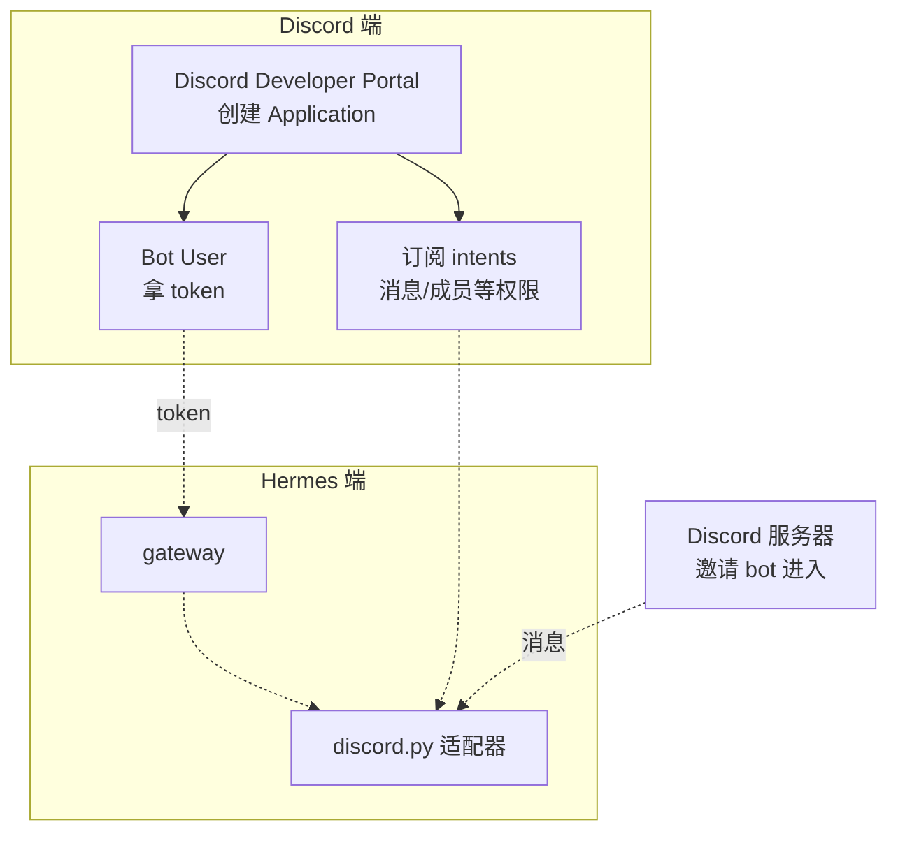
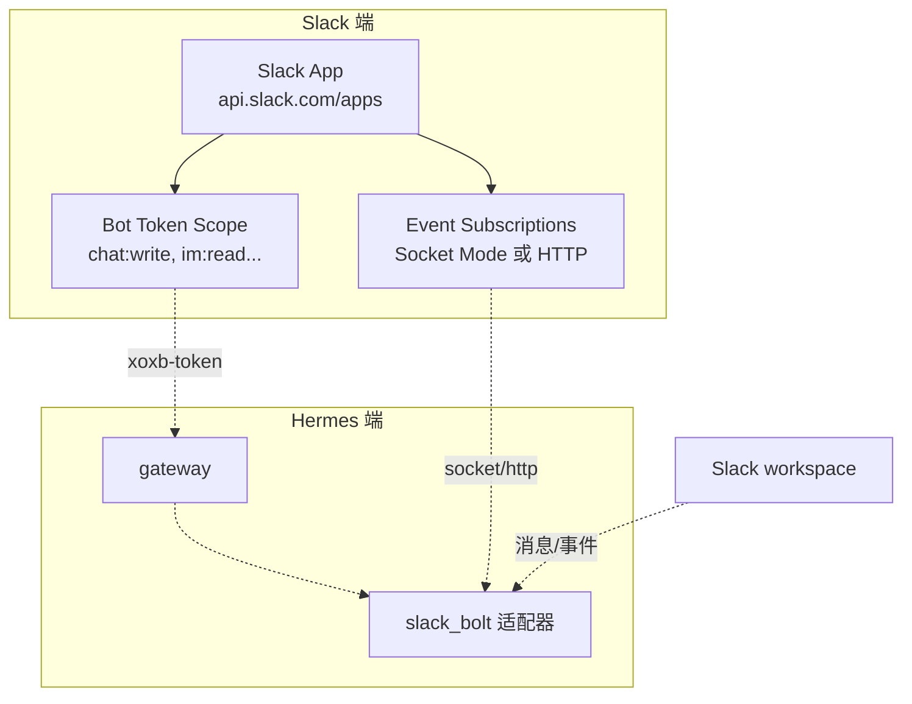

# 13. Discord / Slack 网关

## Discord

### 心智模型:bot 用户 + 意图订阅



Discord bot 的**核心概念**:
- **Application** —— 开发者在 [discord.com/developers](https://discord.com/developers/applications) 建
- **Bot User** —— Application 下的一个机器人身份,有独立 token
- **Intents** —— 声明你要接收哪些类型的事件(message、member join、reaction...)
- **Invite URL** —— 邀请 bot 进入服务器的链接,带权限 bitmask

### 最小实践:10 分钟搭 Discord bot

**Step 1 · 建 Application**

1. 登 [discord.com/developers/applications](https://discord.com/developers/applications)
2. **New Application** → 起名
3. 左侧 **Bot** → **Add Bot** → **Reset Token**,复制
4. **Privileged Gateway Intents** → 开 **Message Content Intent**(关键!否则 bot 读不到消息正文)

**Step 2 · 邀请进服务器**

左侧 **OAuth2** → **URL Generator**:
- Scopes: 勾 **bot** 和 **applications.commands**
- Bot Permissions: 至少勾 **Send Messages** / **Read Message History** / **Attach Files**
- 复制底部生成的 URL,在浏览器打开,选目标服务器

**Step 3 · 配置 Hermes**

```bash
hermes gateway setup
```

选 **Discord**,粘贴 token。可选:
- **allowed_roles**(v0.9 新增)—— 只允许某些角色的成员用 bot
- **home_channel_id** —— bot 主动发消息默认频道

**Step 4 · 启动**

```bash
hermes gateway start
```

在 Discord 服务器**@ 你的 bot + 消息**或**直接私聊**:

```
@MyHermes 你好
```

### Discord 特性

=== "Slash 命令"
    Hermes 的所有 slash 命令自动注册成 Discord native slash commands。在聊天框打 `/` 会弹出自动补全。

=== "Forum 频道"(v0.9+)
    Hermes 支持 Discord 论坛频道 —— 每个主题是独立 session。

=== "角色鉴权"(v0.9+)
    ```yaml
    messaging:
      discord:
        allowed_roles:
          - admin
          - devops
    ```
    只有带这些角色的用户能与 bot 交互。

=== "附件处理"
    用户上传的图片 / 文件,agent 会自动下载并传给视觉模型或作为 context。

### 常见坑

!!! warning "坑 · bot 看不到消息正文"
    **现象**:bot 响应 `/help`,但回话没反应。
    **原因**:Message Content Intent 没开。
    **对策**:Developer Portal 里开,重启 bot。

!!! warning "坑 · Privileged Intents 被拒"
    大型 bot(> 100 服务器)要申请 intent。个人用低于这个数不用申请。

!!! warning "坑 · bot 状态显示离线"
    gateway 没启动,或网络不通 Discord。`hermes gateway status` 查。

---

## Slack

### 心智模型:App + Bot + 事件订阅



Slack 的**两种连接模式**:
- **Socket Mode**(推荐个人 / 内部用)—— 不需要公网,bot 主动拉
- **HTTP Events**(推荐企业)—— 需要公网 URL,Slack 主动推

### 最小实践:用 Socket Mode 搭 Slack bot

**Step 1 · 建 App**

1. 登 [api.slack.com/apps](https://api.slack.com/apps)
2. **Create New App** → **From scratch** → 起名 + 选 workspace
3. 左侧 **Socket Mode** → 打开 → 生成 **App-level token**(`xapp-...`)
4. 左侧 **OAuth & Permissions** → **Bot Token Scopes** 加:
   - `app_mentions:read`
   - `chat:write`
   - `im:history` / `im:read` / `im:write`
   - `channels:history`
   - `users:read`
5. **Install to Workspace** → 拿 **Bot User OAuth Token**(`xoxb-...`)
6. 左侧 **Event Subscriptions** → 打开 → Subscribe to bot events:
   - `app_mention`
   - `message.im`

**Step 2 · 配置**

```bash
hermes gateway setup
```

选 Slack,填 `xoxb-` 和 `xapp-` 两个 token。

**Step 3 · 启动 + 测试**

```bash
hermes gateway start
```

在 Slack 里 `/invite @你的bot` 到频道,然后:

```
@hermes 你好
```

或私聊 bot(DM)。

### Slack 特性

=== "`/hermes` 子命令"
    Hermes 注册 `/hermes` 作为 Slack slash command,支持子命令:`/hermes new`、`/hermes model`、`/hermes skills`...
    
=== "线程"
    bot 默认在线程里回复 —— 不会刷屏。

=== "块消息(Block Kit)"
    Hermes 的 agent 输出尽量用 Slack Block Kit 格式化,图文、按钮、表格都有原生样式。

=== "DM 配对(Direct Message Pairing)"
    一个安全机制:用户首次在公共频道 @ bot 时,bot 自动私聊一个**配对码**,用户在 DM 里输入配对码才能"认证"。防止陌生人滥用。

### 常见坑

!!! warning "坑 · Socket Mode 连不上"
    看 `hermes gateway logs`。最常见是 App-level token 错(格式必须 `xapp-`)。

!!! warning "坑 · bot 不响应 @ 提及"
    确认在 **Event Subscriptions** 里加了 `app_mention` 事件订阅。

!!! warning "坑 · 企业版 Slack 不能用 Socket Mode"
    企业版(Enterprise Grid)强制 HTTP Events。配 `ngrok` 或正式域名,见官方文档。

---

## Discord vs Slack · 选哪个

| | Discord | Slack |
|---|---|---|
| **适合** | 社区 / 游戏 / 个人 | 工作 / 团队 |
| **连接模式** | WebSocket(内置) | Socket Mode 或 HTTP Events |
| **命令菜单** | native slash commands | `/hermes` 子命令 |
| **论坛 / 讨论串** | 原生 Forum 频道 | Threads |
| **鉴权粒度** | 服务器角色 / 频道 | Workspace scope + channel / user |
| **接入复杂度** | 简单 | 中等 |

**个人 / 朋友小组**:Discord。
**公司内部**:Slack(如果团队用 Slack)。

---

## 两平台都用:一个 gateway,双重身份

没必要开两个 gateway。**一个进程同时跑**:

```bash
hermes gateway setup
# 依次配置 Telegram + Discord + Slack + ...
hermes gateway start
```

gateway 会 fork/asyncio 同时监听所有平台。

**session 是跨平台的** —— 你在 Telegram 聊的任务,切到 Slack `/resume <session-id>` 能接着聊。

---

下一章:[14. 其他平台 + 中文生态 →](14-gateway-others.md)
