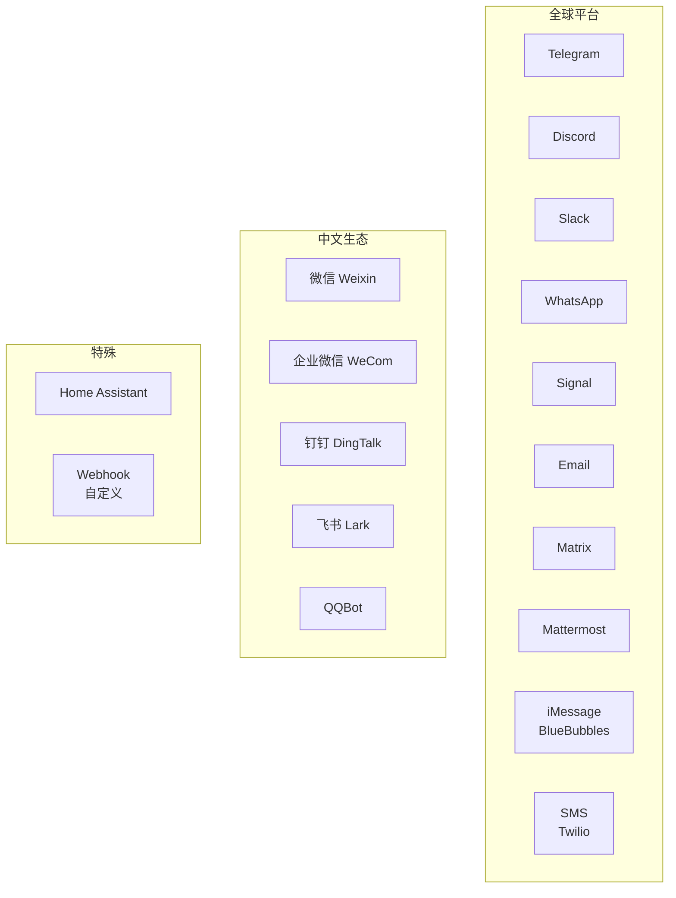
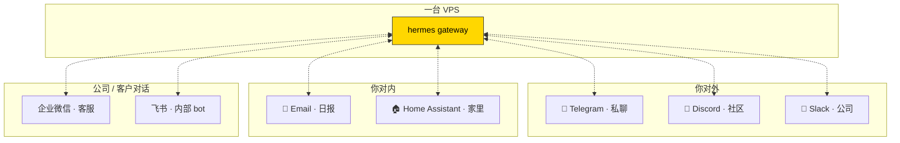

# 14. 其他平台 + 中文生态

## 全景:16+ 平台,分三类看



第 12、13 章讲了 Telegram / Discord / Slack 三大主流。本章补齐剩下 13 个。

---

## WhatsApp

**本质**:走 WhatsApp Business API(官方)或第三方适配(如 green-api)。

**门槛**:WhatsApp 官方 API 需要 Meta Business 验证。个人用门槛高。

**推荐路径**:
- 个人 → **Signal 更省心**
- 公司客户服务 → 走 WhatsApp Business API

配置:
```bash
hermes gateway setup
# 选 whatsapp,填 Business API credentials
```

---

## Signal

**本质**:基于 [signal-cli](https://github.com/AsamK/signal-cli)(一个无头 Signal 客户端)。

**优点**:端到端加密,最注重隐私。

**门槛**:需要一个**独立手机号**给 bot 用(Signal 号码绑定手机)。

**最小实践**:

```bash
# 1. 装 signal-cli
# Linux:
wget https://github.com/AsamK/signal-cli/releases/...
# macOS:
brew install signal-cli

# 2. 注册一个号码(或导入现有)
signal-cli -u +1xxx register

# 3. 配置 Hermes
hermes gateway setup
# 选 signal,填号码 + signal-cli 路径
```

---

## Email

**本质**:IMAP 监听收件 + SMTP 发件。

**用途**:
- 邮件转 agent(发邮件给 bot,agent 回邮件)
- 日报 / 告警主动推送(不用装 IM 客户端的人)
- **自动整理收件箱**(让 agent 分类 / 标记重要邮件)

**配置**:

```yaml
messaging:
  email:
    imap_host: imap.gmail.com
    imap_port: 993
    smtp_host: smtp.gmail.com
    smtp_port: 587
    username: yourbot@gmail.com
    password: ${EMAIL_APP_PASSWORD}   # Gmail 需要应用专用密码
    allowed_senders:
      - you@yourdomain.com
```

!!! warning "Gmail 要用 App Password,不是你的主密码"
    登 [myaccount.google.com/apppasswords](https://myaccount.google.com/apppasswords) 生成应用密码。

---

## Matrix

**本质**:开源分布式即时通讯协议,端到端加密,自托管可选。

**用途**:
- 开源社区 / 隐私敏感场景
- 自建服务器(Synapse / Dendrite / Conduit)

**门槛**:需要对 Matrix 有基础了解。

**配置**:
```yaml
messaging:
  matrix:
    homeserver_url: https://matrix.org
    user_id: "@yourbot:matrix.org"
    access_token: ${MATRIX_ACCESS_TOKEN}
```

v0.9+ 支持 E2E 加密(借助 `mautrix[encryption]` extra)。

---

## Mattermost

开源 Slack 替代。配置基本同 Slack(Bot token + webhook)。公司有自托管 Mattermost 时用。

---

## iMessage(BlueBubbles)· v0.9 新增

**本质**:iMessage 没有官方 API。[BlueBubbles](https://bluebubbles.app) 是第三方桥接方案 —— 在一台 Mac 上跑 BlueBubbles Server,Hermes 连它的 webhook。

**门槛**:需要一台**常开的 Mac** 登着你的 iCloud。

**流程**:
1. Mac 装 BlueBubbles Server,登录 iCloud
2. 获取 BlueBubbles password + server URL
3. `hermes gateway setup` 选 bluebubbles,填入

**用途**:给家人 / 苹果用户的朋友发消息时,agent 能参与。

---

## SMS(Twilio)

**本质**:通过 [Twilio](https://twilio.com) 账号发短信。

**用途**:
- 紧急通知(手机无网但有信号也能收)
- 给没装 IM 的人

**成本**:每条短信几美分,不适合高频。

---

## Home Assistant

**本质**:集成到你的智能家居系统。

**玩法**:
- 让 agent 读取家里传感器("客厅现在多少度?")
- 主动控制("把客厅灯调暗到 30%")
- 基于规则触发(当空气质量差时,agent 自动开净化器)

**配置**:
```yaml
messaging:
  homeassistant:
    url: http://homeassistant.local:8123
    token: ${HA_LONG_LIVED_TOKEN}
```

第 8 类工具 `homeassistant_*` 也配合这个。

---

## 中文生态

### 微信(Weixin)· v0.9 新增

**门槛**:微信没有官方开发者 API 给个人号。Hermes 走 [iLink Bot API](https://ilink.com) 第三方方案。

**用途**:跟微信好友 / 群聊里让 agent 参与(公司营销、客服场景)。

**坑**:
- 需要一个独立微信号(手机 + 验证)
- 风控风险(微信对第三方客户端不友好)
- 有消息延迟

**推荐**:**除非业务必须,否则不建议个人用**。

### 企业微信 WeCom

**两种模式**:
1. **官方应用**(主推)—— 走 WeCom 开放平台,合规
2. **Callback 模式**(v0.9 新增)—— 自建应用走回调 URL

**合规度**:企业自建应用,完全合规。

**用途**:公司内部,让员工在企业微信对话框与 agent 交互。

### 钉钉(DingTalk)

**v0.9 新增**:QR 码 OAuth、媒体上传、AI Cards(消息卡片式交互)、emoji 反应。

**用途**:钉钉生态的公司,做部门 bot。

**特色**:DingTalk AI Cards 能提供**卡片式交互**(按钮、选项、表单),比纯文本体验好。

### 飞书(Lark)

**v0.9-0.10 新增**:飞书文档评论智能回复(3 级访问控制)。

**用途**:
- 消息机器人
- **飞书文档里智能评论**(agent 在文档评论区自动回复)

### QQBot

**v0.9 新增**。QQ 开放平台 OAuth 登录,拉用户进 allow list,设置 home channel。

**用途**:做 QQ 群 bot,适合游戏 / 二次元社区。

---

## 多平台协同的真实部署



一个进程 / 一份 session / 一套技能,统一出口。

---

## systemd 部署模板

Linux 上生产环境,`~/.config/systemd/user/hermes-gateway.service`:

```ini
[Unit]
Description=Hermes Agent Gateway
After=network-online.target
Wants=network-online.target

[Service]
Type=simple
ExecStart=%h/.hermes/venv/bin/hermes gateway start
Restart=on-failure
RestartSec=10s
StandardOutput=journal
StandardError=journal
Environment="PYTHONUNBUFFERED=1"

[Install]
WantedBy=default.target
```

启用:

```bash
systemctl --user daemon-reload
systemctl --user enable hermes-gateway
systemctl --user start hermes-gateway
systemctl --user status hermes-gateway
journalctl --user -u hermes-gateway -f
```

!!! tip "v0.9 对 systemd 做了特殊处理"
    `hermes update` 会自动检测是否跑在 systemd 下,升级时**发 SIGTERM 给老进程**,systemd 自动拉起新版 —— 无缝重启。

---

## macOS launchd 部署模板

`~/Library/LaunchAgents/com.hermes.gateway.plist`:

```xml
<?xml version="1.0" encoding="UTF-8"?>
<plist version="1.0">
<dict>
    <key>Label</key><string>com.hermes.gateway</string>
    <key>ProgramArguments</key>
    <array>
        <string>/Users/you/.hermes/venv/bin/hermes</string>
        <string>gateway</string>
        <string>start</string>
    </array>
    <key>RunAtLoad</key><true/>
    <key>KeepAlive</key><true/>
    <key>StandardOutPath</key><string>/tmp/hermes-gw.log</string>
    <key>StandardErrorPath</key><string>/tmp/hermes-gw.err</string>
</dict>
</plist>
```

启用:

```bash
launchctl load ~/Library/LaunchAgents/com.hermes.gateway.plist
```

---

## 各平台能力对照表

| 平台 | 语音/图片 | 附件下载 | 主动发送 | 鉴权粒度 | 自托管 |
|---|:---:|:---:|:---:|---|:---:|
| Telegram | ✓ | ✓ | ✓ | user / chat | - |
| Discord | ✓ | ✓ | ✓ | role / channel | - |
| Slack | ✓ | ✓ | ✓ | user / channel / workspace | 企业版 |
| WhatsApp | ✓ | ✓ | ✓ | phone number | - |
| Signal | ✓ | ✓ | ✓ | phone number | ✓ (signal-cli) |
| Email | - | ✓ | ✓ | sender email | ✓ |
| Matrix | ✓ | ✓ | ✓ | matrix ID / room | ✓ |
| iMessage | ✓ | ✓ | ✓ | phone / AppleID | ✓ (BlueBubbles) |
| 微信 | ✓ | ✓ | ✓ | wxid | - |
| 企业微信 | ✓ | ✓ | ✓ | user / department | - |
| 钉钉 | ✓ | ✓ | ✓ | user / department | - |
| 飞书 | ✓ | ✓ | ✓ | user / tenant | - |

---

## 坑点总汇

### 坑 1 · 多平台 token 互串

**现象**:升级后所有平台都连不上。

**原因**:有时 `.env` 文件变量名变动 / 合并冲突。

**对策**:`hermes doctor` 核每个 token,`hermes gateway setup` 修漏的。

### 坑 2 · 国内平台频繁掉线

**现象**:微信 / 钉钉 / 企业微信偶发断连。

**原因**:这些平台有**严格的心跳机制**,网络抖动就断。

**对策**:v0.9+ 已改善:
- WeCom WebSocket 有 zombie session 检测 + 重连
- DingTalk 崩溃有自动重启
- 确保 `hermes update` 到最新

### 坑 3 · 消息延迟

**现象**:bot 回答几秒到几十秒不等。

**可能原因**(按概率):
1. LLM 模型延迟(切 Fast Mode 或换模型)
2. 工具调用等 IO(下载、SSH、API 调用)
3. gateway 负载(太多平台并发)
4. 网络延迟(代理 / VPN)

诊断:`hermes gateway logs` 看每一步耗时。

### 坑 4 · 图片 / 附件处理

**现象**:用户发图,agent 收到 "附件 N 个,未解析"。

**原因**:
- 没开视觉模型
- 视觉 provider API key 无效
- 附件太大被截

**对策**:`hermes tools` 确保 `vision` 启用,`hermes doctor` 核 key。

---

下一章:[15. 定时任务 cron 深入 →](15-cron-deep-dive.md)
