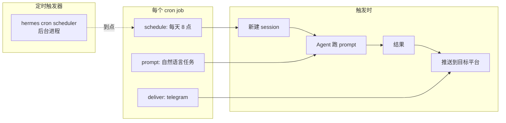

# 15. 定时任务 cron 深入

## 心智模型:cron = 定时的 user message



关键认知:
- **每次触发是独立 session** —— 不会继承上一次的上下文
- **但 memory / USER.md / skills 仍注入** —— agent 记得你是谁、偏好什么
- **结果投递到任何配置好的平台** —— Telegram / Discord / Slack / Email / 甚至多个

---

## 最小实践:5 个真实 cron 剧本

### 剧本 1 · 每日 GitHub 活动报告

```bash
hermes cron add \
    --at "08:00" \
    --deliver telegram \
    "总结我昨天在 GitHub 上的活动:提交、评论、开/关的 issue 和 PR。按仓库分组,200 字以内。"
```

每天早 8 点,Telegram 收到一段昨日工作总结。

### 剧本 2 · 每周一 PR 审查提醒

```bash
hermes cron add \
    --at "Mon 09:00" \
    --deliver slack \
    "扫一下 BeamusWayne 组织下所有仓库,列出还没 merge 的 PR。\
     按等待时长排序,超过 3 天的标红。\
     给出 channel #eng 的消息。"
```

### 剧本 3 · 监控网站健康

```bash
hermes cron add \
    --every 15m \
    --deliver telegram \
    --only-on-change \
    "curl -I https://mysite.com/health 看返回码。\
     不是 200 就告诉我状态码 + 最近 50 行 nginx 错误日志。"
```

`--only-on-change`:只在结果变化时推送,健康的话静默。

### 剧本 4 · 每周五写给自己的总结信

```bash
hermes cron add \
    --at "Fri 18:00" \
    --deliver email \
    "用 session_search 回顾本周我们的讨论,\
     按主题分组,列出:已解决 / 推进中 / 搁置。\
     给我写成一封 800 字周报邮件,收件人:self@yourdomain.com"
```

### 剧本 5 · 凌晨备份

```bash
hermes cron add \
    --at "03:00" \
    --deliver email \
    "hermes backup -o ~/backups/hermes-$(date +%Y%m%d).tar.gz。\
     备份完了 rsync 到 s3://mybackup-bucket/。\
     出错就发邮件给我。"
```

---

## 调度语法

Hermes 的调度支持**三种写法**,内部都转成标准 cron 表达式(通过 `croniter`)。

=== "🎯 自然语言"
    ```bash
    --at "08:00"           # 每天 8:00
    --at "Mon 09:00"       # 每周一 9:00
    --at "1st 10:00"       # 每月 1 号 10:00
    --every 15m            # 每 15 分钟
    --every 2h             # 每 2 小时
    --every 1d             # 每天(指定时间)
    ```

=== "⏰ 标准 cron"
    ```bash
    --cron "0 8 * * *"          # 每天 8:00
    --cron "0 9 * * 1"          # 周一 9:00
    --cron "*/15 * * * *"       # 每 15 分钟
    --cron "0 0 1 * *"          # 每月 1 号 0:00
    ```

=== "📅 ISO 一次性"
    ```bash
    --once "2026-04-20T18:00:00"  # 只跑一次
    ```

---

## 全部命令

```bash
# 创建
hermes cron add [options] "<prompt>"

# 列出
hermes cron list                    # 所有任务
hermes cron list --active           # 只活跃的
hermes cron show <id>               # 单个任务详情

# 管理
hermes cron pause <id>              # 暂停
hermes cron resume <id>             # 恢复
hermes cron remove <id>             # 删除
hermes cron edit <id>               # 改(部分字段)

# 测试
hermes cron test <id>               # 立即跑一次(不改计划)
hermes cron next <id>               # 看下次什么时候跑

# 日志
hermes cron history <id>            # 历史运行记录
hermes cron logs <id>               # 最近运行日志
```

---

## 投递参数详解

```bash
--deliver <target>
```

`<target>` 支持:

| 值 | 投递到 |
|---|---|
| `telegram` | 默认 Telegram 聊天 |
| `telegram:@username` | 指定 Telegram 用户 |
| `discord:<channel_id>` | Discord 指定频道 |
| `slack:#channel` | Slack 指定 channel |
| `slack:@user` | Slack 指定用户 DM |
| `email:to@example.com` | 邮件给指定人 |
| `log` | 只写日志,不推送 |
| `multi` | 多渠道,需要下面的 deliver_to |

多渠道:

```bash
hermes cron add --at "08:00" --deliver multi \
    --deliver-to telegram,email:you@example.com \
    "每日任务"
```

---

## 高级配置

### 失败重试

```bash
hermes cron add --at "08:00" \
    --retry 3 \
    --retry-delay 5m \
    --deliver telegram \
    "..."
```

失败 3 次,每次间隔 5 分钟。超过后**通知你失败原因**。

### 超时

```bash
hermes cron add --every 1h \
    --timeout 10m \
    --deliver telegram \
    "..."
```

单次执行超过 10 分钟自动中止。

### 只在变化时通知

```bash
hermes cron add --every 15m \
    --only-on-change \
    ...
```

Hermes 存上次结果,比对后决定是否推送。适合**监控场景**(健康检查、价格追踪)。

### 指定模型

```bash
hermes cron add --at "08:00" \
    --model openrouter/google/gemini-2.5-flash \
    --deliver telegram \
    "总结昨日 GitHub 活动"
```

!!! tip "cron 任务建议用便宜快的模型"
    定时任务频率高,用贵模型一个月账单很多。**除非任务真的需要推理深度**,优先选 Gemini Flash / DeepSeek / Kimi K2.5。

### 指定 Profile

```bash
hermes cron add -p work --at "09:00" ...
```

用 `work` profile 的模型 / 技能 / memory 跑。**个人 cron 跟工作 cron 用不同 profile** 是常见最佳实践。

### Origin 回退(v0.9+)

任务结果可以**沿用触发来源的平台**投递 —— 如果 cron 是从 Telegram 里创建的,默认 deliver 就是那个 Telegram 用户。不用每次写 `--deliver`。

---

## cron 的数据持久化

```bash
~/.hermes/
├── cron/
│   ├── jobs.json           # 所有 cron job 定义
│   ├── history/            # 每次运行的日志
│   │   └── <job_id>/
│   │       └── 2026-04-18_080000.log
│   └── state/              # --only-on-change 的上次结果
```

---

## 真实场景:个人日报 bot

假设你想搭一个真正能用的日报系统:

```bash
# 1. 早 8 点汇总
hermes cron add --at "08:00" --deliver telegram -p personal \
    "今天日报:\
     - yesterday.md 里看我记了什么\
     - GitHub 最近 24h 活动\
     - 日历今天有什么会\
     - 昨晚邮件 5 封以上的发件人\
     全部汇总成一条 Telegram 消息,300 字以内"

# 2. 每 2 小时主动提醒今日待办
hermes cron add --every 2h --deliver telegram -p personal \
    --only-on-change \
    "看看 todo.md,剩 3 项未完成的给我条消息提醒,\
     已经做了进度的不提"

# 3. 睡前总结
hermes cron add --at "23:00" --deliver telegram -p personal \
    "今天做了什么?\
     用 session_search 搜今天我跟你的对话,\
     总结 3 件完成的事 + 1 件最困难的事,\
     追加到 ~/journal/$(date +%Y-%m-%d).md"
```

**这就是一套完整的个人生产力系统**。

---

## 坑点

### 坑 1 · 时区问题

**现象**:你设 `08:00`,但 bot 在凌晨 4 点响应。

**原因**:cron 用的时区不是你的本地时区。

**对策**:
```bash
# 查当前时区
hermes config get cron.timezone

# 改
hermes config set cron.timezone Asia/Shanghai
```

### 坑 2 · cron scheduler 没跑

**现象**:任务一直不触发。

**排查**:
```bash
hermes gateway status    # scheduler 在 gateway 进程里,gateway 必须启动
```

如果没启 gateway,cron 不会执行。想**只跑 cron 不跑网关**也行:
```bash
hermes cron start       # 只启 cron 进程
```

### 坑 3 · 任务占满 API 额度

**现象**:某个 `--every 5m` 任务一个月吃了几十刀 credit。

**对策**:
- 用便宜模型(`--model gemini-2.5-flash`)
- 加 `--only-on-change`,没变化不跑模型(优化待实现)
- 降频(5m → 30m / 1h)

### 坑 4 · 任务卡住

**现象**:一个任务跑了几小时还不结束,把 gateway 堵住。

**对策**:
- **必须加 `--timeout`**,尤其涉及网络 / 终端的任务
- `hermes cron kill <id>` 强杀当前运行的实例

### 坑 5 · 重启 gateway 后 cron 全重跑

**现象**:`hermes gateway restart` 后所有 cron 立即触发一次,刷屏。

**原因**:scheduler 恢复时**检查是否错过了计划时间**,错过了就立刻补跑。

**对策**:
- 设 `--skip-missed true`(默认就是 true,但老版本可能是 false)
- 重启前 `hermes cron pause-all`,重启后 `resume-all`

---

## 进阶

- 第 20 章 `--deliver` 参数结合 Slack 线程 / Discord forum 的高级投递
- 第 22 章(第四部)—— cron scheduler 源码(cron/scheduler.py)走读
- 跨 profile 的任务调度策略

---

下一章:[16. Profile 多实例 + 备份 →](16-profile-backup.md)
