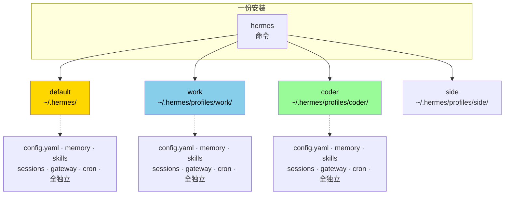

# 16. Profile 多实例 + 备份

## 心智模型:一个 Hermes,多个平行身份



**Profile 是什么**:一套完全隔离的**数据 + 配置 + gateway**。共用二进制,但一切状态独立。

**为什么要 Profile**:
- 👨‍💼 工作 vs 生活分离(不同模型额度、不同记忆、不同 gateway token)
- 🏢 多公司账号(你给 A 公司做外包 + 给 B 公司做咨询)
- 🧪 实验隔离(试新 config 别弄坏主配置)
- 🎭 身份切换(个人、团队、客户 bot)

---

## 最小实践:创建和使用 Profile

### 创建

```bash
hermes profile create work
```

Hermes 会:
1. 建目录 `~/.hermes/profiles/work/`
2. 复制默认 config 模板过去
3. 初始化空的 memory / skills / sessions

### 用

```bash
hermes -p work              # 进入 work profile 的 TUI
hermes -p work model        # 配 work profile 的模型
hermes -p work gateway start # work profile 的 gateway
hermes -p work cron list    # work profile 的 cron
```

**`-p <name>` 加在子命令前面**。不加就是默认 profile(`default`)。

### 列出 / 切默认 / 删

```bash
hermes profile list                     # 列所有
hermes profile show work                # 看某 profile 详情
hermes profile set-default work         # 改默认 profile
hermes profile remove work              # 删(会 prompt 确认)
hermes profile rename work company-a    # 改名
```

---

## Profile 之间数据完全隔离

| 数据 | 隔离? |
|---|:---:|
| `config.yaml` | ✓ |
| `.env` API keys | ✓ |
| `memory/` | ✓ |
| `skills/` | ✓ |
| `sessions.db` | ✓ |
| `personalities/` | ✓ |
| `skins/` | ✓ |
| gateway 的 Telegram / Discord 等 token | ✓ |
| cron 任务 | ✓ |

→ 这意味着:**默认 profile 的 bot 跟 work profile 的 bot 可以是两个 Telegram 账号,绑两个不同 API key 池**。

**不隔离的**:
- Hermes 二进制本身
- 全局 Python 包
- 全局环境变量(除非 profile 自己 override)

---

## 实战模式

### 模式 A · 工作 / 个人二分

```bash
# 默认 profile → 个人
hermes model
# 配 OpenRouter + 你的个人 Telegram bot

# 新建 work profile
hermes profile create work
hermes -p work model
# 配公司 Anthropic key + 公司 Slack bot
```

平时:
```bash
alias w='hermes -p work'
alias h='hermes'        # 默认
```

一天交替:
```bash
$ h                    # 个人闲聊
$ w                    # 工作任务
```

### 模式 B · 客户隔离

做自由职业,每个客户一个 profile:

```bash
hermes profile create client-acme
hermes profile create client-corp
hermes profile create personal
```

每个 profile 有独立:
- memory(这个客户的约定、术语)
- skills(这个客户的流程)
- sessions(这个客户的对话全存着)

**客户结束合作时** → `hermes profile remove client-xxx`,一键全删,不串味。

### 模式 C · 实验隔离

试一个激进新配置,不想搞砸主 profile:

```bash
hermes profile create experiment
hermes -p experiment setup   # 从头配
# 玩坏了也没事
hermes profile remove experiment
```

### 模式 D · 团队共享,个人定制

团队共享某些东西(比如 memory、skills),但各自有独立 Profile:

```bash
# 共享仓库
git clone git@github.com:team/hermes-shared.git ~/team-hermes

# 每个人的 profile 里做软链接
ln -s ~/team-hermes/memory/TEAM.md ~/.hermes/profiles/work/memories/TEAM.md
ln -s ~/team-hermes/skills ~/.hermes/profiles/work/skills/team
```

更新共享内容只需 `git pull`。

---

## `hermes backup` / `hermes import`(v0.9 新增)

### 心智模型

```mermaid
graph LR
    P[~/.hermes/profiles/work/] --> B[hermes backup]
    B --> T[.tar.gz 归档]
    T --> I[hermes import]
    I --> P2[~/.hermes/profiles/work/<br/>(另一台机器)]
```

**一个命令打包所有** —— config、.env、memory、skills、sessions、personalities、skins、cron、gateway 配置,统统打包。

### 最小实践

**备份**:

```bash
hermes backup -o ~/hermes-backup-$(date +%Y%m%d).tar.gz
```

产物是 tarball,大小几 MB 到几百 MB(取决于 sessions.db 大小)。

**可选参数**:

```bash
hermes backup --profile work -o ~/work-snapshot.tar.gz   # 只备份某个 profile
hermes backup --exclude sessions -o ...                   # 不含历史对话
hermes backup --include-only memory,skills -o ...         # 只含特定内容
```

**恢复**:

```bash
hermes import ~/hermes-backup-20260418.tar.gz
```

默认**交互式 diff** —— 告诉你哪些文件会被覆盖,让你选。

### 跨机迁移剧本

```bash
# 旧机器
$ hermes backup -o /tmp/hermes.tar.gz
$ scp /tmp/hermes.tar.gz new-machine:/tmp/

# 新机器
$ curl -fsSL https://raw.githubusercontent.com/NousResearch/hermes-agent/main/scripts/install.sh | bash
$ hermes import /tmp/hermes.tar.gz
$ hermes                       # 完美续跑
```

**整个过程 5 分钟,所有 memory / skills / sessions / cron / gateway 配置都原样过来**。

### 升级前快照

```bash
# 升级前
hermes backup -o ~/pre-upgrade-$(date +%Y%m%d).tar.gz

# 升级
hermes update

# 发现新版有 bug 不顺手?
hermes pip install hermes-agent==0.9.0   # 降回去
hermes import ~/pre-upgrade-20260418.tar.gz
```

---

## Profile 操作的底层机制

Hermes 的 profile 靠一个**环境变量**:`HERMES_HOME`。

```bash
# 默认
echo $HERMES_HOME       # 空 → 用 ~/.hermes
hermes                  # 进默认 profile

# 用 profile
hermes -p work          # 等价于设置 HERMES_HOME=~/.hermes/profiles/work
```

**所有代码都通过 `get_hermes_home()` 读取** —— 这意味着你也可以手动控制:

```bash
# 直接设环境变量
export HERMES_HOME=~/.hermes/profiles/work
hermes                  # 等价于 hermes -p work
```

**一个实用技巧**:用 shell 窗口区分

```bash
# 窗口 A (个人)
$ hermes

# 窗口 B (工作)
$ export HERMES_HOME=~/.hermes/profiles/work
$ hermes
```

两个窗口 Hermes **同时跑,完全隔离**。

---

## 坑点

### 坑 1 · 忘了带 `-p`

**现象**:以为在 work profile 操作,实际动了 default。

**对策**:
- 看 TUI 顶部 banner,会显示 `Profile: xxx`
- 在 shell 提示符里显示当前 `HERMES_HOME`:
  ```bash
  # ~/.zshrc
  precmd() {
      [ -n "$HERMES_HOME" ] && export PS1_HERMES="[${HERMES_HOME##*/}] " || export PS1_HERMES=""
  }
  ```

### 坑 2 · gateway token 冲突

**现象**:default 和 work 都配了 Telegram,两个 gateway 想连同一 bot,冲突。

**原因**:Telegram 同一 bot 同时只能一个 webhook / polling 进程。

**对策**:
- **每个 profile 用不同 bot**(最干净)
- 或者只启动一个 profile 的 gateway

v0.9+ 有 **token lock 机制** —— 同一 token 会阻止第二个 profile 启动 gateway 时占用。

### 坑 3 · Profile 之间要共享某个文件

**现象**:你希望所有 profile 都用同一个 USER.md,不想每个 profile 重写一遍。

**对策**:用 symlink:
```bash
# 把所有 work profile 的 USER.md 指向默认
rm ~/.hermes/profiles/work/memories/USER.md
ln -s ~/.hermes/memories/USER.md ~/.hermes/profiles/work/memories/USER.md
```

### 坑 4 · `hermes profile remove` 真的删

**现象**:误删了一个 profile。

**对策**:这个命令**不可逆**。事先:
- 设 `hermes config set profiles.confirm_remove true`(强制二次确认)
- 删之前先 `hermes backup --profile <name> -o ...`

### 坑 5 · 备份文件泄露

**现象**:备份里有 `.env` 明文 API key,不小心 push 到 git 了。

**对策**:
- 备份目录**加入 .gitignore**
- 放在加密云盘(如 cryptomator 卷)
- 企业环境:用 keyring 代替 `.env`,backup 不包含 key

---

## 进阶

- 第 27 章(第四部)· **Profile 工作原理** —— `_apply_profile_override` 源码走读
- Token lock 的实现细节

---

下一章:[17. 配置文件详解 →](17-config-yaml.md)
