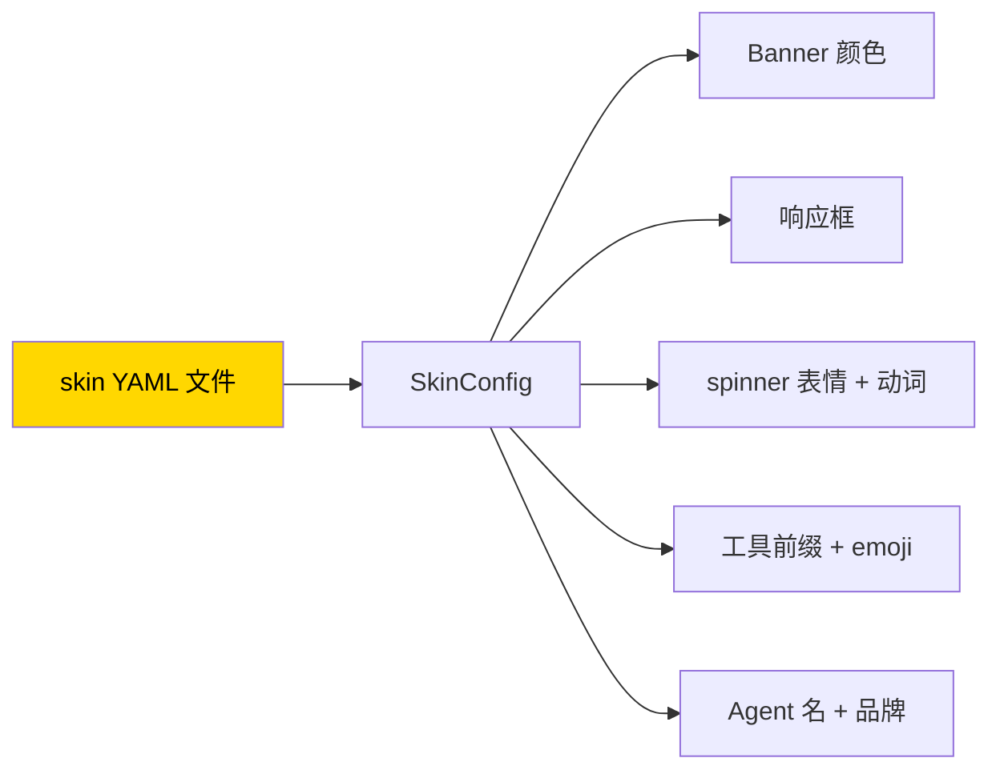

# 18. 皮肤定制

## 心智模型:皮肤是纯数据



**重点**:
- 皮肤**零代码** —— 写 YAML 就够
- 所有可视元素**数据化** —— 改颜色、改 emoji、改提示符、改 agent 名
- **内置 4 套** + 你自己的**无限个**

---

## 内置皮肤一览

=== "default"
    经典金色 + kawaii 颜文字。
    ```
    ╭─ Hermes Agent ────────╮
    │  ☤ (◕‿◕) 琢磨中...    │
    ╰───────────────────────╯
    ```

=== "ares"
    战神主题,深红 + 青铜。
    ```
    ╭─ ARES ─────────────────╮
    │  ⚔ ⟨⚡ 战意澎湃 ⚡⟩    │
    ╰────────────────────────╯
    ```

=== "mono"
    极简灰度。无装饰,专注内容。

=== "slate"
    冷调蓝,开发者向。

### 切换皮肤

```text
> /skin ares
```

或写进 config:

```bash
hermes config set display.skin slate
```

---

## 写自己的皮肤

皮肤文件放:`~/.hermes/skins/<name>.yaml`

### 最小可用皮肤

```yaml
# ~/.hermes/skins/minimal.yaml
name: minimal
description: 极简白皮肤

colors:
  banner_border: "#888888"
  banner_title: "#000000"

branding:
  agent_name: "Agent"
  response_label: " · Agent · "
  prompt_symbol: "$"

tool_prefix: "|"
```

应用:

```text
> /skin minimal
```

### 全字段皮肤(我的 cyberpunk 示例)

```yaml
# ~/.hermes/skins/cyberpunk.yaml
name: cyberpunk
description: 霓虹赛博朋克主题

# 所有可配色
colors:
  banner_border: "#FF00FF"
  banner_title: "#00FFFF"
  banner_accent: "#FF1493"
  banner_dim: "#666666"
  banner_text: "#E0E0E0"
  response_border: "#00FF88"

# 加载等待时的动画
spinner:
  # 「等待」状态(刚发出消息)的 face 循环
  waiting_faces:
    - "⟨⚡⟩"
    - "⟨⟨⚡⟩⟩"
    - "⟨⟨⟨⚡⟩⟩⟩"

  # 「思考」状态(模型真的在跑)的 face
  thinking_faces:
    - "[ ▒ ]"
    - "[ ▓ ]"
    - "[ █ ]"

  # 动词循环(一句提示语)
  thinking_verbs:
    - "jacking in"
    - "decrypting"
    - "uploading"
    - "tracing"
    - "breaching"

  # 可选:装饰性翅膀 / 侧饰
  wings:
    - ["⟨⚡", "⚡⟩"]
    - ["【●】", "【●】"]

# 品牌文案
branding:
  agent_name: "NET RUNNER"
  welcome: "Jack in. Link ready."
  response_label: " ⚡ CYBER "
  prompt_symbol: "▸"

# 工具输出前缀(可以用任何字符)
tool_prefix: "▏"

# 每个工具的专属 emoji(可选)
tool_emojis:
  terminal: "⚙"
  file_read: "📜"
  file_write: "🖋"
  file_edit: "✎"
  grep: "🔎"
  web_search: "🌐"
  browser_navigate: "🚀"
  image_generation: "🎨"
  tts: "🔊"
  memory: "🧠"
  delegate_task: "🔀"
```

---

## 皮肤字段完整参考

| 组 | 字段 | 示例 | 说明 |
|---|---|---|---|
| 元信息 | `name` | `"cyberpunk"` | 必填,唯一 |
| 元信息 | `description` | 一句话 | 可选 |
| colors | `banner_border` | `"#FF00FF"` 或 `"bright_magenta"` | Banner 边框色 |
| colors | `banner_title` | | Banner 标题色 |
| colors | `banner_accent` | | Banner 强调色 |
| colors | `banner_dim` | | 次要文字色 |
| colors | `banner_text` | | 正文色 |
| colors | `response_border` | | 响应框边框 |
| spinner | `waiting_faces` | 数组 | 等待时循环 |
| spinner | `thinking_faces` | 数组 | 模型跑时循环 |
| spinner | `thinking_verbs` | 数组 | 动词循环 |
| spinner | `wings` | 二维数组 | 可选装饰 |
| branding | `agent_name` | `"My Agent"` | 替换"Hermes Agent" |
| branding | `welcome` | | 启动欢迎语 |
| branding | `response_label` | ` " 💡 "` | 响应框标签 |
| branding | `prompt_symbol` | `">"` | 输入提示符 |
| | `tool_prefix` | `"┊"` | 工具输出前缀字符 |
| | `tool_emojis` | `{...}` | 每个工具一个 emoji |

**颜色支持**:
- 十六进制:`"#RRGGBB"`
- Rich 颜色名:`"red"` / `"bright_magenta"` / `"cyan"`
- 256 色:`"color(201)"`

---

## 继承 default 的缺省

你**不需要写全所有字段**。缺的自动从 default 皮肤继承。

最小皮肤可能只有 3 行:

```yaml
name: spring
description: 春季粉色
colors:
  banner_border: "#FFB6C1"
```

剩下一切用 default 的。

---

## 应用场景

### 场景 1 · 工作日 vs 周末

```yaml
# ~/.hermes/skins/work.yaml
name: work
description: 专注工作
colors:
  banner_border: "#4A90E2"
  banner_accent: "#2C3E50"
branding:
  agent_name: "Work Agent"
spinner:
  thinking_verbs: ["analyzing", "deliberating", "reviewing"]
```

```yaml
# ~/.hermes/skins/weekend.yaml
name: weekend
description: 放松模式
colors:
  banner_border: "#FF69B4"
branding:
  agent_name: "Weekend Pal"
  welcome: "Take it easy! Let's have fun."
spinner:
  thinking_verbs: ["pondering", "musing", "daydreaming"]
```

### 场景 2 · 节日主题

```yaml
# holiday.yaml
name: holiday-xmas
spinner:
  thinking_faces: ["🎄", "⛄", "🎁"]
  thinking_verbs: ["wrapping gifts", "caroling", "sipping cocoa"]
colors:
  banner_border: "#C41E3A"
  banner_accent: "#165B33"
```

### 场景 3 · 公司品牌

```yaml
# company.yaml
name: acme-brand
colors:
  banner_border: "#FF5500"    # 公司主色
  banner_title: "#FFFFFF"
branding:
  agent_name: "Acme Intelligence"
  welcome: "Acme AI · 助力一切业务"
  prompt_symbol: "⟩"
```

团队成员 `cp` 到 `~/.hermes/skins/` 就都用上了。

---

## 皮肤分享

### Skin Pack(社区)

没有官方 Skin Hub(目前),但可以:

- **GitHub 建仓库** `your-hermes-skins`,放 `.yaml` 文件
- **README 里附截图**(Hermes TUI 截屏)
- **分享链接** —— 别人 `curl -o ~/.hermes/skins/xxx.yaml <url>` 就用上了

### 社区已有皮肤(示例)

(本书第一版没有官方列表。社区自发分享的可以在 Discord #skins 频道交流。)

---

## 命令速查

```bash
hermes config set display.skin ares        # 设默认皮肤
hermes config get display.skin             # 看当前
```

```text
> /skin                    # 对话内列出可用皮肤
> /skin cyberpunk          # 切换
> /skin default            # 回默认
```

---

## 坑点

### 坑 1 · YAML 错格式

**现象**:启动报 `yaml.scanner.ScannerError` 或皮肤不生效直接回默认。

**排查**:
- 缩进纯空格
- 数组用 `-` 开头
- 字符串含特殊字符加引号
- 用 VSCode 的 YAML 插件验证

### 坑 2 · 终端不支持 24-bit 颜色

**现象**:十六进制颜色显示成近似的 8 色。

**原因**:旧版 terminal 只支持 8 / 256 色。

**对策**:
- 升级终端(iTerm2 / Alacritty / Kitty / Windows Terminal 都支持 truecolor)
- 或改用 256 色:`"color(201)"`

### 坑 3 · emoji 显示 `?`

**现象**:tool_emojis 或 thinking_faces 里的 emoji 变问号。

**原因**:终端字体不含这些字符。

**对策**:装支持 emoji 的字体(如 Nerd Font)。

### 坑 4 · 改了 skin 但启动还是默认

**现象**:`config set display.skin xxx` 成功,启动仍是 default 色。

**排查**:
- **文件名**跟 `name` 字段**必须一致** —— `my-skin.yaml` 里 `name: my-skin`
- 文件权限(能读吗)
- 重启 CLI 才生效(不热加载)

### 坑 5 · 不希望所有 prompt 都定制

**现象**:你想保留 default 的 banner 但只改 spinner。

**对策**:**只写你要覆盖的字段**。没写的自动继承 default。

---

## 进阶

- 源码:`hermes_cli/skin_engine.py` —— 看 `_BUILTIN_SKINS` 结构,复制改
- 第 30 章(第四部)—— 添加 built-in skin 的 PR 流程

---

下一章:[19. MCP 集成 + Web Dashboard →](19-mcp-dashboard.md)
