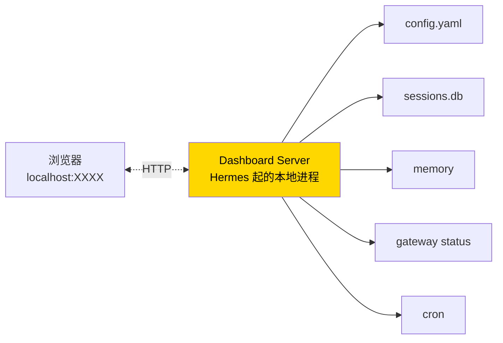

# 19. MCP 集成 + Web Dashboard

## Part A · MCP(Model Context Protocol)

### 心智模型:MCP 是 agent 的 USB-C 接口

```mermaid
graph TB
    subgraph "Hermes Agent"
        H[Agent]
        MC[MCP Client]
        H --> MC
    end

    subgraph "MCP Servers (各自进程)"
        S1[GitHub<br/>@modelcontextprotocol/server-github]
        S2[Notion<br/>notion-mcp-server]
        S3[Postgres<br/>mcp-server-postgres]
        S4[Linear<br/>linear-mcp-server]
        S5[...]
    end

    MC <-.JSON-RPC over stdio/http.-> S1 & S2 & S3 & S4 & S5

    style H fill:#FFD700,color:#000
    style MC fill:#87CEEB,color:#000
```

**MCP 是什么**(一句话):Anthropic 提出的开放协议,**让 AI agent 和外部工具 / 数据源之间有统一接口**。

**为什么革命性**:
- 装一个 MCP server = agent 多一组工具
- **不用改 Hermes 源码**,不用等官方支持某第三方
- 社区服务器爆炸式增长,几乎所有主流 SaaS 都有

---

### 最小实践:接 GitHub MCP

**Step 1 · 确认你有 Node.js**(或 uv)

```bash
node --version    # 18+
# 或
uv --version
```

大多数 MCP server 用 `npx` 或 `uvx` 起。

**Step 2 · 建 GitHub Personal Access Token**

[github.com/settings/tokens](https://github.com/settings/tokens) → 新建 token。

推荐 scope:`repo` + `read:org`。

**Step 3 · 配置 Hermes**

编辑 `~/.hermes/config.yaml`:

```yaml
tools:
  mcp:
    servers:
      github:
        command: npx
        args: ["-y", "@modelcontextprotocol/server-github"]
        env:
          GITHUB_PERSONAL_ACCESS_TOKEN: ${GITHUB_TOKEN}
```

在 `~/.hermes/.env` 加:

```bash
GITHUB_TOKEN=ghp_xxxxxxx
```

**Step 4 · 重启并验证**

```bash
hermes
```

```text
> 列出我最近创建的 3 个 GitHub 仓库
```

agent 会调用 `mcp_github_search_repositories`:

```
┊ mcp_github_search_repositories(q="user:BeamusWayne", sort="created")
```

看到 `mcp_<server>_<tool>` 格式的调用,说明 MCP 接好了。

---

### 常用 MCP Server

| Server | 做什么 | 安装 |
|---|---|---|
| **GitHub** | 仓库 / issue / PR | `@modelcontextprotocol/server-github` |
| **Notion** | 页面读写 | `notion-mcp-server` |
| **Linear** | 工单管理 | `linear-mcp-server` |
| **Postgres** | 查数据库(只读或可写) | `mcp-server-postgres` |
| **Sqlite** | 本地 sqlite | `mcp-server-sqlite` |
| **Slack** | 官方 MCP(跟 Hermes 自带的 Slack gateway 不同层) | `@modelcontextprotocol/server-slack` |
| **Google Drive** | 文件浏览 | `@modelcontextprotocol/server-gdrive` |
| **Memory** | KV 存储(独立于 Hermes memory) | `@modelcontextprotocol/server-memory` |
| **Brave Search** | 搜索 | `@modelcontextprotocol/server-brave-search` |
| **Filesystem** | 让 agent 访问任意目录 | `@modelcontextprotocol/server-filesystem` |

完整列表:[github.com/modelcontextprotocol/servers](https://github.com/modelcontextprotocol/servers)

---

### MCP 配置模式

=== "stdio(推荐)"
    ```yaml
    servers:
      myserver:
        command: npx
        args: ["-y", "some-mcp-server"]
        env:
          KEY: value
    ```
    MCP server 作为子进程跑,Hermes 通过 stdio 通信。**最简单**,适合本地。

=== "HTTP"
    ```yaml
    servers:
      myserver:
        url: http://localhost:8080/mcp
        headers:
          Authorization: "Bearer ${TOKEN}"
    ```
    MCP server 是独立 HTTP 服务。适合**远程 MCP server** 或多个 Hermes 实例共用。

=== "OAuth"
    ```yaml
    servers:
      gmail:
        command: uvx
        args: ["mcp-server-gmail"]
        oauth:
          client_id: ${GMAIL_CLIENT_ID}
          client_secret: ${GMAIL_CLIENT_SECRET}
          redirect_uri: http://localhost:8765/oauth
    ```
    MCP server 需要 OAuth 授权,Hermes 走**本地浏览器授权流程**。

---

### 多 MCP server 组合场景

```yaml
servers:
  github:
    command: npx
    args: ["-y", "@modelcontextprotocol/server-github"]
    env: { GITHUB_PERSONAL_ACCESS_TOKEN: ${GITHUB_TOKEN} }

  linear:
    command: npx
    args: ["-y", "linear-mcp-server"]
    env: { LINEAR_API_KEY: ${LINEAR_API_KEY} }

  db:
    command: uvx
    args: ["mcp-server-postgres", "--connection-string", "${DATABASE_URL}"]
```

Agent 现在可以:
```text
> Linear 上有一个 ENG-1234,帮我看它引用的 PR 是不是已经 merge,
> 如果 merge 了,去数据库把 features 表里那条对应 feature_flag 设成 enabled。
```

Agent 会:`mcp_linear_*` 查 issue → `mcp_github_*` 查 PR → `mcp_postgres_*` 改数据。**跨系统协调**。

---

### MCP 管理命令

```bash
# 列出已配置的 server
hermes config get tools.mcp.servers

# 对话里热重载(不用重启 Hermes)
> /reload-mcp
```

**v0.9 新增 `/reload-mcp`** —— MCP server 崩了 / 升级了,重连不用重启主进程。

### MCP OAuth 管理

```bash
hermes config get tools.mcp.oauth        # 看 oauth token 状态
# 过期了 Hermes 自动走授权流程,不用手动操作
```

Hermes 的 OAuth 凭证存在 `~/.hermes/mcp_oauth/`。

---

### MCP 坑点

!!! warning "坑 · MCP server 启动慢"
    第一次 `npx` 下载包耗时。**预热**:
    ```bash
    npx -y @modelcontextprotocol/server-github --version
    ```

!!! warning "坑 · 工具太多吃 context"
    接 10 个 MCP server,每个暴露 5 个工具,就是 50 个额外工具 schema。
    
    **对策**:只接你真需要的。想接好多但只偶尔用的,写成 **skill** 在 skill 触发时按需提示 agent。

!!! warning "坑 · MCP 凭证泄露"
    一个恶意 MCP server 可以**记录你发的所有请求**。
    
    **只装你信任的**。社区项目看 star 数 + issue 活跃度 + 维护者声誉。

---

## Part B · 本地 Web Dashboard(v0.9 新增)

### 心智模型:浏览器里管 agent



**Dashboard 做什么**:提供一个**本地网页界面**,让你不通过 CLI 就能:
- 配置 config(UI 而非 YAML)
- 浏览 sessions(聊天历史带搜索)
- 看 memory / 改 memory
- 管理 cron jobs
- 看 gateway 状态 + 启停
- 浏览 / 管理 skills

**适合**:
- 不熟 CLI 的新手
- 已经熟 CLI 但想偶尔用界面查看历史
- 给家人 / 非技术同事的「友好面」

---

### 最小实践

```bash
hermes dashboard
```

Hermes 起一个本地 web server,输出:

```
✓ Dashboard running at http://localhost:8765
✓ API token: XXXXXXXX (use to authenticate)
```

浏览器打开,输入 token 登录。

---

### Dashboard 功能(v0.10)

=== "首页"
    - 当前 profile 概览
    - 最近 5 个会话
    - Gateway 各平台连接状态
    - 下一个即将运行的 cron

=== "会话浏览"
    - 全文搜索(底层 FTS5)
    - 按平台 / 时间筛选
    - 点进去看完整对话

=== "Memory 编辑"
    - MEMORY.md 和 USER.md 的**原地可视化编辑**
    - 条目按 § 拆开展示
    - 快速删除 / 重组 / 合并

=== "Skills"
    - 列出所有技能,看元数据
    - 浏览 SKILL.md
    - 触发 / 停用

=== "Config"
    - 分类面板(模型 / 消息 / 安全 / ...)
    - 每项有说明
    - 改完点保存

=== "Cron"
    - 图形化添加任务
    - 看历史运行
    - 暂停 / 恢复

=== "插件"(v0.10+)
    - 已装插件列表
    - 一键启停
    - 查看 dashboard tab 插件

---

### 主题 / 插件(v0.10)

Dashboard 本身有主题系统(跟 CLI skin 类似):

```bash
hermes config set dashboard.theme dark
```

**插件系统**(v0.10+):dashboard 可以加**自定义 tab**。比如你公司内部项目写一个 tab 显示 CI 状态,注入到 dashboard。详见第 21 章。

---

### Dashboard 安全

**默认绑定 localhost** —— 外网访问不到。

如果你想**远程访问**(比如 VPS 上的 Hermes):

=== "✅ 推荐:SSH 端口转发"
    ```bash
    ssh -L 8765:localhost:8765 user@my-vps
    # 本地浏览器打开 http://localhost:8765
    ```

=== "⚠️ 不推荐:直接暴露"
    ```bash
    hermes dashboard --host 0.0.0.0
    ```
    即使有 token,**不建议在公网暴露**。token 泄露后别人可以完全操纵你的 agent。

---

### Dashboard 命令

```bash
hermes dashboard                    # 启动(阻塞)
hermes dashboard --port 9090        # 自定义端口
hermes dashboard --no-browser       # 不自动打开浏览器
hermes dashboard stop               # 停止(另起 shell)
```

---

### 坑点

!!! warning "坑 · 端口被占"
    **现象**:`Address already in use`。
    **对策**:`hermes dashboard --port <other>`。

!!! warning "坑 · 浏览器没自动打开"
    **原因**:服务器环境(无 display)。
    **对策**:输出里有 URL,手动拷贝打开(配合 SSH 转发)。

!!! warning "坑 · Token 忘了"
    **对策**:
    ```bash
    hermes config get dashboard.token
    # 或
    hermes dashboard reset-token
    ```

!!! warning "坑 · 改了 config 但 dashboard 没更新"
    Dashboard 读的是 config 文件,多数字段实时生效。少数高层字段(如 gateway 接入哪些平台)需要重启 gateway 进程。

---

## Part C · Dashboard + MCP 的组合

你可以用 **Dashboard 浏览 MCP 工具返回的结果**。

比如 agent 通过 `mcp_github_get_pull_request` 拉到一个大 PR,返回 5k 行 diff —— 在 TUI 里看很累,**Dashboard 里有代码高亮 + 可折叠视图**。

未来方向(v0.11+):Dashboard 里**直接跟 agent 聊天**(WebSocket),不用跳到 CLI。

---

下一章:[20. Tool Gateway + Fast Mode →](20-gateway-fast.md)
