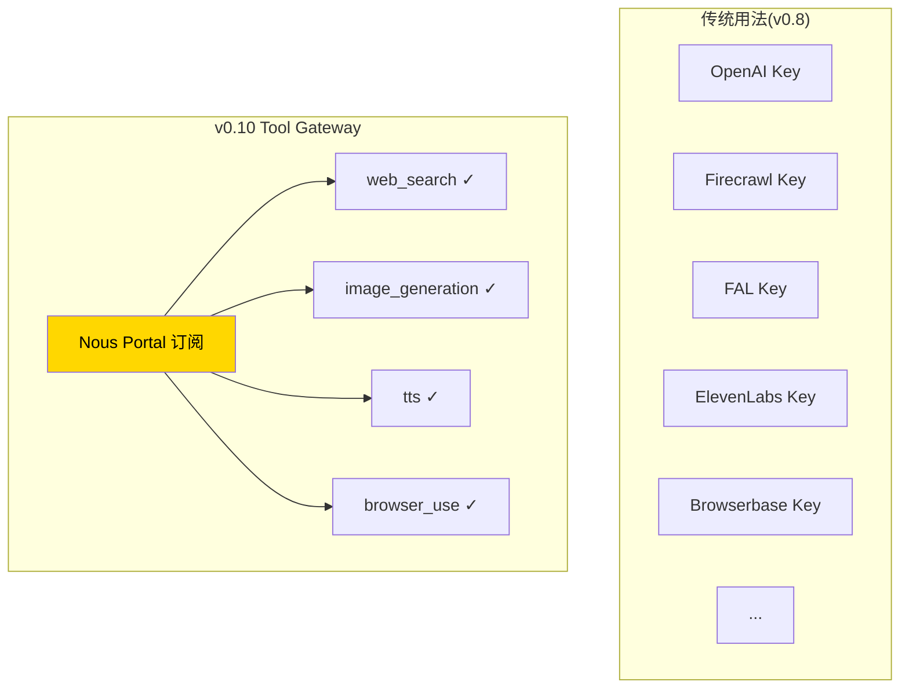
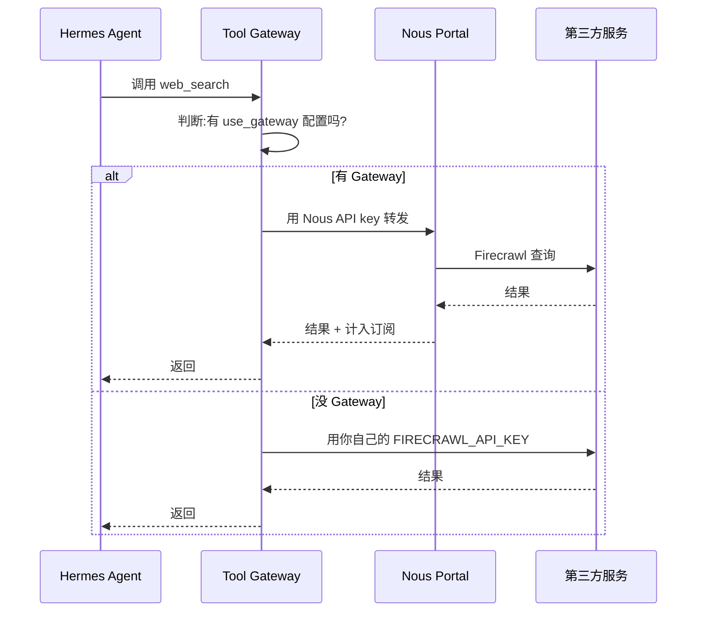
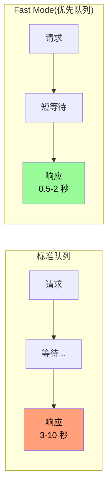

# 20. Nous Tool Gateway + Fast Mode

## Part A · Nous Tool Gateway(v0.10 主推)

### 心智模型:订阅代替 N 个 API key



**简单讲**:**不自己买 Firecrawl / FAL / ElevenLabs 等 key**。月付 Nous Portal 订阅,Hermes 通过 Portal 的 API **代你调用**这些工具。

---

### 谁适合用

=== "✅ 适合"
    - 你已经 / 打算订阅 Nous Portal(模型本身值这个钱)
    - 不想管理一堆 API key + 发票
    - 团队 / 多人使用,要统一账单
    - 新手,想快速有全套工具

=== "❌ 不适合"
    - 用量大到单买每个工具更便宜
    - 需要特定工具的高级功能(比如 FAL 特定模型,Portal 不一定有)
    - 不订阅 Portal 的个人免费用户

---

### 账本估算(参考)

| 工具 | 单独买 | 通过 Portal(订阅含) |
|---|---|---|
| Firecrawl web search | $49 / 月起 | 免费(订阅内) |
| FAL 图像 500 次 | $20-50 | 免费 |
| ElevenLabs TTS 100k 字符 | $22 | 免费 |
| Browserbase 1000 会话 | $29 | 免费 |
| **合计** | **$120+** | **Portal 订阅(通常 $20-50)** |

**前提**:你真的在用这些工具。只用模型不用工具,就不划算。

---

### 最小实践:启用 Tool Gateway

**Step 1 · 确认 Portal 订阅**

[portal.nousresearch.com](https://portal.nousresearch.com) 看订阅状态。

**Step 2 · 切到 Nous Portal 模型**

```bash
hermes model
# 选 Nous Portal
# Hermes 自动检测到你是订阅用户,弹出 Tool Gateway 开关
```

或手动:

```bash
hermes config set tools.use_gateway.web_search true
hermes config set tools.use_gateway.image_generation true
hermes config set tools.use_gateway.tts true
hermes config set tools.use_gateway.browser_use true
```

**Step 3 · 验证**

```bash
hermes doctor
```

相关工具那行应该显示:

```
[✓] web_search (via Nous Tool Gateway)
[✓] image_generation (via Nous Tool Gateway)
[✓] tts (via Nous Tool Gateway)
[✓] browser_use (via Nous Tool Gateway)
```

---

### Gateway 的工作机制



**关键**:即使你同时有**自己的 Firecrawl key**(`.env` 里)和**gateway 启用**,Hermes **优先走 gateway**(除非你关了)。

想**按工具细粒度**控制:

```yaml
tools:
  use_gateway:
    web_search: true        # Firecrawl 走 gateway
    image_generation: false # FAL 用你自己的 key
    tts: true               # OpenAI TTS 走 gateway
    browser_use: true       # Browserbase 走 gateway
```

---

### 省心模式 vs 掌控模式

=== "省心模式"
    ```yaml
    tools:
      use_gateway:
        web_search: true
        image_generation: true
        tts: true
        browser_use: true
    ```
    不买任何 API key,订阅搞定一切。

=== "掌控模式"
    ```yaml
    tools:
      use_gateway:
        web_search: true           # 偶尔搜,gateway 够
        image_generation: false    # 重度用图,自己买 FAL 企业版更划算
        tts: false                 # 需要特定 voice,自买 ElevenLabs
        browser_use: true          # 偶尔用,gateway 够
    ```
    混搭 —— 哪些用 gateway、哪些自买,完全你自己定。

---

## Part B · Fast Mode(`/fast`,v0.9 新增)

### 心智模型:多付一点,插队快过



**支持**:
- OpenAI **Priority Processing** 系列(GPT-5.4、Codex 等)
- Anthropic **Fast Tier**(Claude 3.x / 4.x 某些模型)

**代价**:
- 每次调用**更贵**(OpenAI 标价每 token ×2,Anthropic ×1.5 左右)

**不支持**:
- 其他 provider(OpenRouter 转发不支持;国产模型没有对应机制)
- 本地 / 自托管模型

---

### 用法

=== "对话里"
    ```text
    > /fast
    ✓ Fast Mode enabled. Next turn will use priority processing.

    > 帮我把这段代码重构
    [ 响应明显比平时快 ]

    > /fast off
    ✓ Fast Mode disabled.
    ```

=== "CLI 启动参数"
    ```bash
    hermes --fast
    ```

=== "写进 config"
    ```bash
    hermes config set fast_mode.enabled true
    ```

---

### 什么时候值

| 场景 | 开 Fast Mode? |
|---|---|
| 面试 / 演示 / 直播 | ✓ |
| 开会中,别人等你 | ✓ |
| 聊天式 UX(用户盯着) | ✓ |
| 写代码 pair programming | ✓ |
| 后台 cron 任务 | ✗ |
| 长时间独立工作 | ✗ |
| 批量任务 | ✗ |
| 夜间 / 周末挂跑 | ✗ |

**原则**:**人在等就值,人不等就不值**。

---

### 真实延迟对比(示例数据)

| 模型 | 标准延迟 | Fast 延迟 | 价格倍数 |
|---|---:|---:|:---:|
| GPT-5.4 Priority | ~4s | ~1.2s | 2.0× |
| Claude Opus 4.7 Fast | ~8s | ~2s | 1.5× |
| Claude Sonnet 4.6 Fast | ~3s | ~0.8s | 1.5× |

!!! info "实际延迟受太多因素影响"
    上表仅供参考。受:
    - 输入 token 数量(长 context 慢)
    - 输出 token 数量(thinking 模型更慢)
    - 时区 / 负载 / 节假日
    - 你的网络

---

### Fast Mode 的坑

### 坑 1 · 不支持的模型切进去报错

**现象**:你切到 DeepSeek 然后 `/fast`,报 "not supported by provider"。

**对策**:Fast Mode **只对支持它的模型有效**。用不上的时候直接 `/fast off`。

### 坑 2 · 计费没料到

**现象**:月底看账单 Fast Mode 占了大头。

**对策**:用 `/usage` 随时看累计。长期高频用的话,考虑换用量方案(OpenAI 企业版、Anthropic Team 计划)。

### 坑 3 · Fast ≠ 更准

Fast Mode **只改变队列优先级**,不改模型能力。**如果你要的是更准的答案,切更大模型**,而不是 Fast Mode。

---

## 两个功能的搭配用法

**典型高效配置**:

```yaml
# ~/.hermes/config.yaml

default_model: claude-sonnet-4-6

# 聊天时默认 Fast
fast_mode:
  enabled: true
  auto_disable_for:      # 这些场景自动关 Fast
    - cron               # cron 不需要快,省钱
    - background         # 后台任务不急

# Tool Gateway 全开
tools:
  use_gateway:
    web_search: true
    image_generation: true
    tts: true
    browser_use: true
```

**一起省心**:订阅解决工具 key,Fast 解决延迟。

---

下一章:[21. 安全权限 + 插件系统 →](21-security-plugins.md)
