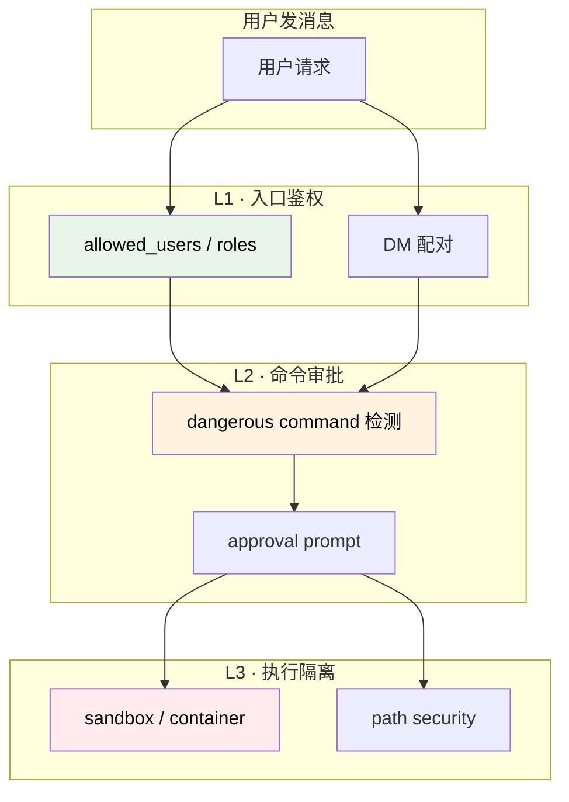
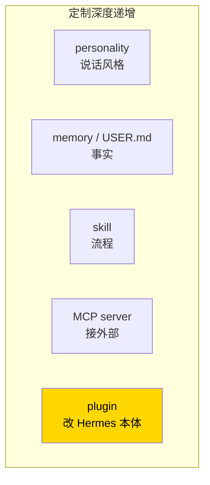

# 21. 安全权限 + 插件系统

## Part A · 安全与权限

### 心智模型:三层防线



### L1 · 入口鉴权

**谁可以跟 bot 说话**。

```yaml
messaging:
  telegram:
    allowed_users:        # 必填!!!
      - katya
      - 123456789
  discord:
    allowed_roles: [admin, devops]
  slack:
    dm_pairing_required: true
```

!!! danger "不设 allowed_users 的后果"
    任何知道 bot username 的人都能:
    - 消耗你的 API credit
    - 让 agent 暴露你的文件、配置、session 历史
    - 发动 prompt injection 让 agent 执行危险操作

    **生产环境必填**。

#### DM 配对(Slack / Discord)

防止**公共频道陌生人滥用**:

```yaml
slack:
  dm_pairing_required: true
```

首次在公共频道 @ bot,bot **私聊发配对码**,用户在 DM 里输对才算认证。

---

### L2 · 命令审批

Agent 想跑的 shell 命令,**Hermes 会拦住危险的**。

#### 危险模式清单(默认)

```yaml
security:
  approval:
    enabled: true
    block_patterns:
      - "rm -rf /"
      - "rm -rf ~"
      - "dd if="
      - "mkfs\\."
      - "> /dev/sd"
      - "chmod 777"         # 在某些路径下
    require_confirmation_for:
      - "sudo"
      - "git push --force"
      - "git reset --hard"
      - "rm -rf"            # 任意 rm -rf
      - "kubectl delete"
      - "DROP TABLE"
      - "TRUNCATE"
```

**三档**:
- `block_patterns`:**直接拒绝**,agent 不会执行
- `require_confirmation_for`:**弹出确认**,你批准才执行
- 其他:直接执行

#### 批准 UX

CLI 里:

```
⚠ Agent wants to run:
   rm -rf ~/old-projects/
   
[a]pprove  [d]eny  [p]ermanent approve (add pattern)  [q]uit
```

- **approve** / `a` —— 本次通过
- **deny** / `d` —— 本次拒绝,agent 被告知换方案
- **permanent approve** / `p` —— 加入 `auto_approve_patterns`,以后同样的不用问
- **quit** / `q` —— 打断整个会话

消息平台里(Telegram / Discord 等):bot 发卡片式消息,带 ✓ 和 ✗ 按钮。

#### YOLO 模式(`/yolo`)

**不要问,全批**:

```text
> /yolo
⚠ YOLO mode enabled. All approvals auto-granted.
```

**只在**:
- 沙箱环境(docker / daytona / 一次性 VM)
- 你 100% 信任当前 agent / 模型
- 一次性脚本批处理

**真机用 YOLO 等于自残**。

---

### L3 · 执行隔离

#### Path Security

限制 agent 能读 / 写的路径:

```yaml
security:
  path_security:
    sandbox_mode: true                  # 开
    allowed_paths:
      - ~/Projects/hermes-agent-guide   # 白名单
      - /tmp
```

Agent 访问白名单外路径时 → 拒绝。

!!! warning "Sandbox 不是绝对的"
    这是**应用层**限制,不是 OS 层 sandbox。agent 如果通过 `terminal` 工具跑 shell,shell 里的 `cat /etc/passwd` 还是能跑(除非同时用 docker / ssh 后端隔离)。

#### 容器隔离(真正的 sandbox)

切 terminal backend 到 docker / daytona:

```yaml
terminal:
  default_backend: docker
  backends:
    docker:
      image: ubuntu:22.04
      volumes:
        - ~/Projects:/workspace
```

现在 agent 跑命令在**容器里**,搞坏了也不影响本机。

---

### 敏感信息保护

```yaml
security:
  secrets:
    scan_memory: true        # memory 写入时扫 KEY/TOKEN/SECRET 等
    scan_output: false       # 扫 agent 输出是否含敏感字(CPU 贵)
    redact_env: true         # 打印环境变量时,敏感的 ***
```

**`scan_memory`**:防 prompt injection 往 memory 里写恶意内容。默认开。

**`scan_output`**:性能代价大,**只在高敏感场景开**。

---

### 审计日志

启用完整命令日志:

```yaml
security:
  audit_log:
    enabled: true
    path: ~/.hermes/audit/
    include_tool_args: true      # 工具参数也记(更详细)
    include_output: false        # 输出也记(很大,按需)
```

每次 tool call 一条 JSON 记录:
```json
{"ts": "...", "session": "...", "tool": "terminal",
 "args": {"command": "git status"}, "user": "katya",
 "platform": "cli", "approved": true}
```

**事后追责** / **合规要求** 时必开。

---

### 真实场景:公司部署

给公司部署 Hermes 内部 bot 时的推荐配置:

```yaml
messaging:
  slack:
    allowed_users: []            # 公司全员
    dm_pairing_required: true
    require_workspace_admin: false

security:
  approval:
    enabled: true
    require_confirmation_for:
      - "sudo"
      - "git push"
      - "kubectl"
      - "terraform apply"
      - "docker rm"
      - "rm -rf"
    block_patterns:
      - "rm -rf /"
      - "DROP DATABASE"
  path_security:
    sandbox_mode: true
    allowed_paths:
      - /opt/company-scripts
      - /tmp
  secrets:
    scan_memory: true
  audit_log:
    enabled: true
    path: /var/log/hermes/audit/
    include_tool_args: true

tools:
  enabled_per_platform:
    messaging:
      - file_read                # 只给读不给写
      - grep
      - web_search
      - mcp_github_*
      # 不开 terminal / file_write / execute_code
```

---

### 审计安全工具

`hermes doctor --security` 给一份安全健康报告:

```
[✓] allowed_users set for all enabled platforms
[✓] approval.enabled = true
[!] dm_pairing_required = false for Slack
[!] sandbox_mode = false
[✓] audit_log = true
[!] 2 patterns in auto_approve_patterns (review recommended)
```

---

## Part B · 插件系统(v0.9+)

### 心智模型:比 skill 更深的定制



**Plugin 是什么**:Python 代码,**挂进 Hermes 的插槽**。能做:
- 注册新的 slash 命令
- 提供新的 Context Engine(控制上下文组装)
- 注入自定义 dashboard tab
- 钩住 agent loop 的关键事件
- 提供新的 Memory Provider(如 Hindsight)

**vs MCP**:
- MCP = 暴露工具,进程外通信
- Plugin = 进程内 hook,能改 Hermes 自身行为

---

### 最小实践:写一个 hello 插件

#### Step 1 · 建插件目录

```bash
mkdir -p ~/.hermes/plugins/hello-plugin
cd ~/.hermes/plugins/hello-plugin
```

#### Step 2 · 写 `plugin.py`

```python
from hermes_cli.plugins import Plugin, PluginContext

class HelloPlugin(Plugin):
    name = "hello"
    version = "1.0.0"
    description = "示范插件"

    def setup(self, context: PluginContext) -> None:
        # 注册一个 slash 命令
        context.register_command(
            name="hello",
            description="向你问好",
            handler=self.handle_hello,
        )

    def handle_hello(self, args: str, context: PluginContext) -> str:
        return f"Hello, {args or '陌生人'}! 这是 hello 插件的响应。"


# 必须 export
plugin = HelloPlugin()
```

#### Step 3 · 启用

```bash
hermes plugins enable hello-plugin
```

#### Step 4 · 用

```text
> /hello
Hello, 陌生人! 这是 hello 插件的响应。

> /hello Katya
Hello, Katya! 这是 hello 插件的响应。
```

---

### Plugin 能做什么(v0.10 的 hook 点)

| Hook | 作用 |
|---|---|
| `register_command` | 注册新的 slash 命令 |
| `register_tool` | 注册新的工具(类似 built-in tool) |
| `register_memory_provider` | 自定义 memory 存储(如 Hindsight) |
| `register_context_engine` | 自定义 context 组装逻辑 |
| `register_dashboard_tab` | dashboard 里加 tab |
| `register_hook('on_session_start')` | session 开始时触发 |
| `register_hook('on_tool_call')` | 工具调用前后触发(能审计 / 修改) |
| `register_hook('on_response')` | 模型响应后触发 |
| `dispatch_tool(name, args)` | 在插件里**调用其他工具** |

---

### 典型插件场景

=== "场景 · 公司审计插件"
    每个工具调用写一行到公司日志系统。
    ```python
    def on_tool_call(self, tool_name, args, context):
        audit_log_service.send({
            "user": context.user,
            "tool": tool_name,
            "args": args,
            "ts": time.time(),
        })
    ```

=== "场景 · 自定义 context engine"
    每次对话前,自动搜索相关的过去对话塞进 context。
    ```python
    class AutoRecallContextEngine(ContextEngine):
        def build_context(self, user_message, ...):
            past = session_search(query=user_message, max=3)
            return f"[相关过去对话]\n{past}\n\n[当前]\n{super().build_context(...)}"
    ```

=== "场景 · Dashboard CI tab"
    dashboard 里加一个 "CI Status" tab,显示公司 CI 流水线。

=== "场景 · Memory Provider(Hindsight)"
    替换 MEMORY.md 为向量数据库,记忆带语义检索。
    Hermes 已经集成了 [Hindsight](https://github.com/nicoloboschi/hindsight) 作为示例。

---

### 插件管理命令

```bash
hermes plugins list                         # 列出已装
hermes plugins enable <name>                # 启用
hermes plugins disable <name>               # 禁用
hermes plugins install <git-url>            # 从 git 装
hermes plugins uninstall <name>             # 卸载
hermes plugins info <name>                  # 看详情
```

---

### 插件坑点

!!! warning "坑 · 插件破坏 prompt cache"
    如果插件的 hook **每次 session 都修改系统提示**,会破缓存。
    
    **规则**:插件改系统提示只能在 session 启动时 一次性,不要 mid-session。

!!! warning "坑 · 插件引入依赖冲突"
    插件如果要装 Python 包,**装在 Hermes 的 venv 里**。版本可能跟 Hermes 本身冲突。
    
    **对策**:插件尽量只用 stdlib,或明确写 requirements.txt 让用户确认。

!!! warning "坑 · 插件安全"
    第三方插件**可以读 memory、API key、session**。
    
    **只装你信任的插件**。看源码。

---

### 插件 vs Skills 的选择

| | Skill | Plugin |
|---|---|---|
| **语言** | markdown | Python |
| **门槛** | 零代码 | 要写代码 |
| **能做** | 引导 agent 行为 | 改 Hermes 本身 |
| **例子** | PR review 流程 | 自定义 context engine |
| **部署** | 拖到 skills/ 目录 | 装 plugin + 启用 |

**80% 的定制需求用 skill 就够**。Plugin 只在 skill 做不到时才上。

---

## 第三部完结检查清单

能独立完成下面所有事情,你完成了第三部:

- [ ] 把 Hermes bot 接入至少 2 个消息平台,自如使用
- [ ] 写一个 cron 任务,每天或每周自动跑,并能看到结果
- [ ] 有 2+ 个 Profile 隔离不同场景
- [ ] 能用 `hermes backup` / `import` 跨机迁移
- [ ] 能读懂 `config.yaml` 里大多数字段
- [ ] 写过一个自己的 skin 文件并应用
- [ ] 接入至少一个 MCP server
- [ ] 启动过 Web Dashboard 浏览 sessions
- [ ] 了解 Nous Tool Gateway 是什么,判断值不值得订阅
- [ ] 知道命令审批的三档,配过 `allowed_users`
- [ ] 对插件系统有概念,哪怕没写过

🎉 全部打勾?你已经是**Hermes 的高级用户**。

---

接下来可以:

- **进入内核** → [第四部 · 内核](../part-4-internals/index.md)(架构、源码、扩展开发)
- **科研方向** → [第五部 · 研究](../part-5-research/index.md)
- **查东西** → [附录](../appendix/index.md)
