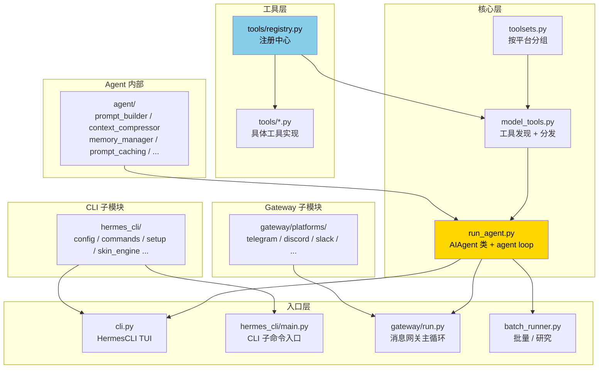

# 22. 项目结构总览

## 心智模型:一张依赖链图



**读源码的顺序**(初次建议):

1. **README.md + AGENTS.md** —— 大局观(你已经读了)
2. **run_agent.py** `AIAgent.run_conversation` —— 看核心 loop
3. **tools/registry.py** —— 了解工具注册
4. **随便一个 tool 文件**(如 `tools/file_tools.py`)—— 看工具怎么写
5. **model_tools.py `_discover_tools`** —— 看工具如何被发现
6. **cli.py `HermesCLI`** —— TUI 是怎么串起来的
7. **gateway/run.py** —— 消息循环
8. **agent/prompt_builder.py** —— 系统提示组装

---

## 完整目录结构

```
hermes-agent/
├── run_agent.py              # ⭐ AIAgent 类 — 核心会话循环
├── model_tools.py            # ⭐ 工具编排 / _discover_tools / handle_function_call
├── toolsets.py               # ⭐ 工具组定义 / _HERMES_CORE_TOOLS
├── cli.py                    # ⭐ HermesCLI — TUI 编排
├── hermes_state.py           # SessionDB — SQLite 会话存储 + FTS5
├── hermes_constants.py       # get_hermes_home / display_hermes_home
├── hermes_logging.py         # logger 配置 + 脱敏 formatter
├── hermes_time.py            # 时区处理
├── batch_runner.py           # 并行批量任务
├── rl_cli.py                 # RL 训练入口
├── trajectory_compressor.py  # 训练数据压缩
├── mini_swe_runner.py        # SWE-bench 评估
├── mcp_serve.py              # 把 Hermes 本身做成 MCP server
├── toolset_distributions.py  # 分发包变体
├── utils.py                  # 杂项

├── agent/                    # ⭐ Agent 内部机制
│   ├── prompt_builder.py     # 系统提示组装
│   ├── prompt_caching.py     # Anthropic prompt cache 管理
│   ├── context_compressor.py # 自动压缩算法
│   ├── context_engine.py     # 可插拔上下文引擎
│   ├── context_references.py # context 文件(AGENTS.md 等)
│   ├── memory_manager.py     # MEMORY.md / USER.md 读写
│   ├── memory_provider.py    # Memory 抽象(支持 Hindsight 等)
│   ├── auxiliary_client.py   # 辅助模型客户端
│   ├── smart_model_routing.py# 模型路由 / fallback
│   ├── credential_pool.py    # API key 池 / 轮询
│   ├── rate_limit_tracker.py # 速率限制跟踪
│   ├── error_classifier.py   # 错误分类(429 / 503 / retry)
│   ├── model_metadata.py     # 模型上下文长度等
│   ├── models_dev.py         # models.dev 注册表集成
│   ├── insights.py           # /insights 命令
│   ├── trajectory.py         # 轨迹保存
│   ├── usage_pricing.py      # 定价计算
│   ├── title_generator.py    # 会话自动命名
│   ├── subdirectory_hints.py # 根据 cwd 注入提示
│   ├── anthropic_adapter.py  # Anthropic API 适配
│   ├── redact.py             # 日志 / memory 脱敏
│   ├── display.py            # KawaiiSpinner / 工具显示
│   ├── retry_utils.py        # 重试工具
│   ├── skill_commands.py     # 技能 slash 命令
│   ├── skill_utils.py        # 技能元数据解析
│   └── ...

├── hermes_cli/               # ⭐ CLI 子命令 + 配置
│   ├── main.py               # CLI 入口(所有 hermes xxx)
│   ├── config.py             # DEFAULT_CONFIG / migration
│   ├── commands.py           # ⭐ COMMAND_REGISTRY 单源头
│   ├── callbacks.py          # 终端回调(approval / clarify)
│   ├── setup.py              # 交互式向导
│   ├── skin_engine.py        # 皮肤引擎
│   ├── skills_config.py      # hermes skills 命令
│   ├── tools_config.py       # hermes tools 命令
│   ├── skills_hub.py         # Skills Hub 客户端
│   ├── models.py             # 模型目录
│   ├── model_switch.py       # /model 切换管道
│   ├── auth.py               # 凭证解析
│   ├── plugins.py            # 插件系统
│   ├── plugins_cmd.py        # hermes plugins 命令
│   ├── env_loader.py         # .env 加载
│   └── ...

├── tools/                    # ⭐ 工具实现
│   ├── registry.py           # ⭐ 中心注册表
│   ├── approval.py           # 危险命令检测
│   ├── terminal_tool.py      # terminal 工具(6 种后端)
│   ├── process_registry.py   # 后台进程管理
│   ├── file_tools.py         # file_read / write / edit / grep / glob
│   ├── file_operations.py    # 低层文件原语
│   ├── web_tools.py          # web_search / web_extract
│   ├── browser_tool.py       # Browserbase 浏览器自动化
│   ├── browser_providers/    # 不同 provider 适配
│   ├── code_execution_tool.py# execute_code sandbox
│   ├── delegate_tool.py      # 子 agent delegate
│   ├── mcp_tool.py           # ⭐ MCP 客户端(~1050 行)
│   ├── mcp_oauth.py          # MCP OAuth
│   ├── memory_tool.py        # memory 工具(读写 MEMORY/USER.md)
│   ├── session_search_tool.py# FTS5 + summary
│   ├── skills_tool.py        # 技能工具
│   ├── skill_manager_tool.py # 技能增删改
│   ├── image_generation_tool.py
│   ├── tts_tool.py
│   ├── transcription_tools.py
│   ├── vision_tools.py
│   ├── send_message_tool.py  # 主动发消息
│   ├── cronjob_tools.py      # cron 管理工具
│   ├── homeassistant_tool.py
│   ├── feishu_doc_tool.py / feishu_drive_tool.py
│   ├── neutts_synth.py       # 本地 TTS
│   ├── managed_tool_gateway.py  # v0.10 Tool Gateway
│   ├── todo_tool.py
│   ├── clarify_tool.py
│   ├── checkpoint_manager.py
│   ├── rl_training_tool.py
│   ├── mixture_of_agents_tool.py
│   ├── interrupt.py          # 打断信号
│   ├── path_security.py      # 沙箱路径检查
│   ├── url_safety.py         # URL 黑名单
│   ├── tirith_security.py    # 安全扫描
│   ├── patch_parser.py       # diff 解析
│   ├── fuzzy_match.py        # 模糊匹配
│   ├── osv_check.py          # OSV 漏洞扫描
│   ├── openrouter_client.py  # OpenRouter 特殊处理
│   ├── xai_http.py           # xAI 适配
│   ├── voice_mode.py         # 语音模式
│   └── environments/         # ⭐ 终端后端
│       ├── local.py
│       ├── docker.py
│       ├── ssh.py
│       ├── daytona.py
│       ├── modal.py
│       └── singularity.py

├── gateway/                  # ⭐ 消息网关
│   ├── run.py                # ⭐ gateway 主循环 + slash 派发
│   ├── session.py            # SessionStore
│   ├── status.py             # gateway 状态 + 锁
│   ├── api_server.py         # HTTP API server
│   └── platforms/            # ⭐ 各平台适配
│       ├── base.py           # ⭐ BasePlatform 抽象
│       ├── helpers.py
│       ├── telegram.py / telegram_network.py
│       ├── discord.py
│       ├── slack.py
│       ├── whatsapp.py
│       ├── signal.py
│       ├── email.py
│       ├── matrix.py
│       ├── mattermost.py
│       ├── bluebubbles.py    # iMessage
│       ├── homeassistant.py
│       ├── webhook.py
│       ├── sms.py
│       ├── weixin.py
│       ├── wecom.py / wecom_callback.py / wecom_crypto.py
│       ├── dingtalk.py
│       ├── feishu.py / feishu_comment.py / feishu_comment_rules.py
│       ├── qqbot/            # 目录(多文件)
│       └── ADDING_A_PLATFORM.md  # ⭐ 加新平台的指南

├── cron/                     # 定时任务
│   ├── scheduler.py
│   └── jobs.py

├── environments/             # RL 环境(Atropos)
├── tinker-atropos/           # submodule: RL 训练框架
├── mini_swe_bench/           # SWE-bench 相关
├── acp_adapter/              # ACP(VS Code / Zed / JetBrains)
├── acp_registry/

├── skills/                   # 内置技能
├── optional-skills/          # 可选技能

├── tests/                    # ⭐ 3000+ 测试
│   ├── conftest.py           # 全局 fixtures(_isolate_hermes_home 等)
│   ├── test_*.py             # 按模块组织
│   ├── gateway/
│   ├── tools/
│   ├── hermes_cli/
│   └── agent/

├── docs/                     # 官方文档 (markdown)
├── website/                  # 官方 docs 站点(Docusaurus)
├── assets/                   # 图片、banner
├── docker/                   # Docker 相关
├── nix/ + flake.nix          # Nix 打包
├── packaging/                # 分发打包
├── plans/                    # 设计文档 / roadmap

├── pyproject.toml            # 包配置
├── requirements.txt
├── uv.lock                   # uv 锁文件
├── setup-hermes.sh           # 安装脚本
├── constraints-termux.txt    # Termux 约束
├── CONTRIBUTING.md
├── AGENTS.md                 # ⭐ 给 AI 开发者看的指南
├── README.md
└── LICENSE
```

---

## 用户数据目录

**代码仓库**跟**运行时数据**完全分离:

```
~/.hermes/                    # 默认 HERMES_HOME
├── config.yaml               # 配置
├── .env                      # 密钥(gitignore!)
├── sessions.db               # SQLite 会话 + FTS5
├── memories/
│   ├── MEMORY.md
│   └── USER.md
├── skills/                   # 用户技能(内置技能跟随代码)
├── personalities/
├── skins/
├── mcp_oauth/                # MCP OAuth tokens
├── cron/
│   ├── jobs.json
│   └── history/
├── audit/                    # 审计日志(可选)
├── venv/                     # 可选:安装脚本建的 venv
└── profiles/
    ├── work/                 # 各 profile 独立子目录
    ├── coder/
    └── ...
```

!!! danger "绝对不要在代码里 hardcode ~/.hermes/"
    用 `get_hermes_home()`(从 `hermes_constants`),它读 `HERMES_HOME` 环境变量,profile 切换会正确返回 `~/.hermes/profiles/<name>/`。
    
    见 [第 28 章 Profile 工作原理](28-profile-internals.md) 详解。

---

## 文件依赖链规律

几个**一定要内化**的依赖规则:

### 1. `tools/registry.py` 是依赖链底层

```
tools/registry.py                  (不依赖其他)
       ↑
tools/*.py                         (每个文件 import registry,调 register() 注册自己)
       ↑
model_tools.py                     (import 一堆 tools/,触发所有 register)
       ↑
run_agent.py / cli.py / gateway/   (用 model_tools 发现工具)
```

**含义**:动工具系统时,从 registry 看起。

### 2. 入口点都走 `_apply_profile_override()`

```
hermes <command>    →    hermes_cli/main.py
                          ↓
                    _apply_profile_override()     ← 在任何 import 之前设 HERMES_HOME
                          ↓
                    import rest of modules
```

**含义**:新加的 CLI 子命令要尽可能**让 main.py 管入口**,不要自己建 parser。

### 3. Slash 命令单源头

```
hermes_cli/commands.py              → COMMAND_REGISTRY 单源头
       ↓                 ↓              ↓
  CLI 派发          Gateway 派发   Telegram / Slack 菜单 / 自动补全 / 帮助
```

**含义**:加 slash 命令**只需要改 commands.py + 两个 handler**。见第 25 章。

---

## 关键全局常量

```python
# hermes_constants.py
def get_hermes_home() -> Path:
    """profile-aware,读 HERMES_HOME env var"""

def display_hermes_home() -> str:
    """给用户看的 ~/.hermes 或 ~/.hermes/profiles/<name>"""

# run_agent.py
DEFAULT_MAX_ITERATIONS = 90
DEFAULT_MODEL = "anthropic/claude-sonnet-4-6"

# tools/registry.py
class Registry:
    _tools: Dict[str, ToolSpec]  # 全局单例状态
```

---

## 常用 grep 路径

找东西的套路:

```bash
# 找某个工具的实现
grep -rn "name=\"terminal\"" tools/

# 找 config 字段用在哪
grep -rn "display.skin" .

# 找某个错误在哪 raise
grep -rn "class HermesError" .

# 找 slash 命令定义
grep -n "CommandDef(\"compress\"" hermes_cli/commands.py

# 看所有 env var
grep -rn "os.getenv(\"HERMES_" .
```

---

## 下一步

从这里往下读取决于你想做什么:

| 我想... | 读这章 |
|---|---|
| 懂 agent 怎么跑对话 | [23. AIAgent 类详解](23-aiagent-class.md) |
| 加一个工具 | [24. 工具注册机制](24-tool-registry.md) |
| 加一个 slash 命令 | [25. Slash 命令系统](25-slash-commands.md) |
| 加一个消息平台 | [26. 消息网关架构](26-gateway-arch.md) |
| 写代码前避坑 | [27 · Prompt Caching](27-prompt-caching.md) + [31 · 已知坑](31-pitfalls.md) |
| 理解 Profile 底层 | [28. Profile 工作原理](28-profile-internals.md) |
| 改上下文压缩逻辑 | [29. Context Compression 算法](29-compression-algo.md) |
| 写 / 跑测试 | [30. 测试策略](30-testing.md) |
