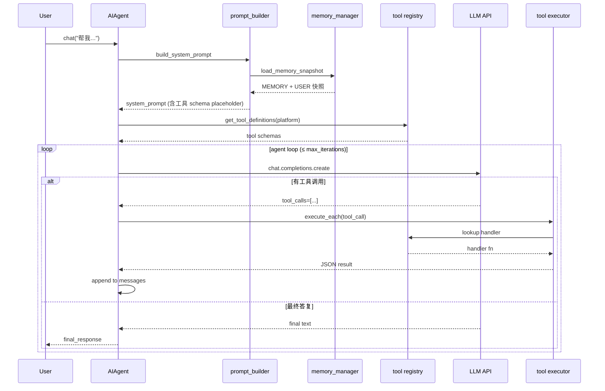
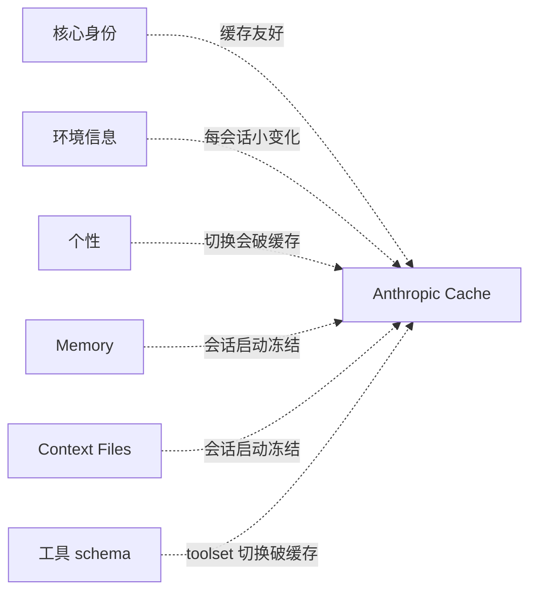

# 23. AIAgent 类详解

## 文件:`run_agent.py`

这是**整个 Hermes 的心脏**。所有消息(CLI / gateway / cron / batch)最终都通过 `AIAgent` 实例处理。

---

## 构造函数

```python
class AIAgent:
    def __init__(self,
        model: str = "anthropic/claude-sonnet-4-6",
        max_iterations: int = 90,
        enabled_toolsets: list = None,
        disabled_toolsets: list = None,
        quiet_mode: bool = False,
        save_trajectories: bool = False,
        platform: str = None,           # "cli" | "telegram" | ...
        session_id: str = None,
        skip_context_files: bool = False,
        skip_memory: bool = False,
        provider: str = None,
        api_mode: str = None,
        callbacks: dict = None,
        routing: dict = None,
        # ... 更多
    ): ...
```

**关键参数说明**:

| 参数 | 作用 |
|---|---|
| `model` | 主模型 id,格式 `provider/model_name` |
| `max_iterations` | 每次对话的**工具循环上限**。防止死循环 |
| `enabled_toolsets` / `disabled_toolsets` | 按平台过滤可用工具 |
| `platform` | 影响 toolset 选择和部分 prompt |
| `session_id` | 续接之前的 session;不传则新建 |
| `skip_memory` | 启动时不加载 MEMORY/USER.md |
| `skip_context_files` | 不扫项目的 AGENTS.md / CLAUDE.md |
| `callbacks` | 注入自定义回调(approval、clarify 等) |

---

## 两个主要入口方法

### `chat(message)` · 简单接口

```python
def chat(self, message: str) -> str:
    """Simple interface — returns final response string."""
    result = self.run_conversation(message)
    return result["final_response"]
```

给**脚本 / batch / 测试**用的简易接口。

### `run_conversation(user_message, ...)` · 完整接口

```python
def run_conversation(
    self,
    user_message: str,
    system_message: str = None,
    conversation_history: list = None,
    task_id: str = None,
) -> dict:
    """Full interface — returns dict with final_response + messages."""
```

返回:

```python
{
    "final_response": "agent 的最终文字回答",
    "messages": [...],              # 完整消息历史(可持久化)
    "usage": {                       # token 用量
        "input_tokens": ...,
        "output_tokens": ...,
        "cache_read_tokens": ...,
    },
    "tool_calls_made": 5,
    "reasoning": "...",              # 推理模型的 thinking 段(可选)
    "errors": [...],                 # 期间遇到的错误(非致命)
}
```

---

## 核心 Agent Loop

```python
def run_conversation(self, user_message, ...):
    # 1. 组装系统提示(memory + skills + context files + personality)
    system_prompt = self._build_system_prompt()
    
    # 2. 初始化 messages
    messages = [
        {"role": "system", "content": system_prompt},
        *conversation_history,
        {"role": "user", "content": user_message},
    ]
    
    # 3. 工具发现
    tool_schemas = get_tool_definitions(self.platform, ...)
    
    # 4. Agent Loop
    api_call_count = 0
    while api_call_count < self.max_iterations and self.iteration_budget.remaining > 0:
        
        # 4.1 调模型
        response = client.chat.completions.create(
            model=self.model,
            messages=messages,
            tools=tool_schemas,
            ...
        )
        
        # 4.2 有工具调用?
        if response.choices[0].message.tool_calls:
            assistant_msg = response.choices[0].message
            messages.append(assistant_msg)
            
            for tool_call in assistant_msg.tool_calls:
                result = handle_function_call(
                    tool_call.function.name,
                    json.loads(tool_call.function.arguments),
                    task_id=task_id,
                )
                messages.append({
                    "role": "tool",
                    "tool_call_id": tool_call.id,
                    "content": result,  # JSON 字符串
                })
            
            api_call_count += 1
            continue  # 继续循环
        
        # 4.3 没工具调用 = 最终答复
        return {
            "final_response": response.choices[0].message.content,
            "messages": messages,
            ...
        }
    
    # 超出 max_iterations
    return {
        "final_response": "[触达 max_iterations,任务可能未完成]",
        "messages": messages,
        "errors": ["max_iterations_reached"],
    }
```

---

## 详细流程图



---

## 系统提示组装(prompt_builder.py)

系统提示**不是一个字符串**,而是**多段结构化组装**:

```python
def build_system_prompt(
    platform: str,
    enabled_toolsets: list,
    skip_memory: bool,
    skip_context_files: bool,
    personality: str,
    ...
) -> str:
    parts = [
        _core_identity(platform),          # 你是 Hermes, 平台是 X
        _environment_info(),               # cwd / OS / time
        _personality_section(personality), # 个性(如配)
        _memory_section(skip_memory),      # MEMORY + USER
        _context_files(skip_context_files),# AGENTS.md 等
        _tools_section(enabled_toolsets),  # 可用工具清单
        _platform_specific(platform),      # 平台调整
        _closing(),                        # 结尾提示
    ]
    return "\n\n".join(p for p in parts if p)
```

**为什么这样分段?**



**每段的变化频率不同 → 合理分段让缓存命中更多**。

详见第 27 章 [Prompt Caching 的边界](27-prompt-caching.md)。

---

## 消息格式规范

Hermes 用 **OpenAI 格式**作为内部中间表达,所有 provider(Anthropic / Gemini / etc.)在 `agent/anthropic_adapter.py` 等处做适配转换。

```python
# 用户消息
{"role": "user", "content": "..."}

# 助手文字回复
{"role": "assistant", "content": "..."}

# 助手工具调用
{
    "role": "assistant",
    "content": None,
    "tool_calls": [{
        "id": "call_abc123",
        "type": "function",
        "function": {"name": "terminal", "arguments": "{...}"}
    }]
}

# 工具结果
{
    "role": "tool",
    "tool_call_id": "call_abc123",
    "content": "{\"stdout\": \"...\", \"exit_code\": 0}"
}

# 推理(reasoning)模型的 thinking
{
    "role": "assistant",
    "reasoning": "...",     # 非标准字段,Hermes 自己管
    "content": "..."
}
```

---

## 回调机制(Callbacks)

AIAgent 支持**自定义回调**,外层(CLI、gateway)注入:

```python
callbacks = {
    "on_approval_needed": lambda cmd, reason: prompt_user(...),
    "on_clarify_needed": lambda question: ask_user(...),
    "on_tool_started": lambda tool, args: spinner.start(...),
    "on_tool_finished": lambda tool, result: spinner.stop(...),
    "on_response_chunk": lambda text: stream_to_ui(text),
    "on_compression": lambda before, after: notify(...),
}

agent = AIAgent(..., callbacks=callbacks)
```

每个平台都实现一套自己的 callbacks —— CLI 用 rich 打印,gateway 用消息反馈,batch 模式几乎全空。

---

## 打断机制(Interrupt)

用户 Ctrl+C 或 `/stop` 时,AIAgent 要能**干净中止**。

核心机制在 `tools/interrupt.py`:

```python
import threading

_interrupt_event = threading.Event()

def set_interrupt():
    _interrupt_event.set()

def check_interrupt():
    if _interrupt_event.is_set():
        raise InterruptedError("Agent interrupted by user")
```

每个工具在长操作中会**定期 `check_interrupt()`**。LLM 调用时如果流式输出,每个 chunk 也会 check。

---

## 迭代预算(Iteration Budget)

不同于 `max_iterations`(硬上限),**iteration_budget** 是更细粒度的 **token 预算**:

```python
class IterationBudget:
    total_tokens_remaining: int
    per_turn_cap: int
    ...
```

一次 `terminal` 返回 50k 字符的 log?这会吃掉 budget。budget 耗尽 → 提前结束循环,返回部分结果 + warning。

---

## 常见 hacking 场景

### 场景 1 · 自定义系统提示

```python
agent = AIAgent(model="...", skip_context_files=True, skip_memory=True)
result = agent.run_conversation(
    user_message="...",
    system_message="你是一个只会回答 yes/no 的助手。",
)
```

### 场景 2 · 复现一个 session

```python
import hermes_state
session = hermes_state.SessionDB().get_session("abc123")
history = session["messages"]

agent = AIAgent(model=session["model"])
result = agent.run_conversation(
    user_message="继续从上面",
    conversation_history=history,
)
```

### 场景 3 · Batch 跑

```python
from batch_runner import run_batch
results = run_batch(
    prompts=["任务1", "任务2", "任务3"],
    model="openrouter/google/gemini-2.5-flash",
    concurrency=5,
)
```

---

## 跟 cli.py 的关系

`cli.py` 的 `HermesCLI` 类是**围绕 AIAgent 的 TUI 包装**:

```python
class HermesCLI:
    def __init__(self):
        self.agent = AIAgent(
            model=config.default_model,
            platform="cli",
            callbacks=self._build_callbacks(),
            ...
        )
    
    def run(self):
        while True:
            user_input = self._read_input()  # prompt_toolkit
            if user_input.startswith("/"):
                self.process_command(user_input)
                continue
            self.agent.chat(user_input)
```

**CLI 只做**:渲染、输入、命令派发、活动监控。真正的思考全在 AIAgent。

---

## 常见坑

### 坑 1 · `max_iterations` 撞墙

**现象**:复杂任务突然返回 "max_iterations reached"。

**对策**:
- 把任务拆小(delegate)
- 调大 `max_iterations`(config 或 AIAgent 构造)
- 看日志找是不是某工具陷入循环

### 坑 2 · 中断后状态脏

**现象**:打断后再问,agent 行为怪。

**原因**:中断抛 InterruptedError 后,messages 列表可能**最后一条是 user 但没 assistant 对应**。

**对策**:CLI 已经处理(补一条 "[interrupted]" assistant msg),自己写代码时注意。

### 坑 3 · 忘传 callbacks 导致阻塞

**现象**:你用 AIAgent 跑脚本,突然卡住不动。

**原因**:agent 想调 `clarify` 或 `approval`,默认 callback 是 `input()`(但非交互环境没有 stdin)。

**对策**:
- 批处理环境用 `callbacks={"on_clarify_needed": lambda q: ""}`(自动回空)
- 或 `enabled_toolsets=[...]` 过滤掉 clarify

### 坑 4 · Provider 差异

**现象**:同样代码 Anthropic 能跑,换 OpenRouter 某模型报错。

**原因**:Hermes 内部用 OpenAI 格式,每个 provider 有 adapter。偶尔某 provider 的 quirk 没覆盖全。

**对策**:
- 看 `agent/anthropic_adapter.py` / 等 adapter
- 启用 `HERMES_DEBUG=1` 看真实请求
- 提 issue

---

## 阅读顺序建议

要深入源码,按这个顺序:

1. **`run_agent.py` `run_conversation`** 从头读到尾
2. **`agent/prompt_builder.py`** 看系统提示怎么拼
3. **`model_tools.py` `handle_function_call`** 看工具怎么分发
4. **`agent/context_compressor.py`** 看压缩什么时候触发(第 29 章详解)
5. **`agent/prompt_caching.py`** 看 cache_control 标记什么
6. **`tools/registry.py`** 看工具生命周期

---

下一章:[24. 工具注册机制 →](24-tool-registry.md)
