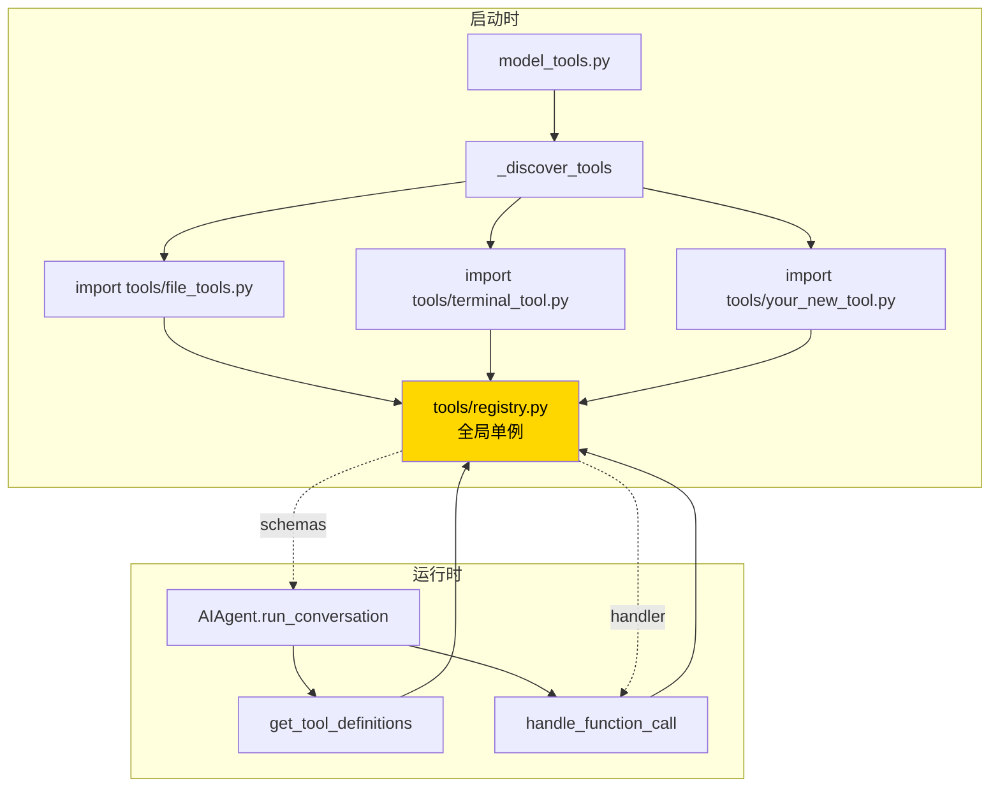

# 24. 工具注册机制

## 心智模型:中心注册表 + 自注册



**核心机制**:
1. 每个工具文件在 `import` 时自己调 `registry.register(...)`
2. `_discover_tools` 只是**触发 import**
3. `registry` 对外提供 `get_schemas()` / `get_handler()` / `check_availability()`

---

## registry.py 的核心数据结构

```python
# tools/registry.py

@dataclass
class ToolSpec:
    name: str
    toolset: str               # 所属 toolset(见 toolsets.py)
    schema: dict               # JSON schema for LLM
    handler: Callable          # 实际执行函数
    check_fn: Callable[[], bool]  # 环境检查(有没有装依赖 / API key)
    requires_env: list[str]    # 需要的环境变量(用于 doctor)


class Registry:
    def __init__(self):
        self._tools: dict[str, ToolSpec] = {}

    def register(self, name, toolset, schema, handler,
                 check_fn=None, requires_env=None):
        if name in self._tools:
            raise ValueError(f"duplicate tool: {name}")
        self._tools[name] = ToolSpec(...)

    def get_all_available(self, platform: str = None) -> list[ToolSpec]:
        """按 toolset + check_fn 过滤"""
        ...

    def dispatch(self, name: str, args: dict, **kwargs) -> str:
        """调用对应 handler,结果是 JSON 字符串"""
        spec = self._tools[name]
        try:
            return spec.handler(args, **kwargs)
        except Exception as e:
            return json.dumps({"success": False, "error": str(e)})

# 全局单例
registry = Registry()
```

---

## 最小实践:加一个新工具

需求:加一个 `weather_now` 工具,查当前天气。

### 3 文件改动

**1. `tools/weather_tool.py`** —— 新文件:

```python
"""Weather tool — fetch current weather from OpenWeatherMap."""
import json
import os
import httpx
from tools.registry import registry

OWM_API = "https://api.openweathermap.org/data/2.5/weather"


def check_requirements() -> bool:
    """Tool available only if env var is set."""
    return bool(os.getenv("OPENWEATHER_API_KEY"))


def weather_now(city: str, units: str = "metric", task_id: str = None) -> str:
    """Fetch current weather for a city."""
    key = os.getenv("OPENWEATHER_API_KEY")
    if not key:
        return json.dumps({
            "success": False,
            "error": "OPENWEATHER_API_KEY not set",
        })

    try:
        r = httpx.get(OWM_API, params={
            "q": city, "appid": key, "units": units,
        }, timeout=10.0)
        r.raise_for_status()
        data = r.json()
        return json.dumps({
            "success": True,
            "city": data["name"],
            "temp": data["main"]["temp"],
            "feels_like": data["main"]["feels_like"],
            "description": data["weather"][0]["description"],
            "humidity": data["main"]["humidity"],
        })
    except Exception as e:
        return json.dumps({
            "success": False,
            "error": f"weather API failed: {e}",
        })


# JSON Schema for the LLM
WEATHER_SCHEMA = {
    "name": "weather_now",
    "description": "Fetch the current weather for a city. Returns temperature, humidity, and a short description.",
    "parameters": {
        "type": "object",
        "properties": {
            "city": {
                "type": "string",
                "description": "City name, e.g. 'Beijing', 'San Francisco'",
            },
            "units": {
                "type": "string",
                "enum": ["metric", "imperial"],
                "description": "Temperature units",
                "default": "metric",
            },
        },
        "required": ["city"],
    },
}

# 注册
registry.register(
    name="weather_now",
    toolset="weather",
    schema=WEATHER_SCHEMA,
    handler=lambda args, **kw: weather_now(
        city=args["city"],
        units=args.get("units", "metric"),
        task_id=kw.get("task_id"),
    ),
    check_fn=check_requirements,
    requires_env=["OPENWEATHER_API_KEY"],
)
```

**2. `model_tools.py` `_discover_tools()`** —— 加一行 import:

```python
def _discover_tools():
    from tools import file_tools
    from tools import terminal_tool
    from tools import web_tools
    # ... 已有的
    from tools import weather_tool   # ← 加这行
```

**3. `toolsets.py`** —— 把 `weather` toolset 加到想用的平台:

```python
# 法 1:加入核心工具集(所有平台默认开)
_HERMES_CORE_TOOLS = [
    "terminal", "file_read", "web_search", ...,
    "weather_now",   # ← 加这个
]

# 法 2:只在某些 toolset 里
TOOLSETS = {
    "weather": ["weather_now"],
    "dev": [...existing..., "weather_now"],
}
```

### 验证

```bash
# 1. 在 .env 加 key
echo "OPENWEATHER_API_KEY=..." >> ~/.hermes/.env

# 2. 诊断
hermes doctor --verbose
# 应该能看到 [✓] weather_now available

# 3. 用
hermes
> 现在北京天气怎么样?
[ agent 调用 weather_now(city="Beijing") ]
```

---

## 工具 handler 的签名约定

```python
def my_tool(param1: str, param2: int = 10, task_id: str = None) -> str:
    """
    Args:
        param1, param2: LLM 填的参数(来自 args dict)
        task_id: 由 framework 传入,用于追踪 / 取消

    Returns:
        JSON string
    """
```

**铁律**:
- **必须返回 JSON 字符串**(不是 dict,不是对象)
- **错误不要 raise**,返回 `{"success": false, "error": "..."}`
- **task_id 接受但可选**(用于取消 / 追踪)

---

## 工具 schema 的最佳实践

### 写好 description

```python
# ❌ 差
"description": "Weather tool"

# ✅ 好
"description": (
    "Fetch the current weather for a city. "
    "Returns temperature, humidity, wind, and conditions. "
    "Use this when user asks about current or real-time weather. "
    "Does NOT provide forecasts — for forecasts use weather_forecast."
)
```

**description 里写清楚**:
- 做什么
- **什么时候用 / 什么时候不用**
- 返回什么
- 跟相似工具的区别

### Parameters schema 要严

```python
"parameters": {
    "type": "object",
    "properties": {
        "city": {
            "type": "string",
            "description": "City name, e.g. 'Beijing'",
            # 避免 "maxLength" 等约束,除非真有限制
        },
        "units": {
            "type": "string",
            "enum": ["metric", "imperial"],  # ← enum 让 LLM 不乱填
            "default": "metric",
        },
    },
    "required": ["city"],  # ← 必填项明确
    "additionalProperties": false,  # ← 可选,防止 LLM 瞎加参数
}
```

### 避免 cross-tool reference

```python
# ❌ 坏例:引用另一个可能不存在的工具
"description": "... Prefer web_search for queries ..."
```

**为什么不行**:那个 `web_search` 在当前 toolset 可能没开(或没 API key),LLM 被误导,会尝试调不存在的工具。

**正确做法**:在 `model_tools.py` 的 `get_tool_definitions()` 里**动态拼接** cross-reference,只在相关工具可用时加。

---

## check_fn 的用法

```python
def check_requirements() -> bool:
    # 环境变量
    if not os.getenv("OPENWEATHER_API_KEY"):
        return False
    # 依赖检查
    try:
        import httpx
    except ImportError:
        return False
    # 外部可执行文件
    if not shutil.which("some-binary"):
        return False
    return True
```

**作用**:`hermes tools` 和 `hermes doctor` 用它判断工具能不能用,决定是否给用户展示 `[✓]` 或 `[!]`。

**不满足时**:工具**不进入 schema 列表**,LLM 根本看不到 —— 不会出现"调了不存在的工具"。

---

## Agent-level 工具

有些工具**不走 `handle_function_call` 的常规路径**,而是 agent 直接拦截:

- `todo_*` —— 在 `run_agent.py` 里特殊处理,不打 LLM 就能管 todo list
- `memory_*` —— 拦截后做文件读写,不调 LLM

看 `tools/todo_tool.py` 的注释了解这种模式。

---

## 调试工具

Hermes 开启 debug 模式能看到工具调用细节:

```bash
HERMES_DEBUG=1 hermes
```

输出里会有:

```
[DEBUG] tool_call: weather_now(city="Beijing")
[DEBUG] tool_result: {"success": true, "temp": 22, ...}
```

加环境变量 `HERMES_DEBUG_TOOLS=1` 可以**只打印工具层**。

---

## 路径处理:Profile-safe 的规矩

工具里**任何跟 HERMES_HOME 相关的路径都必须用 `get_hermes_home()`**:

```python
from hermes_constants import get_hermes_home

# 工具持久化数据
def save_state(data):
    path = get_hermes_home() / "weather_cache.json"
    path.write_text(json.dumps(data))

# 用户 facing 路径(schema description 里)
from hermes_constants import display_hermes_home
WEATHER_SCHEMA["description"] += f"\nCache stored at {display_hermes_home()}/weather_cache.json"
```

详见第 28 章 [Profile 工作原理](28-profile-internals.md)。

---

## 常见坑

### 坑 1 · 忘了把 toolset 加到 `_HERMES_CORE_TOOLS`

**现象**:工具注册了,hermes doctor 能看到可用,但对话里调不到。

**原因**:`enabled_toolsets` 过滤后没你这个 toolset。

**对策**:要么加入 `_HERMES_CORE_TOOLS`,要么让用户 `hermes tools` 手动启用你的 toolset。

### 坑 2 · 返回不是 JSON 字符串

**现象**:LLM 看到工具结果是 "None" / 看到 dict 原样被序列化。

**原因**:handler 返回了 None / dict / 抛异常了。

**对策**:严格**返回 `json.dumps(...)`**。用 `try/except` 包住,错了也返回 JSON 错误字符串。

### 坑 3 · 同步阻塞太久

**现象**:工具跑 30 秒,UI 冻住。

**对策**:
- 长操作用 `terminal(background=True)` 而非同步工具
- 加 `timeout` 参数
- 定期 `check_interrupt()` 让用户能中断

### 坑 4 · 硬编码 `~/.hermes/`

**现象**:在 Profile 下,工具的缓存文件写错地方。

**对策**:**一律 `get_hermes_home()`**。

### 坑 5 · 工具名冲突

**现象**:启动报 `duplicate tool: xxx`。

**原因**:两个文件注册了同名工具。

**对策**:tool name 全局唯一。按模块前缀(`weather_now` / `weather_forecast`)避免冲突。

---

## 参考:简短工具代码模板

```python
# tools/your_tool.py
import json
import os
from tools.registry import registry


def check_requirements() -> bool:
    return bool(os.getenv("YOUR_API_KEY"))


def your_tool(param: str, task_id: str = None) -> str:
    try:
        # ... 实际工作 ...
        result = {"success": True, "data": ...}
    except Exception as e:
        result = {"success": False, "error": str(e)}
    return json.dumps(result)


registry.register(
    name="your_tool",
    toolset="your_toolset",
    schema={
        "name": "your_tool",
        "description": "What this does. When to use. What it returns.",
        "parameters": {
            "type": "object",
            "properties": {
                "param": {"type": "string", "description": "..."},
            },
            "required": ["param"],
        },
    },
    handler=lambda args, **kw: your_tool(
        param=args["param"],
        task_id=kw.get("task_id"),
    ),
    check_fn=check_requirements,
    requires_env=["YOUR_API_KEY"],
)
```

**拷贝改改就是一个新工具**。

---

下一章:[25. Slash 命令系统 →](25-slash-commands.md)
