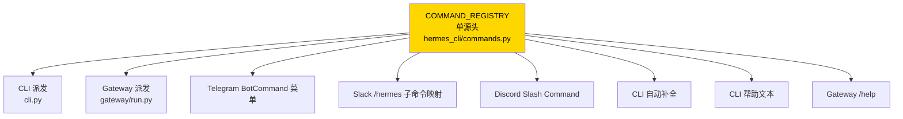
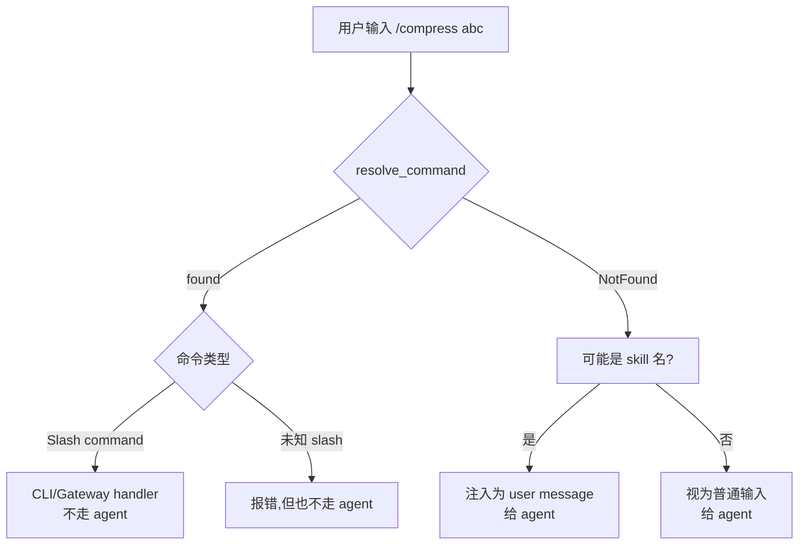

# 25. Slash 命令系统

## 心智模型:一个 registry,多个下游



**为什么设计成单源头**:加一个命令、加一个别名,**只改一处**,所有下游自动更新。

---

## CommandDef 结构

```python
# hermes_cli/commands.py

@dataclass
class CommandDef:
    name: str                    # 无斜杠的规范名:"compress"
    description: str             # 帮助文本
    category: str                # Session / Configuration / Tools & Skills / Info / Exit
    aliases: tuple = ()          # 别名:("cmpress", "shrink")
    args_hint: str = ""          # 参数提示:"<prompt>" 或 "[name]"
    cli_only: bool = False       # 只在 CLI 里可用
    gateway_only: bool = False   # 只在消息平台可用
    gateway_config_gate: str = None  # config 路径,真值时 gateway 启用
```

例:

```python
COMMAND_REGISTRY: list[CommandDef] = [
    CommandDef("new", "Start a fresh conversation", "Session",
               aliases=("reset",)),
    CommandDef("model", "Switch or view the current model", "Configuration",
               args_hint="[provider/model-id]"),
    CommandDef("compress", "Compress the conversation context", "Session",
               args_hint="[focus topic]"),
    CommandDef("platforms", "Show CLI-specific platforms info", "Info",
               cli_only=True),
    CommandDef("sethome", "Set working directory", "Configuration",
               gateway_only=True),
    CommandDef("background", "Background process management", "Tools & Skills",
               aliases=("bg",),
               gateway_config_gate="display.tool_progress_command"),
    # ... ~50 条命令
]
```

---

## 下游怎么消费 registry

### 1. 规范名解析

```python
def resolve_command(command: str) -> Optional[CommandDef]:
    """'/cmpress args' → CommandDef("compress")"""
    name = command.strip().lstrip("/").split()[0].lower()
    for cmd in COMMAND_REGISTRY:
        if cmd.name == name or name in cmd.aliases:
            return cmd
    return None
```

### 2. CLI 派发(cli.py)

```python
def process_command(self, raw: str):
    cmd = resolve_command(raw)
    if not cmd:
        self.console.print(f"Unknown command: {raw}")
        return

    canonical = cmd.name
    if canonical == "new":
        self._handle_new()
    elif canonical == "model":
        self._handle_model(raw)
    elif canonical == "compress":
        self._handle_compress(raw)
    # ... 一个大 if/elif
```

### 3. Gateway 派发(gateway/run.py)

```python
async def handle_message(self, event):
    text = event.text
    if text.startswith("/"):
        cmd = resolve_command(text)
        if not cmd or (cmd.cli_only and not cmd.gateway_config_gate):
            return  # 不是 gateway 能处理的
        if cmd.name == "new":
            return await self._handle_new(event)
        elif cmd.name == "model":
            return await self._handle_model(event)
        # ...
```

### 4. Telegram BotCommand 菜单

```python
def telegram_bot_commands() -> list[BotCommand]:
    out = []
    for cmd in COMMAND_REGISTRY:
        if cmd.cli_only and not cmd.gateway_config_gate:
            continue
        if cmd.gateway_config_gate and not config_value(cmd.gateway_config_gate):
            continue
        out.append(BotCommand(cmd.name, cmd.description[:256]))
    return out
```

### 5. 自动补全

```python
class SlashCommandCompleter(Completer):
    def get_completions(self, document, complete_event):
        word = document.get_word_before_cursor()
        if not word.startswith("/"):
            return
        prefix = word[1:]
        for cmd in COMMAND_REGISTRY:
            names = [cmd.name, *cmd.aliases]
            for n in names:
                if n.startswith(prefix):
                    yield Completion(f"/{n}", ...)
```

### 6. 帮助文本按 category 分组

```python
COMMANDS_BY_CATEGORY = {}
for cmd in COMMAND_REGISTRY:
    COMMANDS_BY_CATEGORY.setdefault(cmd.category, []).append(cmd)

def show_help():
    for cat, cmds in COMMANDS_BY_CATEGORY.items():
        console.print(f"[bold]{cat}[/bold]")
        for c in cmds:
            console.print(f"  /{c.name} {c.args_hint}  {c.description}")
```

---

## 最小实践:加一个 `/weather` 命令

需求:直接在 CLI / Telegram 里查天气(对话里 `/weather Beijing`)。

### Step 1 · 在 COMMAND_REGISTRY 加一条

```python
# hermes_cli/commands.py
CommandDef(
    "weather",
    "Show current weather for a city",
    "Tools & Skills",
    aliases=("wth",),
    args_hint="<city>",
),
```

**只改这一行,Telegram / Slack 菜单 / autocomplete / help 全部自动更新**。

### Step 2 · 加 CLI handler

```python
# cli.py — HermesCLI.process_command
elif canonical == "weather":
    self._handle_weather(raw)

def _handle_weather(self, raw: str):
    parts = raw.split(maxsplit=1)
    if len(parts) < 2:
        self.console.print("Usage: /weather <city>")
        return
    city = parts[1]
    # 直接调 weather_now 工具(见第 24 章)
    from tools.weather_tool import weather_now
    result = json.loads(weather_now(city))
    if result["success"]:
        self.console.print(f"{result['city']}: {result['temp']}°C, {result['description']}")
    else:
        self.console.print(f"Error: {result['error']}")
```

### Step 3 · 加 gateway handler

```python
# gateway/run.py
elif cmd.name == "weather":
    return await self._handle_weather(event)

async def _handle_weather(self, event):
    text = event.text[len("/weather"):].strip()
    if not text:
        await event.reply("Usage: /weather <city>")
        return
    from tools.weather_tool import weather_now
    result = json.loads(weather_now(text))
    if result["success"]:
        await event.reply(f"{result['city']}: {result['temp']}°C, {result['description']}")
    else:
        await event.reply(f"Error: {result['error']}")
```

### Step 4 · 验证

```bash
hermes
> /weather Beijing
Beijing: 22°C, few clouds

> /wth Shanghai    # 别名
Shanghai: 24°C, clear sky
```

Telegram 里也自动出现 `/weather` 菜单项。

---

## `gateway_config_gate` 的妙用

**场景**:某命令默认只在 CLI 可用,但可以通过配置**在 gateway 里开启**。

```python
CommandDef(
    "background",
    "Background process management",
    "Tools & Skills",
    aliases=("bg",),
    cli_only=True,
    gateway_config_gate="display.tool_progress_command",
),
```

行为:
- CLI 里**始终可用**
- Gateway 里:**只有 `config.display.tool_progress_command = true` 时才可用**

用法:**dispatch 总是包含**这个命令(`GATEWAY_KNOWN_COMMANDS` 里有),**菜单显示**按 config 决定。

---

## 添加别名的成本最低路径

```python
# 已有:
CommandDef("compress", "...", "Session"),

# 改成:
CommandDef("compress", "...", "Session", aliases=("compact", "shrink")),
```

**就完事了**。派发、帮助、菜单、自动补全全部自动识别别名。

---

## 对 LLM 可见性

**注意**:slash 命令**不是工具**。LLM 看不到它们、不能调用。

Slash 命令是**用户用的**,处理发生在 CLI / gateway 层,**不走 agent loop**。

如果你想让 agent 能"按这个流程走"但不让用户打命令触发,那是**技能(skill)** 的活,不是 slash 命令。

---

## 命令的生命周期:跳过 vs 预处理 vs agent 消化

一条 user 输入 `"/compress abc"`,CLI 接到后:



**Skill 触发是特殊的** —— 看起来像 slash 命令(`/my-skill`),但实际走的是"注入 user message"路径。

---

## 常见坑

### 坑 1 · 改 CommandDef 但忘了加 handler

**现象**:命令出现在菜单里,但用 `/xxx` 什么都不做。

**对策**:加 CommandDef 时**必须**同时加 CLI / gateway handler(如果对应平台可用)。

### 坑 2 · 命令重名

**现象**:启动报 `duplicate command name`。

**对策**:name 全局唯一,aliases 也跟已有 name 不冲突。

### 坑 3 · args_hint 撒谎

**现象**:help 里显示 `<prompt>`(必填),但实际不传也不报错。

**对策**:`args_hint` 只是**显示**,真的校验在 handler 里。`<x>` 是必填,`[x]` 是可选,自己要一致。

### 坑 4 · Telegram 命令名超 32 字符被截

**现象**:`/my-very-long-command-name` 在 Telegram 里变成 `/my-very-long-command-na`。

**对策**:
- 命令名保持 **≤ 32 字符**
- 或者只在 CLI 用 (`cli_only=True`)

### 坑 5 · 别名触发别的命令

**现象**:你给 `compress` 加别名 `new`,但 `new` 已经是另一个命令。

**对策**:resolve_command 用**名字优先,别名其次**。但**仍然会冲突**(两个命令都想要 `new`)。启动时该报错,没报就是 bug(提 issue)。

---

## 进阶:动态命令(插件)

v0.9+ 的插件可以在运行时**往 COMMAND_REGISTRY 加命令**:

```python
# 某插件
def setup(context):
    context.register_command(
        name="myplugin-cmd",
        description="...",
        handler=...,
    )
```

内部实现:插件的 register_command 实际上是**追加一个 CommandDef 到 COMMAND_REGISTRY**。

---

## 高阶:Active session bypass

某些命令必须**绕开会话队列立即执行**(如 `/stop` 打断):

```python
ACTIVE_SESSION_BYPASS_COMMANDS = {"stop", "interrupt", "queue"}
```

消息到来时先 check 这个集合,命中的直接派发,不排队。

---

下一章:[26. 消息网关架构 →](26-gateway-arch.md)
