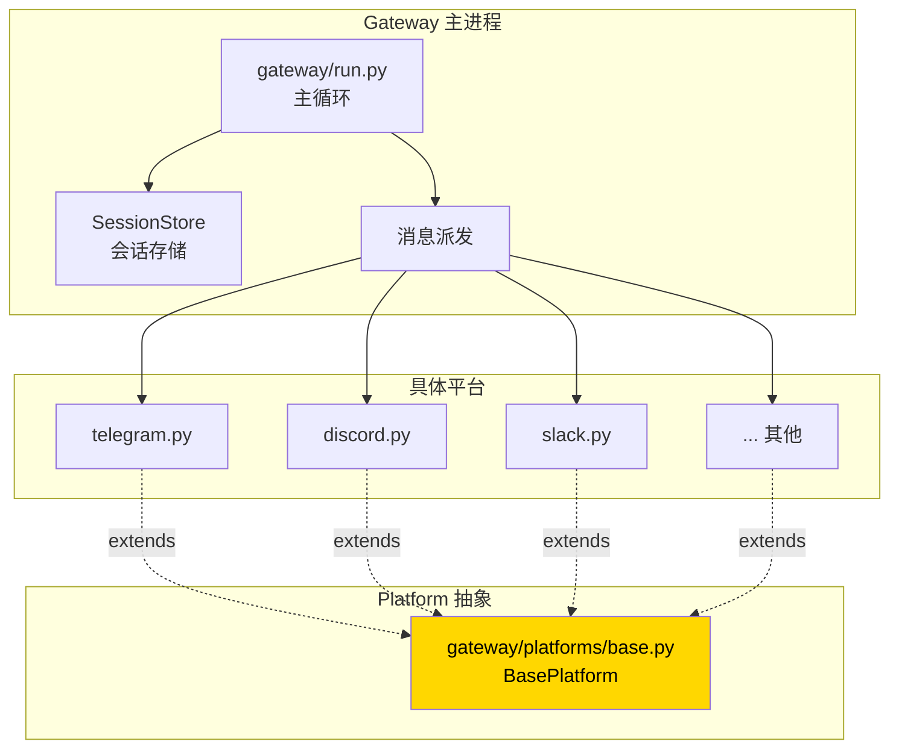
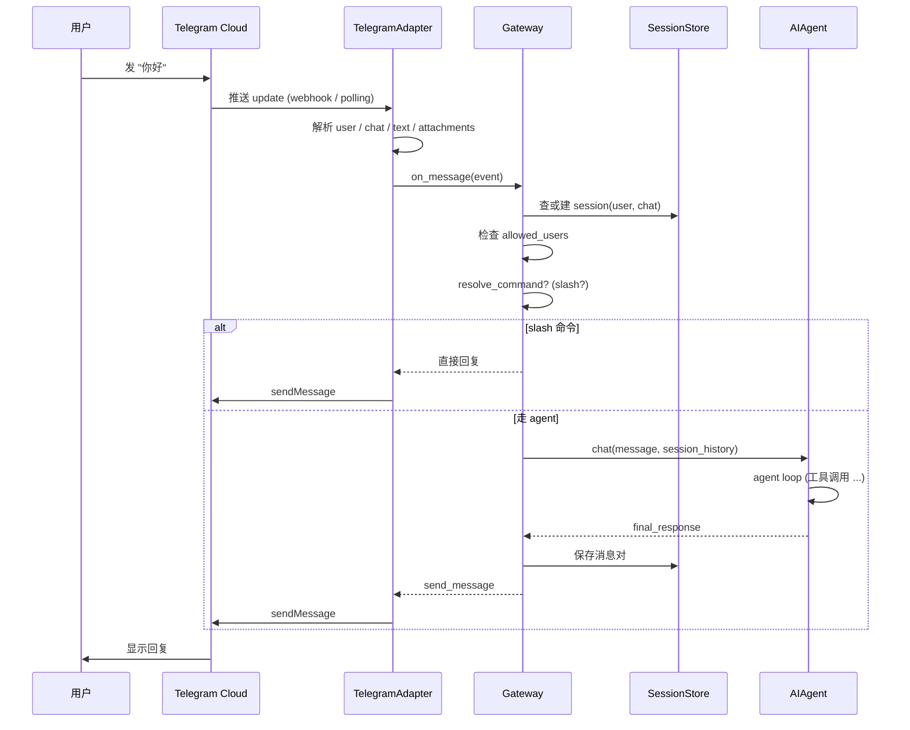

# 26. 消息网关架构

## 心智模型:BasePlatform 抽象 + 调度器



**网关的工作**:
1. 启动时加载所有启用的平台适配器
2. 每个适配器**独立建立连接**(WebSocket / webhook / polling)
3. 收到消息 → 包装 → 送进 SessionStore + 派发给 agent
4. Agent 结果 → 送回原平台 → 回复给用户

---

## BasePlatform 抽象

```python
# gateway/platforms/base.py

class BasePlatform(abc.ABC):
    name: str
    config_key: str     # 'telegram' 'discord' 等

    @abc.abstractmethod
    async def connect(self) -> None:
        """建立连接,开始监听"""

    @abc.abstractmethod
    async def disconnect(self) -> None:
        """断开"""

    @abc.abstractmethod
    async def send_message(self, chat_id, text, **kwargs) -> None:
        """发消息"""

    @abc.abstractmethod
    async def send_file(self, chat_id, path, **kwargs) -> None:
        """发文件"""

    # 可选
    async def send_typing_indicator(self, chat_id) -> None:
        pass

    async def update_message(self, chat_id, msg_id, text) -> None:
        pass

    # 回调(由 gateway/run.py 设置)
    on_message: Callable = None
    on_error: Callable = None

    # 元信息
    @abc.abstractmethod
    def platform_info(self) -> dict:
        """用于 /status"""
```

---

## 一次消息的完整流



---

## 最小实践:加一个新平台

假设你想加一个 **Mastodon** 适配器(Mastodon 是去中心化社交平台)。

### Step 1 · 写新平台文件

创建 `gateway/platforms/mastodon.py`:

```python
"""Mastodon platform adapter."""
import asyncio
import logging
from mastodon import Mastodon, StreamListener
from gateway.platforms.base import BasePlatform
from gateway.platforms.helpers import normalize_text

logger = logging.getLogger(__name__)


class MastodonStreamListener(StreamListener):
    def __init__(self, adapter):
        self.adapter = adapter

    def on_notification(self, notification):
        # 新提及事件
        if notification["type"] == "mention":
            status = notification["status"]
            event = {
                "platform": "mastodon",
                "user_id": status["account"]["id"],
                "username": status["account"]["acct"],
                "chat_id": status["id"],
                "text": normalize_text(status["content"]),
                "raw": status,
            }
            asyncio.run_coroutine_threadsafe(
                self.adapter.on_message(event),
                self.adapter._loop,
            )


class MastodonPlatform(BasePlatform):
    name = "Mastodon"
    config_key = "mastodon"

    def __init__(self, config: dict):
        self.instance = config["instance_url"]
        self.access_token = config["access_token"]
        self.allowed_users = set(config.get("allowed_users", []))
        self.client: Mastodon = None
        self._stream = None
        self._loop = None

    async def connect(self):
        self._loop = asyncio.get_event_loop()
        self.client = Mastodon(
            access_token=self.access_token,
            api_base_url=self.instance,
        )
        # 开启流
        listener = MastodonStreamListener(self)
        # mastodon.py 的流在线程里跑
        self._stream = self.client.stream_user(
            listener,
            run_async=True,
            reconnect_async=True,
        )
        logger.info(f"Mastodon connected: {self.instance}")

    async def disconnect(self):
        if self._stream:
            self._stream.close()

    async def send_message(self, chat_id, text, **kwargs):
        # chat_id 是 status id,回复就是 reply
        self.client.status_post(
            text,
            in_reply_to_id=chat_id,
            visibility="direct",  # DM
        )

    async def send_file(self, chat_id, path, **kwargs):
        media = self.client.media_post(path)
        self.client.status_post(
            kwargs.get("caption", ""),
            in_reply_to_id=chat_id,
            media_ids=[media["id"]],
            visibility="direct",
        )

    def platform_info(self) -> dict:
        return {
            "name": "Mastodon",
            "instance": self.instance,
            "connected": self._stream is not None,
        }
```

### Step 2 · 注册到 gateway

```python
# gateway/run.py 的适配器加载部分
from gateway.platforms.mastodon import MastodonPlatform

PLATFORM_CLASSES = {
    "telegram": TelegramPlatform,
    "discord": DiscordPlatform,
    # ...
    "mastodon": MastodonPlatform,   # ← 加
}
```

### Step 3 · 加配置模板

```python
# hermes_cli/config.py
DEFAULT_CONFIG = {
    # ...
    "messaging": {
        # ...
        "mastodon": {
            "enabled": False,
            "instance_url": "https://mastodon.social",
            "access_token": "${MASTODON_ACCESS_TOKEN}",
            "allowed_users": [],
        },
    },
}
```

### Step 4 · 加 `hermes gateway setup` 流程

```python
# hermes_cli/setup.py
def _setup_mastodon():
    # 交互问用户 instance / token / allowed_users
    ...
```

### Step 5 · 加 doctor 检查

```python
# hermes_cli/doctor.py
def _check_mastodon(config):
    if not config.get("messaging.mastodon.enabled"):
        return
    token = os.getenv("MASTODON_ACCESS_TOKEN")
    if not token:
        yield ("!", "Mastodon enabled but MASTODON_ACCESS_TOKEN not set")
    # 可选:尝试连接看能不能通
```

### Step 6 · 写测试

```python
# tests/gateway/test_mastodon.py
import pytest
from unittest.mock import MagicMock, patch
from gateway.platforms.mastodon import MastodonPlatform

@pytest.mark.asyncio
async def test_connect_success():
    config = {"instance_url": "https://test.social", "access_token": "xxx"}
    adapter = MastodonPlatform(config)
    with patch("gateway.platforms.mastodon.Mastodon"):
        await adapter.connect()
    assert adapter.client is not None
```

---

## `gateway/platforms/ADDING_A_PLATFORM.md`

项目有**官方详细指南**:`gateway/platforms/ADDING_A_PLATFORM.md`。

里面覆盖:
- BasePlatform 所有 method 的语义
- 如何处理 typing indicator / 流式输出 / edit 消息
- 如何处理附件(图片 / 语音 / 文件)
- 错误处理和重连策略
- 按平台差异的注意点

**写新平台前必读**。

---

## 平台能力的差异处理

Gateway 的派发要考虑**平台能力差异**:

```python
# gateway/run.py
async def send_response(self, platform, chat_id, text, images=None):
    adapter = self.adapters[platform]
    
    # 1. Markdown 表格?
    if platform_supports_tables(platform):
        pass  # 直接发
    else:
        text = wrap_tables_in_code_blocks(text)  # Telegram 处理
    
    # 2. 消息长度限制?
    max_len = platform_max_message_length(platform)
    if len(text) > max_len:
        chunks = split_text(text, max_len)
        for c in chunks:
            await adapter.send_message(chat_id, c)
    else:
        await adapter.send_message(chat_id, text)
    
    # 3. 有图片?
    for img in images or []:
        await adapter.send_file(chat_id, img)
```

---

## Token 锁机制(v0.9+)

多个 profile 都配了 Telegram,**token 不能同时占用**。

```python
# gateway/status.py
def acquire_scoped_lock(token: str, profile: str):
    """
    尝试获取 token 的独占锁。
    用 ~/.hermes/profiles/<profile>/gateway-lock-<hash>.lock 文件。
    """

def release_scoped_lock(token: str):
    """释放"""
```

每个平台适配器在 `connect()` 时获取锁,`disconnect()` 时释放。

**冲突时**:后启动的 profile **启动失败**,告诉用户「这个 token 被 profile X 占用」。

---

## 消息存储(SessionStore)

```python
# gateway/session.py

class SessionStore:
    def get_or_create_session(
        self, user_id: str, platform: str
    ) -> Session:
        """按(用户,平台)查或建 session。同一个用户跨平台是同一 session。"""

    def add_message(self, session_id, role, content, ...): ...

    def get_history(self, session_id, max_tokens): ...
```

底层:SQLite(`~/.hermes/sessions.db`),FTS5 索引 —— 跟 CLI 共用。

**意味着**:你在 CLI 跟 agent 聊过,晚上 Telegram `/resume <session-id>` 接着聊,CLI 的历史照样在。

---

## 平台特殊行为汇总

| 平台 | 消息长度 | 线程 | 语音 | 附件 | Markdown |
|---|:---:|:---:|:---:|:---:|:---:|
| Telegram | 4096 | - | ✓ | ✓ | 部分 |
| Discord | 2000 | Thread / Forum | ✓ | ✓ | ✓ |
| Slack | 40000 | Threads | - | ✓ | Block Kit |
| WhatsApp | 4096 | - | ✓ | ✓ | 有限 |
| Signal | 无硬限 | - | ✓ | ✓ | 纯文本 |
| Matrix | 无硬限 | Threads | ✓ | ✓ | ✓ |
| Email | 无 | - | - | ✓ | HTML |
| 微信 | 2048 | - | ✓ | 有限 | - |
| 钉钉 | 5000 | - | ✓ | ✓ | ✓ AI Cards |

这些差异在各自适配器里处理,**gateway 主循环不操心**。

---

## 常见坑

### 坑 1 · WebSocket 断线不重连

**现象**:gateway 跑着跑着某平台掉线,再也不响应。

**对策**:
- 每个适配器实现 `on_disconnect` 回调 + 自动重连
- 用 keepalive / ping
- 配合 systemd 的 `Restart=on-failure` 兜底

### 坑 2 · 阻塞主循环

**现象**:某平台收到一条大消息,整个 gateway 卡 30 秒。

**原因**:没用 async/await 把工作让出来。

**对策**:
- 所有适配器**全 async**
- 慢工作用 `loop.run_in_executor`
- 适配器之间**相互独立**,不共享阻塞状态

### 坑 3 · 跨平台 session 混乱

**现象**:用户用 Telegram 和 Discord 对 bot,两个对话内容串了。

**原因**:SessionStore 按 user_id 建 session。不同平台的 user_id 不同(Telegram 是数字,Discord 是字符串)。

**对策**:SessionStore 的 key 是 `(platform, user_id)`,默认已经隔离。**除非**你显式设 `resume_same_session_across_platforms: true`。

### 坑 4 · 配置变了不热加载

**现象**:改了 `allowed_users`,gateway 不识别。

**对策**:目前**需要 `hermes gateway restart`**。热加载是 TODO。

### 坑 5 · Bot 回自己 / 回其他 bot

**现象**:两个 bot 在群里相互触发,无限循环。

**对策**:适配器层**过滤 bot 消息**:
```python
if event.is_bot:
    return  # 不处理 bot 消息
```

---

## Adding-a-platform 检查清单

开新平台前对照:

- [ ] 新平台 `gateway/platforms/<name>.py` 继承 `BasePlatform`
- [ ] 实现 `connect / disconnect / send_message / send_file / platform_info`
- [ ] `gateway/run.py` 的 `PLATFORM_CLASSES` 注册
- [ ] `hermes_cli/config.py` 的 `DEFAULT_CONFIG` 加默认值
- [ ] `hermes_cli/setup.py` 加交互式 setup
- [ ] `.env.example` 或文档说明需要哪些变量
- [ ] `hermes doctor` 加对应检查
- [ ] `tests/gateway/test_<name>.py` 基本测试
- [ ] **如果需要 Token 锁** → 在 connect / disconnect 里调用 `acquire/release_scoped_lock`
- [ ] 更新 `gateway/platforms/ADDING_A_PLATFORM.md` / CHANGELOG

---

下一章:[27. Prompt Caching 的边界 →](27-prompt-caching.md)
