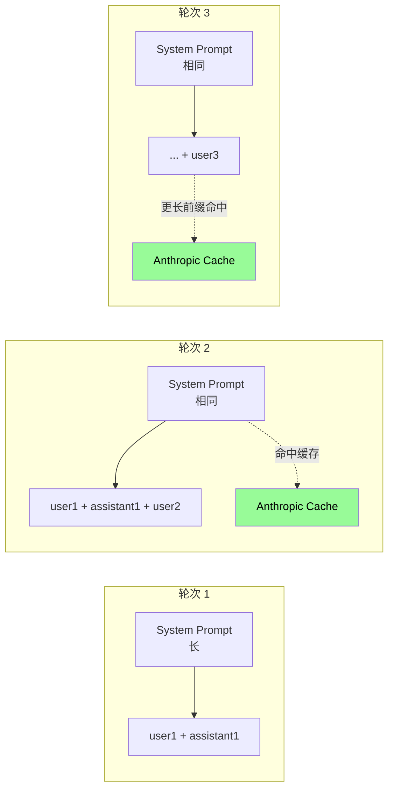
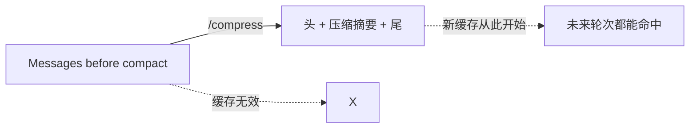

# 27. Prompt Caching 的边界

!!! danger "这是整个内核部分最重要的一章"
    破坏 prompt cache = **成本飙升 5-10 倍**。
    
    如果你打算改 Hermes 的代码,**先读完本章**。

---

## 心智模型:前缀缓存



**Anthropic 的 prompt cache 规则**(核心):
- 只有**前缀完全相同**才命中
- 命中部分按 **cache_read 折扣价**(input 的 1/10)
- 不命中按全价
- 缓存 **5 分钟 TTL**(不访问就蒸发)

---

## 为什么对 Hermes 极重要

一个典型长对话的 tokens 分布:

```
轮次 1:  System(5k) + U1(0.5k) + A1(2k) = 7.5k
轮次 2:  System(5k) + U1+A1(2.5k) + U2(0.5k) + A2(2k) = 10k
轮次 3:  ... 累积到 15k
...
轮次 20: 累积到 60k+
```

**每轮 API 调用都发整个历史**。没 cache:20 轮总 input = sum(5k, 7.5k, 10k, 12.5k, ...) ≈ **240k tokens**。

**有 cache**:每轮 input 只有**最后的增量 ~2.5k 收全价**,前面的全走 cache。总成本下降 **80%+**。

---

## Hermes 的 cache 策略

### 哪些段落被标记为 cacheable

```python
# agent/prompt_caching.py

def add_cache_control_to_messages(messages):
    """
    给合适的消息块打上 cache_control 标记。
    """
    # 1. System prompt 末尾打标记
    if messages[0]["role"] == "system":
        messages[0]["content"] = [
            {"type": "text", "text": "...", "cache_control": {"type": "ephemeral"}}
        ]

    # 2. 历史对话的某个合适的点打标记(不是每轮都打)
    # ...
```

**只有**:
- 系统提示 **末尾**
- 历史对话的某些**检查点**

会被标记 `cache_control`。Anthropic 最多允许 4 个 cache breakpoints per request。

---

## 规则 1 · 不要修改已有消息

❌ **错误示范**:

```python
# 用户编辑了上一条消息,你改 messages[i]["content"]
messages[i]["content"] = new_content  # BANG! 破缓存

agent.continue_conversation(messages)
```

这会让 **messages[i] 之后所有缓存失效**。长对话里这代价巨大。

✅ **正确做法**:

```python
# 要么开新 session
# 要么把修改作为"新一条 user message":
messages.append({
    "role": "user",
    "content": "我上一条说错了,应该是 X",
})
```

---

## 规则 2 · 不要 mid-session 改 system prompt

❌ **错误示范**:

```python
# 用户 /personality 切换了
messages[0]["content"] = build_system_prompt_with_new_personality()

agent.continue(messages)
```

**整个缓存全没了**。下一轮按全价重发 60k tokens。

✅ **正确做法**:
- Personality 切换是**有代价的**(缓存破坏)—— UI 告知用户这轮之后新缓存开始
- 不要在中间任意时刻改 system —— 要么 session 开始时决定好,要么接受破缓存的代价

---

## 规则 3 · 不要 mid-session 改 toolsets

❌ **错误示范**:

```python
# 对话到一半,用户启用新 toolset
agent.enabled_toolsets.append("new_set")
# 下一轮工具 schema 变了
```

**工具 schema 是系统提示的一部分**,变了 = 破缓存。

✅ **正确做法**:
- 会话开始时确定 toolset
- 运行时增删 toolset 要警告用户 "将清除缓存"
- 或者:**新 toolset 的工具始终注册但看起来不可用**,用 check_fn 控制可见性 —— 不重建 schema

---

## 规则 4 · 不要 mid-session 重载 memory

❌ **错误示范**:

```python
# 用户说 "重新读一下 memory",你这么做:
system_prompt = build_system_prompt(memory=load_fresh_memory())
messages[0]["content"] = system_prompt

agent.continue(messages)
```

**破缓存**。

✅ **正确做法**:

Hermes 的**冻结快照** (frozen snapshot) 机制就是为了防这个:
- 会话启动时读一次 memory,写入系统提示
- 整个会话里系统提示**不变**,即使 memory 文件改了
- **下次新 session 才生效**

这是为什么你在本次会话里 `memory.add("X")`,紧接着问 agent "X 是什么",它可能不知道 —— 系统提示没变,它看不到新写的。

---

## 规则 5 · 预留好 cache breakpoint 位置

Anthropic 最多 4 个 cache_control 标记。Hermes 的分配:

1. **System prompt 末尾** —— 最稳定
2. **First user turn 后** —— 通常是任务大意,也稳定
3. **History 某个节点** —— 动态选择
4. **最近的 assistant turn** —— 帮助下一轮快速命中

你**不应该**直接操作 cache_control(除非你在改 `prompt_caching.py`)。

---

## 允许破坏缓存的场景

只有**两种情况**可以破坏缓存:

### 1. Context Compression



压缩**必然**破坏缓存 —— 但一次破坏能省下之后几十轮的 context 费用,净收益正。

### 2. Session 间的 cache drift

不同 session 的系统提示自然不同(不同 personality / 不同 memory 状态),cache 互相独立,这是正常的。

---

## 在代码里怎么验证缓存行为

Anthropic response 里有 cache metadata:

```python
response.usage.cache_creation_input_tokens   # 这次创建了多少
response.usage.cache_read_input_tokens        # 这次命中了多少
response.usage.input_tokens                   # 全价部分
```

Hermes `/usage` 命令显示 cache hit rate:

```
Context: 45,234 / 200,000 tokens
Session cost: $0.18
Cache hit rate: 87%    ← 这个指标
```

**健康的 cache hit rate 是 70-90%**。低于 50% 说明某处在反复重建缓存,值得排查。

---

## 最大的坑:你以为没动,其实动了

某些操作看起来"只是给 agent 多说一句话",但实际上**改了系统提示**,破缓存。

### 陷阱 1 · 动态时间戳

```python
system_prompt = f"当前时间是 {datetime.now()}"
# ↑ 每次调用都不同 → 永远命中不了缓存
```

**对策**:
- **session 开始时的时间戳冻结**(整个 session 里用同一个时间)
- 如果真需要实时时间,通过**工具**提供(`get_current_time` 工具),不要进系统提示

### 陷阱 2 · 工作目录变化

```python
system_prompt = f"你在 {os.getcwd()} 工作..."
# ↑ 用户 cd 了,下一轮系统提示变
```

Hermes 已经处理(`agent/subdirectory_hints.py` 的 hint 是**会话开始时冻结**的),你写代码时不要破坏这个约定。

### 陷阱 3 · 非确定性序列化

```python
system_prompt = f"工具: {json.dumps(get_tools(), sort_keys=False)}"
# ↑ dict 顺序可能每次不同(Python 3.7+ 保证插入序,但看你有没有 sort)
```

**对策**:**永远 `sort_keys=True`** 序列化。

### 陷阱 4 · 在 system 里插入 session_id

```python
system_prompt = f"session_id: {session_id}\n\n..."
# ↑ 每个 session 确实不同,但 session 内要稳定
```

这个其实 OK(同一 session 里 session_id 不变),但**不要把别的东西塞进来**造成意外变化。

---

## 跨 session 的 cache drift

Anthropic cache 按**账户 + 请求内容**维度共享。不同 session 之间:

- **系统提示前缀相同**(比如「你是 Hermes Agent」)—— **可以跨 session 命中**
- **memory / personality / tools schema 不同** —— 这部分每个 session 独立

所以理论上**共用前缀**的缓存跨 session 生效。实际上:
- 前缀要**非常稳定**
- 5 分钟 TTL 限制跨 session 需要频繁触发

**不要刻意优化跨 session cache**,自然就好。

---

## 实验:怎么观察缓存行为

```bash
HERMES_DEBUG=1 HERMES_LOG_USAGE=1 hermes

> 你好
[DEBUG] API call: input=5012 tokens, cache_creation=5000, cache_read=0
> 再来一轮
[DEBUG] API call: input=5512 tokens, cache_creation=0, cache_read=5000
                                            ↑ cache 命中了
> /personality coder
> 再聊一轮
[DEBUG] API call: input=6012 tokens, cache_creation=5800, cache_read=0
                                            ↑ 破了! 全价重建
```

---

## Provider 差异

上面都是 Anthropic。其他 provider:

| Provider | prompt cache 支持 |
|---|---|
| **Anthropic** | ✓ 原生,Hermes 默认实现 |
| **OpenAI** | ✓(5 分钟自动,无需标记) |
| **Gemini** | ✓(但限制多) |
| **DeepSeek / Kimi** | ✓(各自机制) |
| **OpenRouter** | 取决于底层 provider |
| **本地模型** | 取决于引擎(vLLM 支持) |

Hermes 以 Anthropic 的行为为标杆,**对其他 provider 可能非最优但不破坏**。

---

## 代码约定(给贡献者)

如果你要改 Hermes 的以下文件,请**确认不破坏 cache**:

- `agent/prompt_builder.py`
- `agent/prompt_caching.py`
- `agent/context_compressor.py`
- `agent/memory_manager.py`
- `model_tools.py`

**PR 自查清单**:

- [ ] 我的改动**不会** mid-session 修改 system prompt
- [ ] 我的改动**不会** mid-session 修改 messages 历史(追加除外)
- [ ] 如果涉及 toolset 变化,我在 PR 描述里**明确提到**并评估影响
- [ ] 我跑了本地的 `tests/agent/test_prompt_caching.py`
- [ ] 我的代码产生的 system prompt 对同一 session 是**确定性**的(多次调用相同输入得相同输出)

---

## 为什么 Hermes 要做"冻结快照"

再强调一次 —— Hermes 的这几个冻结快照都是为了缓存:

| 数据 | 快照点 | 为什么 |
|---|---|---|
| MEMORY.md / USER.md | session 启动 | 防 memory 写入破缓存 |
| AGENTS.md / CLAUDE.md | session 启动 | 防 context files 改动破缓存 |
| Subdirectory hints | session 启动 | 防 cd 破缓存 |
| Personality | session 启动 | 改 personality 必破缓存,所以只在 session 间改 |

理解了缓存,这些设计就合理了。

---

## 进阶阅读

- Anthropic 官方 prompt caching 文档:[docs.anthropic.com/en/docs/build-with-claude/prompt-caching](https://docs.anthropic.com/en/docs/build-with-claude/prompt-caching)
- 源码:`agent/prompt_caching.py`(< 400 行)
- 源码:`agent/prompt_builder.py` 看系统提示**分段**,缓存友好的设计

---

下一章:[28. Profile 工作原理 →](28-profile-internals.md)
