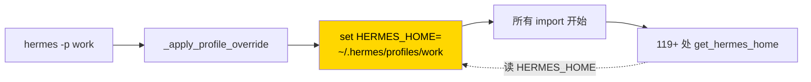
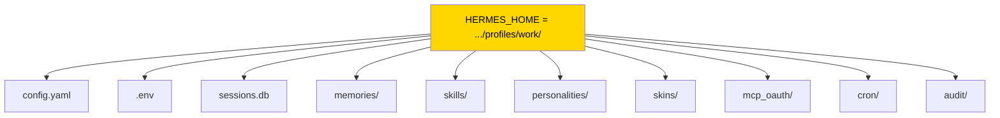
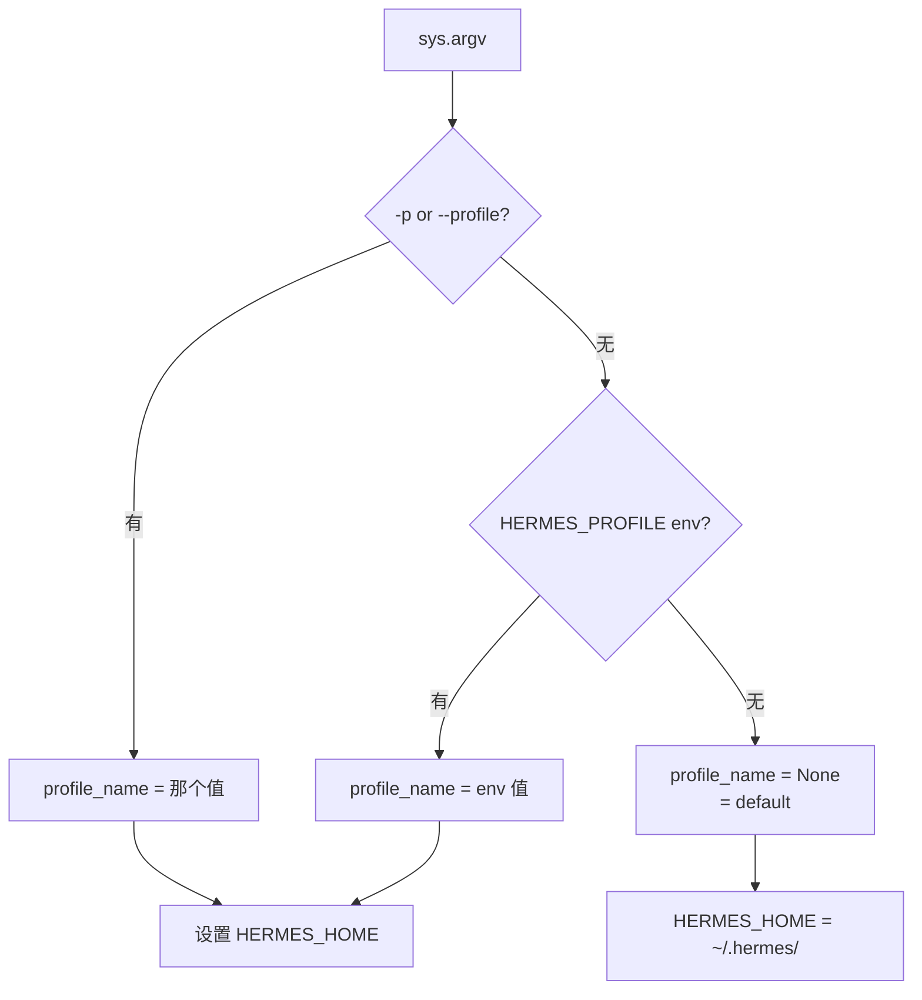

# 28. Profile 工作原理

## 核心机制:一个环境变量搞定一切



**一句话**:profile 就是**一个独立的 HERMES_HOME 目录**,通过环境变量传递给所有代码。

---

## `_apply_profile_override()` 源码走读

```python
# hermes_cli/main.py

def _apply_profile_override():
    """
    关键:必须在任何模块 import 之前设 HERMES_HOME。
    
    原因:很多模块有:
        from hermes_constants import get_hermes_home
        DATA_DIR = get_hermes_home() / "data"   # 模块级缓存!
    
    如果 profile 设置晚于 import,这些模块级常量已经基于错误的 HOME 定格。
    """
    args = sys.argv
    
    # 1. 扫命令行找 -p <profile> / --profile <profile>
    profile_name = None
    for i, a in enumerate(args):
        if a in ("-p", "--profile") and i + 1 < len(args):
            profile_name = args[i + 1]
            break
    
    # 2. 或者从 HERMES_PROFILE 环境变量读
    if not profile_name:
        profile_name = os.environ.get("HERMES_PROFILE")
    
    # 3. 如果没指定,用默认
    if not profile_name or profile_name == "default":
        os.environ["HERMES_HOME"] = str(_get_default_hermes_home())
        return
    
    # 4. 设置 profile 的 HOME
    profile_home = _get_profiles_root() / profile_name
    profile_home.mkdir(parents=True, exist_ok=True)
    os.environ["HERMES_HOME"] = str(profile_home)


def _get_default_hermes_home() -> Path:
    """无 profile 时的默认。~/.hermes/ 或 HERMES_HOME env var。"""
    env = os.environ.get("HERMES_HOME")
    return Path(env) if env else Path.home() / ".hermes"


def _get_profiles_root() -> Path:
    """profiles 目录的固定位置,不受 HERMES_HOME 影响。"""
    return Path.home() / ".hermes" / "profiles"
    # ↑ 故意写死 Path.home(),不用 get_hermes_home()
    # 这样 `hermes -p coder profile list` 能看到所有 profile
```

### 关键设计点 1 · 入口点第一行

`hermes_cli/main.py` 的**第一行**(import 之前):

```python
#!/usr/bin/env python3
import os
import sys

# ↓ 必须在任何其他 import 之前
from hermes_cli._profile_bootstrap import _apply_profile_override
_apply_profile_override()

# 接下来才能 import 其他模块
from hermes_cli.config import load_config
from cli import HermesCLI
# ...
```

**为什么**:Python import 是一次性求值的。如果 `cli.py` 里有:

```python
from hermes_constants import get_hermes_home
DEFAULT_SESSION_DB = get_hermes_home() / "sessions.db"
```

这个 `DEFAULT_SESSION_DB` 在 `cli` 被第一次 import 时就**定格了**。如果 profile 设置晚于这行 import,profile 就无效。

### 关键设计点 2 · profiles 根目录不受 override 影响

```python
def _get_profiles_root():
    return Path.home() / ".hermes" / "profiles"
```

**故意不用 `get_hermes_home()`**。如果用了会产生问题:

```
hermes -p work profile list
                 ↑ HERMES_HOME 已经被设成 profiles/work
                   那 list 怎么看到其他 profile?
```

通过把 profiles 根目录**固定在 `~/.hermes/profiles/`**,不论当前用哪个 profile,`profile list` 都能看到全部。

---

## `get_hermes_home()` / `display_hermes_home()`

```python
# hermes_constants.py

def get_hermes_home() -> Path:
    """
    代码路径:读 HERMES_HOME env var。
    Profile 感知。用于文件读写、缓存、日志。
    """
    env = os.environ.get("HERMES_HOME")
    if env:
        return Path(env)
    return Path.home() / ".hermes"


def display_hermes_home() -> str:
    """
    用户展示路径:返回 `~/.hermes` 或 `~/.hermes/profiles/<name>`。
    用于用户可见的 print / log 消息。
    """
    home = get_hermes_home()
    try:
        # 如果是 profile,返回"可读形式"
        relative = home.relative_to(Path.home())
        return f"~/{relative}"
    except ValueError:
        return str(home)
```

**规则**:

| 场景 | 用哪个 |
|---|---|
| 读写文件 / 持久化路径 | `get_hermes_home()` |
| print / log / 给用户看的消息 | `display_hermes_home()` |
| 工具 schema description 里提到路径 | `display_hermes_home()` |

---

## Profile 影响的范围



每样东西都通过 `get_hermes_home() / <subpath>` 访问。profile 切换**一刀切**全部隔离。

---

## 代码示范:Profile-safe 的写法

### ❌ 错误

```python
from pathlib import Path

# 模块级常量,import 时就算了
CACHE_DIR = Path.home() / ".hermes" / "my-tool-cache"

def save_cache(data):
    CACHE_DIR.mkdir(exist_ok=True)
    (CACHE_DIR / "data.json").write_text(json.dumps(data))
```

这段代码在 profile 下**永远写到默认 profile 的 cache**。

### ✅ 正确写法 1:函数内调用

```python
from hermes_constants import get_hermes_home

def save_cache(data):
    cache_dir = get_hermes_home() / "my-tool-cache"
    cache_dir.mkdir(exist_ok=True)
    (cache_dir / "data.json").write_text(json.dumps(data))
```

每次调用**动态决定**路径。

### ✅ 正确写法 2:模块级常量

```python
from hermes_constants import get_hermes_home

# 模块级,但在 _apply_profile_override() 之后 import
CACHE_DIR = get_hermes_home() / "my-tool-cache"

def save_cache(data):
    CACHE_DIR.mkdir(exist_ok=True)
    ...
```

**这也 OK**,只要该模块是在 `_apply_profile_override()` 之后 import 的。这是正常情况 —— 入口点先调用 override,再 import 所有其他模块。

**例外**:如果你的模块被**其他工具**或**测试**直接 import,绕过 main.py,profile 就没设置 —— `get_hermes_home()` 返回默认。这通常是 OK 的(测试环境已经用 fixture 重定向了 HERMES_HOME)。

---

## Gateway Platform Token 锁

多 profile 都配了同一个 Telegram bot → 冲突。解决方案:

```python
# gateway/status.py

def acquire_scoped_lock(
    token: str,
    profile_name: str,
    platform: str,
) -> bool:
    """
    尝试用文件锁占用 token。
    
    lock file:
        <profile>/gateway/locks/<platform>-<token_hash>.lock
    
    其他 profile 如果已经占着同一 token hash,返回 False。
    """
    lock_path = _lock_path(token, platform)
    if lock_path.exists():
        owner = lock_path.read_text().strip()
        if owner != profile_name:
            raise TokenInUseError(
                f"Token already locked by profile '{owner}'"
            )
    lock_path.parent.mkdir(exist_ok=True, parents=True)
    lock_path.write_text(profile_name)
    return True


def release_scoped_lock(token: str, platform: str):
    lock_path = _lock_path(token, platform)
    if lock_path.exists():
        lock_path.unlink()
```

**规范**:每个 gateway adapter 在 `connect()` 调 acquire,`disconnect()` 调 release。

---

## 测试里怎么处理 profile

`tests/conftest.py` 有个 autouse fixture:

```python
@pytest.fixture(autouse=True)
def _isolate_hermes_home(tmp_path, monkeypatch):
    """
    每个测试都跑在干净的 tmp 目录下,不污染用户真实 ~/.hermes/。
    """
    fake_home = tmp_path / ".hermes"
    fake_home.mkdir()
    monkeypatch.setenv("HERMES_HOME", str(fake_home))
    yield fake_home
```

**任何测试都会被这个 fixture 自动包裹**,写 / 读 `~/.hermes/` 都落在 tmp 目录。

### Profile 相关的测试

```python
@pytest.fixture
def profile_env(tmp_path, monkeypatch):
    """
    测试 profile 功能时,mock Path.home 也要改到 tmp,
    因为 _get_profiles_root() 用 Path.home()。
    """
    home = tmp_path / ".hermes"
    home.mkdir()
    monkeypatch.setattr(Path, "home", lambda: tmp_path)
    monkeypatch.setenv("HERMES_HOME", str(home))
    return home


def test_profile_create(profile_env):
    # 现在可以安全测 hermes profile create xxx
    ...
```

---

## 命令行参数的解析

```bash
hermes -p work cron list
hermes --profile work cron list
hermes cron list   # 无 profile → 默认
```

解析顺序:



---

## 常见坑

### 坑 1 · 在 `_apply_profile_override` 之前 import

**现象**:用户用 profile,但某个模块读写的还是默认目录。

**排查**:grep `from hermes_constants import get_hermes_home` 的**导入时机**。

**对策**:
- 入口点**保证** `_apply_profile_override()` 在其他所有 import 之前
- 如果你的代码被脚本 import,参考测试 fixture 的写法先设环境变量

### 坑 2 · hardcode `~/.hermes/`

**现象**:用户 profile 下这个东西不生效。

**对策**:搜 `Path.home() / ".hermes"`、`~/.hermes/`、`/home/user/.hermes/` 之类的 hardcode,全改成 `get_hermes_home()`。

### 坑 3 · Module-level 常量在不同 import 路径上不同

**现象**:直接跑脚本 vs 通过 `hermes` 命令跑,行为不同。

**原因**:模块级 `CONST = get_hermes_home() / "x"` 被 import 时求值。直接跑脚本,profile override 可能没跑。

**对策**:如果可能被直接 import,**不要**在模块级 cache 路径,用函数包装。

### 坑 4 · 测试污染真实 `~/.hermes/`

**现象**:跑完测试发现你的真实 memory 被改了。

**对策**:**所有测试必须**依赖 `_isolate_hermes_home` fixture(autouse,正常情况自动生效)。如果你手动禁用了它,错了自己负责。

### 坑 5 · `_get_profiles_root` 用了 `get_hermes_home()`

**现象**:`hermes -p A profile list` 看不到 profile B。

**原因**:有人手贱把 `_get_profiles_root` 改成用 `get_hermes_home()`。

**对策**:**profile root 必须用 `Path.home() / ".hermes" / "profiles"`**,不受 override 影响。这是刻意为之。

---

## Debug 一个 profile 相关问题

```bash
# 1. 看当前 HERMES_HOME
env | grep HERMES

# 2. hermes doctor 会打印(v0.9+)
hermes doctor
# 输出里应该有:
# HERMES_HOME: /Users/you/.hermes
# Profile: default

# 3. 直接问 Hermes(用 terminal 工具)
hermes
> 跑 `echo $HERMES_HOME`
```

---

## 进阶

- 源码 `hermes_cli/main.py` 读前 100 行
- 源码 `hermes_constants.py` 全文(< 100 行)
- PR #3575 当年修的 5 个 hardcode bug(git log 搜)

---

下一章:[29. Context Compression 算法 →](29-compression-algo.md)
