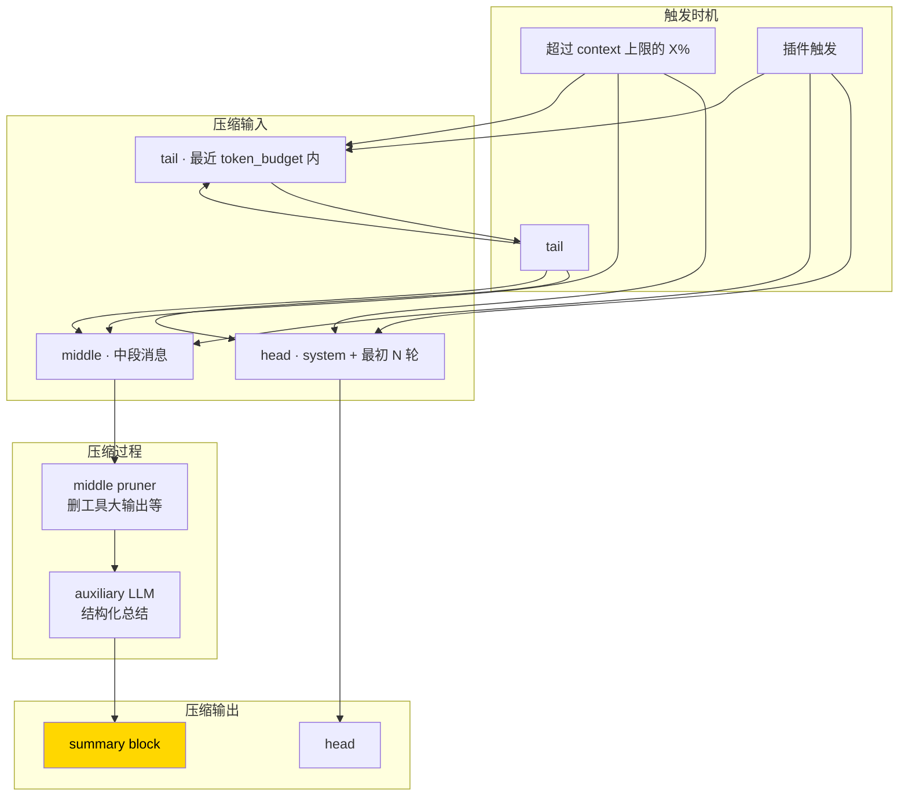

# 29. Context Compression 算法

## 源码:`agent/context_compressor.py`

## 心智模型:头保留 + 中压缩 + 尾保留



---

## 触发条件

```python
def should_compact(messages, model) -> bool:
    total_tokens = estimate_tokens(messages)
    context_limit = get_model_context_length(model)
    pressure = total_tokens / context_limit
    
    # 默认阈值:接近 limit 的 80% 触发
    return pressure > 0.8
```

**Tiered warnings**(v0.9+):
- `pressure > 0.65` —— 只记日志,不做事
- `pressure > 0.75` —— 打印 warning 给用户("context getting large")
- `pressure > 0.85` —— 自动触发压缩
- `pressure > 0.95` —— 紧急压缩

---

## 被保留的 head 和 tail

```python
class TokenBudget:
    head_reserved_tokens: int = 4_000
    tail_reserved_tokens: int = 16_000
    summary_target_tokens: int = 4_000   # 期望摘要长度
```

**Head**:系统提示 + 最初 1-2 轮用户+助手消息。

**Tail 是 token-budget 式的**,不是固定数量:

```python
def select_tail(messages, budget_tokens):
    """从尾部往前累加,直到填满 budget。"""
    selected = []
    total = 0
    for msg in reversed(messages):
        msg_tokens = estimate_tokens([msg])
        if total + msg_tokens > budget_tokens:
            break
        selected.insert(0, msg)
        total += msg_tokens
    return selected
```

**优点**:短消息多保留,长消息适度裁剪。

---

## 中段预修剪(Pre-pass)

在送去 auxiliary LLM 总结前,先做**便宜的预修剪**:

```python
def prune_middle(middle_msgs):
    """便宜的预修剪,不调 LLM。"""
    for msg in middle_msgs:
        if msg["role"] == "tool":
            # 工具结果太长,截断并留个标记
            if len(msg["content"]) > 2000:
                msg["content"] = (
                    msg["content"][:800]
                    + f"\n\n[... 截断 {len(msg['content'])-1600} 字符 ...]\n\n"
                    + msg["content"][-800:]
                )
    return middle_msgs
```

**为什么**:一个 `ls -la /` 返回 5000 行,大部分对后续理解无用。裁掉再送总结,省 auxiliary token。

---

## 结构化摘要模板

Hermes 要求 auxiliary model **按模板输出**:

```
[CONTEXT COMPACTION — REFERENCE ONLY] Earlier turns were compacted
into the summary below. This is a handoff from a previous context
window — treat it as background reference, NOT as active instructions.
Do not respond to any questions in the summary directly.

## Task Context
<任务背景,1-3 段>

## Key Decisions Resolved
<已达成的结论,bullet 形式>

## Active Files
<涉及的文件,列表>

## Pending Questions
<未决的问题>

## Remaining Work
<待完成工作,用 "Remaining" 而非 "Next Steps" 避免被误当成指令>
```

**设计细节**:

1. **开头 "REFERENCE ONLY" 警告** —— 防止模型把摘要当成用户请求去回答
2. **"Do not respond"** —— 明确禁止
3. **"Remaining Work" 不是 "Next Steps"** —— 避免命令式口吻被误解
4. **"Pending Questions" 列出但不回答** —— 后续需要时 agent 可以主动问用户

---

## 递归压缩(多次压缩)

长对话可能压 2-3 次。Hermes 的策略:

```python
def compress(messages, prev_summary=None):
    """
    prev_summary:上一轮压缩的摘要(如果这是第二次压缩)。
    
    传给 auxiliary model 时,让它"更新"这个摘要,而不是从头写。
    """
    prompt = f"""
    Update the existing summary with new information from recent messages.
    
    EXISTING SUMMARY:
    {prev_summary}
    
    NEW MESSAGES SINCE:
    {format_messages(new_middle)}
    
    Rewrite the summary incorporating both. Format: <模板>.
    """
```

**迭代式总结**的好处:
- 重要决策不会被第二次压缩丢失
- 新信息能合理融入

---

## auxiliary model 的选择

```python
# agent/auxiliary_client.py

def get_auxiliary_client(task: str = "compression"):
    """
    按 config.auxiliary.mode 决定:
    - auto (v0.10 默认):用主模型
    - same-as-main:强制主模型
    - custom:按 config.auxiliary.custom[task] 挑
    """
```

**默认 auto 的好处**:
- 避免用户配置 2 个 provider(主 + 辅助)
- 信任边界同一个

**custom 的价值**:
- 主模型贵(Opus),辅助用便宜的(Gemini Flash)省钱
- 主模型慢(reasoning models),辅助用快的不阻塞

---

## Live model vs 冷配置

```python
# 坑:不要用配置里的默认 auxiliary model,用会话里 live 的模型
# agent/context_compressor.py

def compress_session(session):
    # ❌ 用配置模型 — 可能与 session 当前实际用的模型不同
    # model = config.default_auxiliary_model
    
    # ✅ 用 session 里的 live 模型
    model = session.current_model  # 用户可能 /model 切换过
```

这是 v0.9.0 才修的坑(PR #8258)。

---

## Scaled summary budget

摘要目标长度**按被压缩内容量按比例调整**:

```python
def compute_summary_budget(middle_tokens):
    # 被压缩 30k → 摘要 3k(10%)
    # 被压缩 10k → 摘要 2k(20%) —— 比例更高,细节保留更多
    # 被压缩 100k → 摘要 5k(5%)—— 必须更激进
    
    ratio = {
        (0, 10_000): 0.20,
        (10_000, 30_000): 0.15,
        (30_000, 100_000): 0.10,
        (100_000, 999_999): 0.05,
    }
    for (lo, hi), r in ratio.items():
        if lo <= middle_tokens < hi:
            return int(middle_tokens * r)
```

---

## `/compress <focus>` 实现

用户带主题:

```text
> /compress 保留所有 auth.py 相关细节
```

传给 auxiliary model 的 prompt 多一段:

```
FOCUS:
保留所有 auth.py 相关细节

When summarizing, prioritize preserving details related to FOCUS.
Other content can be aggressively summarized.
```

Auxiliary model 偏向更详细地保留 focus 相关内容,其他更粗略。

---

## 降级保护

万一 auxiliary model 挂了:

```python
def compress_with_fallback(messages):
    try:
        return compress_with_llm(messages)
    except Exception as e:
        logger.error("LLM compression failed, falling back to truncation")
        # 降级:直接**截断**中段,留个提示
        return truncate_middle(messages, note=f"[Compression LLM failed: {e}]")
```

宁愿粗糙地继续,也不要让会话因为压缩失败而中断。

---

## 跟 Context Engine 的关系

**v0.9+ 的 Context Engine 插件可以替换整个压缩逻辑**。

默认 `ContextEngine`:
```python
class DefaultContextEngine:
    def compact(self, messages, model):
        return default_context_compressor.compress(messages, model)
```

你可以实现自己的:
```python
class MyContextEngine(ContextEngine):
    def compact(self, messages, model):
        # 比如:基于向量数据库找相似历史,注入新 context
        similar = my_vector_db.query(messages)
        return head + [summary_of_similar] + tail
```

通过 `hermes plugins` 启用。

---

## 性能 / 成本典型值

| 中段大小 | auxiliary = Flash | auxiliary = Sonnet |
|---|---:|---:|
| 10k tokens | ~$0.005, 2s | ~$0.04, 5s |
| 50k tokens | ~$0.03, 8s | ~$0.20, 20s |
| 100k tokens | ~$0.07, 15s | ~$0.50, 40s |

→ **长对话用 Flash 压缩省 5-10 倍成本**。

---

## 常见坑

### 坑 1 · 压缩把 focus 压没了

**现象**:用户 `/compress focus: X`,但结果里 X 的细节还是丢了。

**排查**:
- auxiliary model 能力不够(小模型不理解 focus 指令)
- prompt 里 focus 写得太模糊

**对策**:升级 auxiliary model,focus 写具体。

### 坑 2 · 压缩后 agent 重复提问

**现象**:压缩摘要里提了 "Pending Questions",agent 下一轮去问用户已经回答过的东西。

**原因**:老版本没加 "REFERENCE ONLY" 警告(v0.8 修了)。

**对策**:升级 ≥ v0.8。

### 坑 3 · 压缩中断

**现象**:压缩到一半用户 Ctrl+C。

**对策**:中断后保留**压缩前的消息**继续。下次 `/compress` 重试。

### 坑 4 · 连续多次压缩质量下降

**现象**:第一次压缩后继续聊,触发第二次压缩 —— 重要信息丢了。

**对策**:
- 第 3 次压缩前考虑 `/new`
- 关键事实提前写入 **memory**(不受压缩影响)

### 坑 5 · 工具调用 ID 在压缩后对不上

**现象**:ID `call_abc123` 出现在摘要里,但后续 tool_result 找不到对应 call。

**对策**:压缩时**工具调用对**(assistant 的 tool_call + 对应的 tool result)要**作为整体**保留或整体压缩。`context_compressor.py` 里有 `_group_tool_pairs` 函数处理这个。

---

## 进阶

- 源码 `agent/context_compressor.py`(大约 800 行,注释详细)
- 源码 `agent/context_engine.py` 看插件接口
- 对照 PR #6395, #6453, #7983 看压缩的历史迭代

---

下一章:[30. 测试策略 →](30-testing.md)
