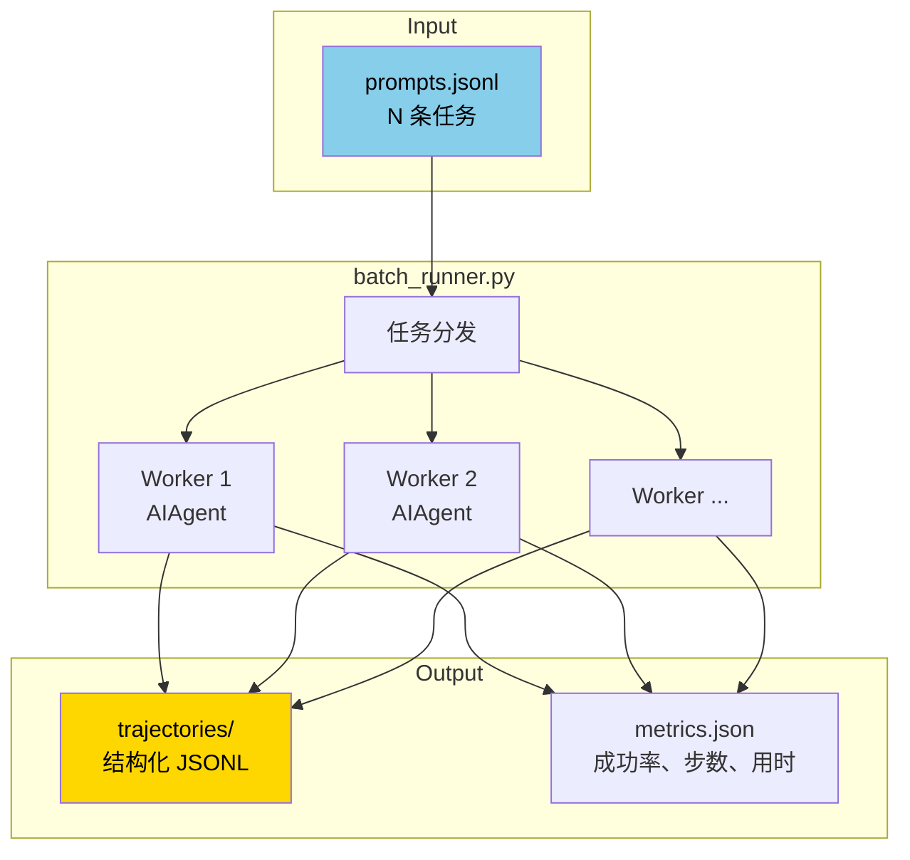

# 32. 批量轨迹生成

## 心智模型:并行跑 N 个 agent,产出轨迹



**用途**:
- 生成 SFT / DPO 训练数据
- 系统评估某模型的 agent 能力
- 跑一堆离线任务(比如"给这 200 个项目各自生成 README")

---

## 最小实践

### Step 1 · 准备任务文件

```jsonl
{"id": "task-001", "prompt": "Write a Python function to check if a number is prime."}
{"id": "task-002", "prompt": "Debug this code: def foo(): return x"}
{"id": "task-003", "prompt": "Create a Fibonacci generator."}
```

### Step 2 · 跑

```bash
python batch_runner.py \
    --input tasks.jsonl \
    --output trajectories/ \
    --model anthropic/claude-sonnet-4-6 \
    --concurrency 10 \
    --max-iterations 30
```

### Step 3 · 查看结果

```
trajectories/
├── task-001.json
├── task-002.json
├── task-003.json
└── metrics.json
```

每个 `.json` 长这样:

```json
{
  "id": "task-001",
  "prompt": "Write a Python function...",
  "model": "anthropic/claude-sonnet-4-6",
  "final_response": "```python\ndef is_prime(n):\n    ...",
  "messages": [
    {"role": "system", "content": "..."},
    {"role": "user", "content": "..."},
    {"role": "assistant", "tool_calls": [...]},
    {"role": "tool", "content": "..."},
    ...
  ],
  "usage": {
    "input_tokens": 5234,
    "output_tokens": 812,
    "cache_read_tokens": 4500
  },
  "tool_calls_made": 3,
  "duration_seconds": 12.4,
  "success": true,
  "error": null
}
```

---

## 参数详解

```bash
python batch_runner.py --help
```

关键参数:

| 参数 | 作用 | 典型值 |
|---|---|---|
| `--input` | JSONL 任务文件 | `tasks.jsonl` |
| `--output` | 输出目录 | `trajectories/` |
| `--model` | 主模型 | `anthropic/claude-sonnet-4-6` |
| `--provider` | provider | 自动推断或显式 |
| `--concurrency` | 并行数 | 5-20(看 API 限流) |
| `--max-iterations` | 单 task 最大步数 | 30-90 |
| `--timeout` | 单 task 超时(秒) | 600 |
| `--enabled-toolsets` | 启用的 toolset | `dev,web` |
| `--disabled-toolsets` | 禁用的 toolset | `browser` |
| `--save-all` | 连失败的也保存 | true |
| `--deterministic` | 关闭温度 / seed 固定 | 复现研究用 |
| `--resume` | 断点续跑 | 跳过已完成的 |

---

## 并行度与限流

```python
# batch_runner.py 内部
semaphore = asyncio.Semaphore(concurrency)

async def worker(task):
    async with semaphore:
        return await run_single(task)
```

**限流策略**:
- OpenRouter:同时 10-20 个通常 OK
- Anthropic 官方:看你的 tier
- OpenAI:Priority Processing 更稳定

**不要**:一口气 200 并发,API 会 429。

### 配 fallback 应对 429

```yaml
# ~/.hermes/config.yaml
providers:
  routing:
    fallback_model: openrouter/google/gemini-2.5-flash  # 主挂了跌到便宜的
    max_fallback_attempts: 3
```

---

## 成功标准的定义

Hermes 默认:**没 exception + 没达到 max_iterations** = 成功。

如果你要更细粒度,**后处理**或传入 `--success-checker`:

```python
# custom_checker.py
def check(trajectory) -> tuple[bool, str]:
    """Return (success, reason)."""
    # 比如要求最终响应包含特定关键词
    if "is_prime" not in trajectory["final_response"]:
        return False, "missing expected function"
    # 比如要求代码能跑
    if not try_exec(trajectory["final_response"]):
        return False, "code does not run"
    return True, "ok"
```

```bash
python batch_runner.py ... --success-checker custom_checker.check
```

---

## 成本估算

生成 1000 条轨迹的粗估:

| 模型 | 每条任务平均 tokens | 每条平均成本 | 1000 条 |
|---|---:|---:|---:|
| Claude Sonnet 4.6 | 20k in / 5k out | $0.14 | $140 |
| Claude Opus 4.7 | 20k in / 5k out | $0.68 | $680 |
| Gemini Flash | 20k in / 5k out | $0.006 | $6 |
| DeepSeek | 20k in / 5k out | $0.011 | $11 |

!!! tip "做研究省钱心法"
    - **模型选择**:生成 SFT 数据用 Sonnet / Opus 质量高;蒸馏小模型用 Gemini Flash 够用
    - **Prompt cache**:batch_runner 每个 task 是独立 session,**cache 打不进**。如果任务有公共 system prompt,考虑手动 warm cache 的 hack

---

## 跟官方 benchmark 联动:mini-swe-bench

Hermes 集成了 [mini-swe-bench](https://github.com/swe-bench/mini-swe-bench) 的简化版。

```bash
python mini_swe_runner.py \
    --dataset mini-swe-bench \
    --split verified \
    --output swe-results/ \
    --model anthropic/claude-opus-4-7 \
    --concurrency 5
```

输出符合 SWE-bench 格式,能直接提交榜单。

---

## 输出格式的选择

默认每个 task 一个 JSON 文件。也可以:

```bash
python batch_runner.py ... --output-format jsonl --output all.jsonl
```

→ 所有 trajectory 合在一个 JSONL(每行一个 task),方便后续批处理。

---

## Trajectory 用途:训练数据

轨迹拿去训练模型的常见链路:


见 [第 33 章 轨迹压缩](33-trajectory-compression.md)。

---

## 真实剧本

### 剧本 A · 跑 500 个 GitHub issue 作为数据

```bash
# 1. 从 GitHub API 抓最近 500 个 Python 项目的 issue
python scripts/collect_issues.py > issues.jsonl

# 2. 每个 issue 当作 prompt,让 agent 尝试解决
python batch_runner.py \
    --input issues.jsonl \
    --output issue-solutions/ \
    --model anthropic/claude-sonnet-4-6 \
    --concurrency 8 \
    --enabled-toolsets dev,file

# 3. 过滤成功的,用作 SFT 数据
jq 'select(.success == true)' issue-solutions/*.json > training-data.jsonl
```

### 剧本 B · A/B 测试两个模型的 agent 能力

```bash
# A:Sonnet
python batch_runner.py \
    --input benchmark.jsonl \
    --output bench-sonnet/ \
    --model anthropic/claude-sonnet-4-6

# B:Kimi K2.5
python batch_runner.py \
    --input benchmark.jsonl \
    --output bench-kimi/ \
    --model moonshot/kimi-k2-5

# 分析:
python scripts/compare_runs.py bench-sonnet/ bench-kimi/
# 输出:成功率、平均步数、平均耗时、token 消耗
```

---

## 常见坑

### 坑 1 · 并发太高 → 429

**对策**:降 concurrency,或者多 provider 轮询(credential pool)。

### 坑 2 · 某 task 无限循环

**现象**:一个 task 撞 max_iterations 还不停。

**对策**:
- 设合理 `--max-iterations` 和 `--timeout`
- 任务 prompt 写清楚**终止条件**

### 坑 3 · 输出目录爆炸

**现象**:1000 个 task × 每个轨迹 100KB = 100MB,GitHub 上传不了。

**对策**:
- 用 `--output-format jsonl`(单文件更小 + 更好压缩)
- gzip 打包
- 只保留你需要的字段(用 jq 后处理)

### 坑 4 · 不同 provider 输出格式差异

**现象**:Sonnet 和 Gemini 的 `reasoning` 字段结构不同。

**对策**:Hermes 已经统一成 OpenAI 格式,但某些 provider-specific 字段仍然不同。后处理时 `jq` 统一结构。

### 坑 5 · 敏感数据泄露

**现象**:task prompt 里有公司内部路径 / 代码,生成的轨迹里也有。

**对策**:
- 生成前 dedupe / redact
- 本地跑,不上传

---

## 进阶

- `environments/` 目录里的 Atropos 环境(第 34 章)
- 自定义 batch runner 的 hook:`--on-task-done` 回调做实时分析

---

下一章:[33. 轨迹压缩 →](33-trajectory-compression.md)
