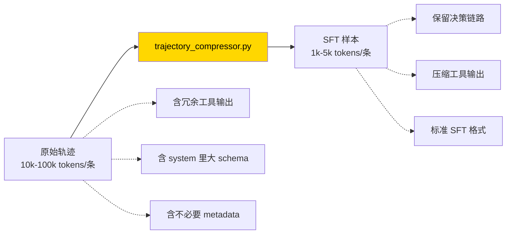
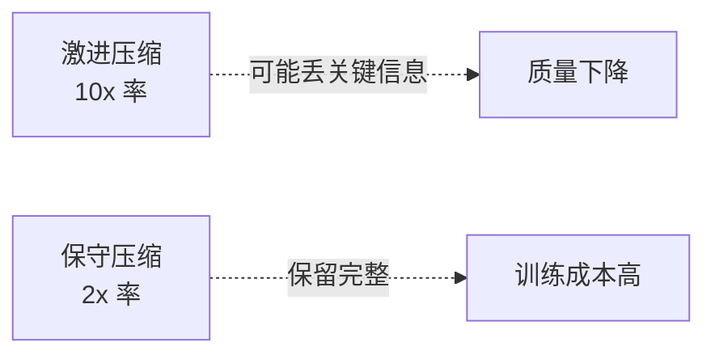

# 33. 轨迹压缩

## 心智模型:原始轨迹 → SFT 样本



**为什么要压缩**:
- 原始轨迹**太长**:一个典型 task 包含 5-10 轮 agent-tool 循环,累积 50k-100k tokens
- 训练时**单 sample 越大,训练效率越低**
- 大部分工具输出(如完整 `ls` 结果)对**训练下一代模型学 agent 行为**并不必要

---

## 压缩策略

### 策略 1 · 保留决策链路,删冗余输出

**删 / 裁**:
- `terminal` 跑 `ls -la` 返回 1000 行 → 保留前 20 行 + `[截断]` 标记
- `web_extract` 返回整页 HTML → 保留模型实际引用的段落
- 重复的错误信息 → 合并

**保**:
- 所有 `assistant` 消息(决策)
- 每个 `tool_call` 和 `tool_result` 的**关键摘要**
- user 消息完整

### 策略 2 · 转成标准 SFT 格式

```json
// 原始
{
  "messages": [
    {"role": "system", "content": "长 system prompt 含所有工具 schema"},
    {"role": "user", "content": "..."},
    {"role": "assistant", "tool_calls": [...]},
    {"role": "tool", "content": "..."}
  ]
}

// 压缩后(适合训练)
{
  "messages": [
    {"role": "system", "content": "你是一个有工具的助手。可用工具:terminal, file_read, ..."},
    {"role": "user", "content": "..."},
    {"role": "assistant", "content": "<tool_call>...</tool_call>"},
    {"role": "user", "content": "<tool_result>...</tool_result>"},
    {"role": "assistant", "content": "最终答案"}
  ]
}
```

**不同训练框架要不同格式**:
- OpenAI fine-tuning:`{role, content, tool_calls}`
- DeepSpeed / FSDP:简化成 `prompt / completion`
- HuggingFace SFT:ShareGPT 格式

---

## 最小实践

```bash
python trajectory_compressor.py \
    --input trajectories/ \
    --output sft-data.jsonl \
    --format openai-sft \
    --max-tokens 4096 \
    --drop-thinking false
```

### 关键参数

| 参数 | 作用 |
|---|---|
| `--format` | `openai-sft` / `sharegpt` / `alpaca` / `custom` |
| `--max-tokens` | 单个 sample 目标长度 |
| `--drop-thinking` | 是否丢弃 reasoning 段(看训练目标) |
| `--keep-failed` | 失败轨迹是否保留(可用于 DPO 负例) |
| `--truncate-tool-output` | 工具输出单次最大字符 |
| `--redact-paths` | 脱敏路径(隐私 / 匿名化) |

---

## 训练数据的三种用法

### 用法 1 · SFT(Supervised Fine-Tuning)

直接用 trajectory 的完整对话 train loss on assistant turns。

**目标**:让模型学会 agent 行为(工具调用、推理、格式化输出)。

**数据需要**:只要**成功的、高质量的**轨迹。

### 用法 2 · DPO(Direct Preference Optimization)

成对的 (好 / 坏) 轨迹。

**目标**:强化"做对了的 agent 行为" over "做错了的"。

**数据需要**:
- 成功 / 失败对
- 或不同模型对同一 task 的对比(Opus 成功,小模型失败)

### 用法 3 · RL 训练数据

看下一章 [34. Atropos RL 环境](34-atropos-rl.md)。

---

## 具体例子:生成 SFT 数据

```bash
# Step 1 · 批量生成
python batch_runner.py \
    --input benchmark.jsonl \
    --output raw-trajectories/ \
    --model anthropic/claude-opus-4-7 \
    --concurrency 5

# Step 2 · 筛选成功 & 高质量
python scripts/filter.py raw-trajectories/ \
    --min-tool-calls 2 \
    --max-tool-calls 15 \
    --success-only \
    > filtered.jsonl

# Step 3 · 压缩成 SFT
python trajectory_compressor.py \
    --input filtered.jsonl \
    --output sft-train.jsonl \
    --format openai-sft \
    --max-tokens 4096

# Step 4 · 分 train/val
python scripts/split.py sft-train.jsonl --train 0.95 --val 0.05

# Step 5 · 去训!
```

---

## 压缩质量 vs 压缩率

**trade-off**:



**经验参数**:

| 目标 | max-tokens | truncate-tool-output | 预期压缩比 |
|---|---:|---:|---:|
| 质量优先 | 8192 | 2000 | 2-3× |
| 平衡 | 4096 | 1000 | 3-5× |
| 效率优先 | 2048 | 500 | 5-10× |

---

## Tool use 标记方式

不同训练格式对工具调用的标记不同:

### 方式 1 · 原生 OpenAI Function Calling

```json
{
  "role": "assistant",
  "tool_calls": [
    {"id": "call_1", "function": {"name": "terminal", "arguments": "{...}"}}
  ]
}
```

**优点**:跟 inference 时一致。
**缺点**:训练框架支持不一(HF SFT 不天然支持)。

### 方式 2 · 特殊 token(如 `<tool_call>`)

```
<tool_call>
{"name": "terminal", "arguments": {"command": "ls"}}
</tool_call>
```

**优点**:纯文本,任何 SFT 框架都能训。
**缺点**:推理时要额外解析。

### 方式 3 · Hermes-style 结构化

Hermes 自己用的格式(源码 `trajectory_compressor.py`):

```
I need to list the files.

<tool_use name="terminal">
{"command": "ls"}
</tool_use>

<tool_output>
foo.py
bar.py
</tool_output>

Now I see two files...
```

**优点**:推理时 regex 解析简单。
**缺点**:非标准,生态不兼容。

---

## 数据质量 check

压缩前 / 后都做质量 check:

```bash
python scripts/check_quality.py sft-train.jsonl
```

输出:

```
Total samples: 5432
Avg tokens: 3021
Max tokens: 4096
Min tokens: 412

Issues:
  - 23 samples with truncated tool output > 80%
  - 12 samples missing final assistant response
  - 3 samples with null reasoning

Recommendations:
  - Re-run compression with higher max-tokens (8192?) for the 23 samples
  - Filter out the 12 broken samples
```

---

## 常见坑

### 坑 1 · 压缩丢失 system prompt

**现象**:训完的模型不会叫工具,因为 system prompt 里的工具 schema 被压没了。

**对策**:
- system prompt 单独保留,不压缩
- 或在压缩后**重新注入简化 schema**

### 坑 2 · 工具输出全没了

**现象**:所有 `tool_result` 都被截到 0 字符。

**对策**:`--truncate-tool-output` 不要过激进。至少保留 200 字符给模型看 shape。

### 坑 3 · 格式不符合目标框架

**现象**:training framework 报 `KeyError: 'text'`。

**对策**:`--format` 选对。或写 custom format(见源码 `trajectory_compressor.py`)。

### 坑 4 · 失败轨迹混入 SFT

**现象**:训出来的模型学了**错误行为**。

**对策**:
- 默认 `--success-only`
- 失败轨迹留做 DPO 负例

### 坑 5 · 敏感信息进训练集

**现象**:公司内部 path / 客户 data 泄露到训练数据。

**对策**:
- 压缩时 `--redact-paths`
- 手动 audit 一批样本
- 公司策略:训练数据离开本地前必须脱敏

---

## 进阶

- 源码 `trajectory_compressor.py`(~600 行)
- 自定义 format 见源码里的 `FORMAT_REGISTRY`

---

下一章:[34. Atropos RL 环境 →](34-atropos-rl.md)
