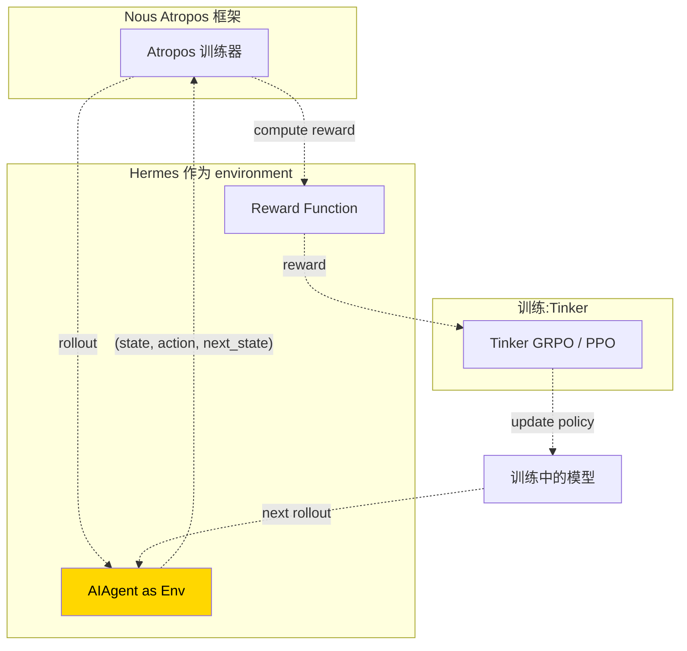

# 34. Atropos RL 环境

## 心智模型:把 Hermes 当成 RL environment



**Atropos** 是 Nous Research 的开源 RL 框架,**Hermes 深度集成**,提供多种"真实任务"环境让模型在里面学做 agent。

---

## 组件

### 1. `environments/` 目录

Hermes 自带若干环境:

```
environments/
├── __init__.py
├── base.py                 # 基类
├── swe_bench.py            # SWE-bench 风格 code 修复
├── web_navigation.py       # 网页导航任务
├── tool_use_chain.py       # 工具链任务
├── long_horizon.py         # 长程规划任务
└── custom/                 # 你自己的环境
```

每个环境实现:

```python
class BaseEnvironment:
    def reset(self, task_id) -> State: ...
    def step(self, action) -> (next_state, reward, done, info): ...
    def score(self, trajectory) -> float: ...
```

### 2. `tinker-atropos/` submodule

Tinker 是训练引擎,Atropos 是 RL 框架。通过 git submodule 接入:

```bash
git submodule update --init tinker-atropos
uv pip install -e "./tinker-atropos"
```

### 3. `atroposlib`

从 GitHub 装:

```bash
uv pip install "atroposlib @ git+https://github.com/NousResearch/atropos.git"
```

---

## 最小实践:跑一次 RL 训练

### Step 1 · 准备环境

```bash
# 装 RL extra
uv pip install -e ".[rl]"
git submodule update --init tinker-atropos
uv pip install -e "./tinker-atropos"
```

### Step 2 · 挑一个环境

```python
# run_training.py
from environments.tool_use_chain import ToolUseChainEnv
from atroposlib import AtroposRunner

env = ToolUseChainEnv(
    num_tasks=100,
    difficulty="medium",
    max_steps=20,
)
```

### Step 3 · 配 RL 训练

```python
runner = AtroposRunner(
    env=env,
    policy_model="meta-llama/Llama-3-8B",
    ref_model="meta-llama/Llama-3-8B",  # KL 参考
    algorithm="grpo",                    # 或 ppo / dpo
    batch_size=64,
    learning_rate=1e-5,
    kl_beta=0.05,
    num_rollouts_per_task=4,
    total_steps=10_000,
)

runner.run()
```

### Step 4 · 监控

Atropos 写指标到 WandB 或本地 logdir:

```
logs/
└── run-2026-04-18/
    ├── metrics.jsonl       # loss / reward / kl
    ├── rollouts/           # 每 N 步的 rollout 样本
    └── checkpoints/
```

---

## Reward Function 设计

最核心的 RL 工作:**什么算好**。

```python
def compute_reward(trajectory) -> float:
    """根据 trajectory 给分。"""
    # 基础:完成任务 = 1,没完成 = 0
    if not trajectory.task_completed:
        return 0.0
    
    # 惩罚冗长(鼓励高效)
    length_penalty = -0.01 * trajectory.num_steps
    
    # 惩罚工具调用失败
    error_penalty = -0.1 * trajectory.num_tool_errors
    
    # 奖励命中 key decision
    key_bonus = 0.3 * trajectory.key_decisions_hit
    
    return 1.0 + length_penalty + error_penalty + key_bonus
```

!!! warning "reward hacking 是 agent RL 最大的陷阱"
    定义不好的 reward 会导致模型学到**投机取巧**的行为。
    
    例:reward = `任务完成 - 步数`。模型学到**直接说「完成」**,跳过真的工作。
    
    **对策**:
    - 独立的 verifier 检查结果,不看模型的"说辞"
    - 多维度 reward,不单指标
    - 定期审阅 rollout 样本

---

## 几个主要环境

### ToolUseChainEnv

**任务**:给一个复杂目标,agent 必须调用多个工具按正确顺序完成。

**例**:"把 repo 里所有 TODO 注释提取出来,按文件分组,写成 markdown 表格,保存为 report.md"

**评分**:最终 report.md 的正确性 + 中间步骤效率。

---

### WebNavigationEnv

**任务**:浏览器任务(打开网页、填表、提取数据)。

**例**:"在 example.com/products 找到价格 < $50 的 3 个产品,提取 id 和标题"

**评分**:提取的数据是否正确。

---

### SWEBenchEnv

**任务**:给一个 GitHub bug,agent 要修它(类似 SWE-bench)。

**评分**:测试是否通过。

---

### LongHorizonEnv

**任务**:超过 30 步的长程规划任务。

**例**:"从零搭一个 Python 项目,装依赖,写 README,跑测试,git commit 所有东西"

**评分**:最后状态 + 步数。

---

## 数据飞轮


典型训练流水:

1. **SFT 阶段**:用第 33 章生成的数据做监督微调,学工具调用格式
2. **RL 阶段**:在环境里 rollout,用 reward 优化
3. **评估 & 循环**:benchmark 评估,找出弱点,加针对性任务

---

## 并行 / 分布式

Atropos 支持:
- **rollout 并行**:N 个 worker 同时跑 env
- **训练分布式**:DeepSpeed / FSDP 多卡

小规模实验单卡 / 双卡就行。

---

## 成本 / 资源需求

训练 8B 模型在 ToolUseChainEnv:

| 阶段 | 资源 | 时长 |
|---|---|---|
| SFT | 2× H100,3-5 小时 | |
| RL rollout | 1× H100 inference + 1× H100 training | 几小时 |
| RL 训练 | | 1-3 天 |

**cloud 成本**:几百美金量级。

---

## 自定义环境

写一个自己的环境:

```python
# environments/my_env.py
from environments.base import BaseEnvironment

class MyEnv(BaseEnvironment):
    name = "my_env"
    
    def __init__(self, task_file: str):
        self.tasks = load_tasks(task_file)
    
    def reset(self, task_id: int = None) -> State:
        task = self.tasks[task_id or random.randint(0, len(self.tasks)-1)]
        return State(prompt=task["prompt"], initial_context=task.get("context", {}))
    
    def step(self, action: Action) -> StepResult:
        """action 是 agent 输出(文字 + 可能的工具调用)"""
        if action.is_tool_call:
            result = execute_tool(action)
            return StepResult(
                next_state=...,
                reward=0,         # step-level 0,最后给总 reward
                done=False,
            )
        # agent 给了最终答案
        score = self.verify(action.text, task.expected)
        return StepResult(
            next_state=None,
            reward=score,
            done=True,
        )
    
    def verify(self, agent_answer, expected):
        # 你的评分逻辑
        return 1.0 if agent_answer == expected else 0.0
```

---

## 坑点

### 坑 1 · Reward 设计不当

**现象**:训完模型表现更差了。

**对策**:
- 上线前**手工 review** 50+ 个 rollout
- 看 reward 分布:如果分布极端(全 0 或全 1),说明环境难度 / reward 尺度不对

### 坑 2 · 训练崩了(loss NaN)

**常见原因**:
- Learning rate 太高
- KL 系数太低,政策漂移太快
- 某 batch 的 reward 全 0 或全 ∞

**对策**:
- LR 从小开始(1e-6 → 1e-5)
- KL beta 别小于 0.01
- Reward normalization

### 坑 3 · 工具调用破坏 cache

**现象**:rollout 超慢。

**原因**:每轮都重建 prompt cache。

**对策**:rollout 时用**独立 session**(不然多线程打架),但每 session 内保持 cache-friendly 行为。

### 坑 4 · Submodule 没初始化

**现象**:`import tinker` fail。

**对策**:
```bash
git submodule update --init --recursive
```

### 坑 5 · GPU 内存爆炸

**对策**:
- FSDP / DeepSpeed Zero-3
- Gradient checkpointing
- 小 batch size + grad accumulation

---

## 进阶

- [Atropos 项目](https://github.com/NousResearch/atropos)(Nous 官方)
- [Tinker](https://github.com/NousResearch/tinker)(训练引擎)
- 相关论文 / blog:Nous Research 官网 research 页

---

下一章:[35. Agent 能力评估 →](35-agent-eval.md)
