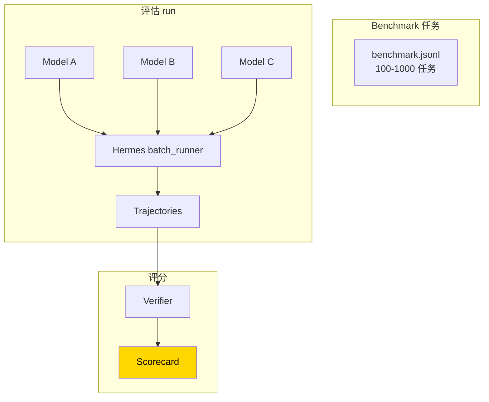

# 35. Agent 能力评估

## 心智模型:用 Hermes 当评测框架



**价值**:同一个 benchmark、同一套工具、同一个运行框架,**公平对比**不同模型的 agent 能力。

---

## 两种评估范式

### A · Reference-based(对答案)

**有标准答案**。模型输出和标答比较。

**例**:
- MMLU(多选题)
- HumanEval(代码跑过测试)
- SWE-bench(PR diff 跑过测试)

### B · Rubric-based(打分)

**没有唯一答案**。用 rubric 或**另一个 LLM 评判**。

**例**:
- "写一份 200 字的产品简介"
- "重构这段代码,提升可读性"

**Hermes 研究场景**以 A 为主,B 作辅助(用 auxiliary LLM 当 judge)。

---

## 最小实践:跑一次对比评估

### Step 1 · 准备 benchmark

```jsonl
{"id": "task-001", "prompt": "Given this CSV, compute the median of column B",
 "files": {"data.csv": "..."},
 "expected_answer": "42.5",
 "category": "data-analysis"}
{"id": "task-002", "prompt": "Fix this bug in auth.py",
 "files": {"auth.py": "..."},
 "expected_test": "tests/test_auth.py",
 "category": "code-fix"}
```

### Step 2 · 批量跑多个模型

```bash
for model in \
    "anthropic/claude-sonnet-4-6" \
    "anthropic/claude-opus-4-7" \
    "moonshot/kimi-k2-5" \
    "openrouter/deepseek/deepseek-chat"
do
    name=$(echo $model | tr '/' '-')
    python batch_runner.py \
        --input benchmark.jsonl \
        --output "bench/$name/" \
        --model "$model" \
        --concurrency 5 \
        --deterministic true
done
```

### Step 3 · 评分

```bash
python scripts/evaluate.py \
    --input-dir bench/ \
    --output-report report.html \
    --verifier strict-match
```

### Step 4 · 看结果

```
Benchmark: my-bench (100 tasks)

Model                      Success  Avg Steps  Avg Time  Cost / task
─────────────────────────  ───────  ─────────  ────────  ───────────
claude-opus-4-7             87%      4.2        24s       $0.35
claude-sonnet-4-6           78%      4.8        18s       $0.12
kimi-k2-5                   73%      5.1        14s       $0.08
deepseek-chat               58%      6.4        12s       $0.02

By category:
  data-analysis:      opus > sonnet > kimi > deepseek
  code-fix:           opus = sonnet > kimi > deepseek
  web-navigation:     sonnet > opus > kimi > deepseek  ← interesting
```

---

## Verifier 设计

### Verifier 1 · Exact Match

```python
def strict_match(agent_answer, expected):
    return agent_answer.strip() == expected.strip()
```

只在**单选 / 单值**任务用。

### Verifier 2 · 跑测试

```python
def run_test(agent_modified_code, test_file):
    # 把 agent 改后的代码写入 tmpdir
    # 跑 pytest,return 是否通过
    ...
```

代码修复类任务用。

### Verifier 3 · LLM as Judge

```python
def llm_judge(agent_answer, rubric):
    prompt = f"""
    Task: {task}
    Answer: {agent_answer}
    Rubric: {rubric}
    
    Score 0-10 with reasoning.
    """
    response = call_auxiliary_llm(prompt)
    return parse_score(response)
```

**适用**:主观质量(写作、设计、重构)。

**注意**:
- Judge 自己是 LLM,有偏见(常偏好自家模型)
- 用**多个 judge** 取平均
- 不要用被评估的模型去 judge 自己

### Verifier 4 · 混合评分

```python
def score(trajectory):
    # 多维度
    scores = {
        "correctness": strict_match(...),
        "efficiency": 1.0 / trajectory.num_steps,
        "cost": 1.0 / trajectory.tokens_used * SCALE,
        "judge": llm_judge(...),
    }
    # 加权
    return weighted_sum(scores, weights={
        "correctness": 0.6,
        "efficiency": 0.2,
        "cost": 0.1,
        "judge": 0.1,
    })
```

---

## mini-swe-bench

Hermes 集成了 SWE-bench 的简化版。

```bash
python mini_swe_runner.py \
    --dataset mini-swe-bench \
    --split verified \
    --model anthropic/claude-sonnet-4-6 \
    --output swe-results/
```

产出 SWE-bench 官方格式,可直接提交排行榜。

---

## 评估 benchmark 的好坏

一个好 benchmark:

- [x] **覆盖多样场景**(不只是一种任务)
- [x] **有 easy / medium / hard 分级**,能区分模型能力梯度
- [x] **自动化验证**,人工只抽查
- [x] **没有数据泄露**(任务里的答案不出现在公开语料)
- [x] **随时间稳定**(任务不会因外部变化失效,如某 API 变了)
- [x] **成本可控**(1000 任务 × 4 模型 总成本不超 $500)

---

## 防数据泄露

**现象**:某模型莫名高分。

**原因**:benchmark 任务可能在训练数据里。

**诊断**:
- **canary 测试**:给 benchmark 任务**完全对不上的 prompt**,看模型是否按原任务回答(是 = 泄露)
- **看训练截止日期**:benchmark 在截止日期前公开过?可能泄露

**对策**:
- 用**私有 benchmark**(自己写,不公开)
- benchmark 题**随机扰动**(改变量名、改数字)
- 关注**最新模型在老 benchmark 上的 ceiling**(过高异常)

---

## 常见陷阱

### 陷阱 1 · 忽略方差

一次 run 的结果随机性大。

**对策**:
- 每个 (model, task) 跑 3-5 次,取均值
- 算置信区间
- 温度不是 0 时,变异可能更大

### 陷阱 2 · Benchmark 过拟合

**现象**:在你的 benchmark 上 model A 比 model B 好,但实际使用里 B 更好。

**原因**:你的 benchmark 不代表实际使用分布。

**对策**:
- benchmark 包含你**真实使用的任务**代表样本
- 定期更新 benchmark
- **离线 benchmark + 在线反馈**双轨

### 陷阱 3 · 工具差异混淆

**现象**:比较两个模型,但两次 run 用的 toolset 不同。

**对策**:评估脚本**严格统一 toolset**(`--enabled-toolsets core`)。

### 陷阱 4 · 主模型 vs Auxiliary 混淆

**现象**:你评估 Kimi,但压缩 / 总结还用着默认的 Gemini Flash。不同模型的压缩质量会影响最终表现。

**对策**:
- 评估时**auxiliary = same-as-main**,隔离变量
- 或者**完全关闭**压缩(任务 context 控制在窗口内)

### 陷阱 5 · Reward hack (LLM judge 用)

**现象**:模型学会**写冗长花哨的回答骗 judge**。

**对策**:
- Rubric 写严
- 多 judge
- Exact-match 测试当主,judge 当辅

---

## 报告的写法

好的评估报告包含:

1. **背景**:评估什么,为什么
2. **Benchmark 描述**:任务类型、数量、难度分布
3. **方法**:评估流程、verifier、参数
4. **结果**:总分 + 分类目 + error bars
5. **典型样例**:每个类别 2-3 个 success + failure case
6. **讨论**:观察到的 trade-off、surprise
7. **限制**:样本量小?benchmark 代表性?

---

## 推荐资源

- [SWE-bench](https://www.swebench.com) —— 官方代码修复 benchmark
- [τ-Bench](https://github.com/sierra-research/tau-bench) —— 复杂工具调用
- [WebArena](https://webarena.dev) —— web 导航
- [AgentBench](https://github.com/THUDM/AgentBench) —— 多环境 agent 测评

---

## 第五部完结检查清单

能独立完成下面所有事情,你完成了第五部:

- [ ] 用 `batch_runner.py` 跑过一批任务,看过结构化轨迹
- [ ] 懂 trajectory 压缩是做什么,选过 format / max-tokens 参数
- [ ] 理解 Atropos / Tinker 的角色分工
- [ ] 知道如何设计 reward function,避免 reward hacking
- [ ] 构造过自己的 benchmark + verifier,对多模型做公平对比
- [ ] 懂数据泄露、评估方差、benchmark 过拟合的陷阱

🎉 全部打勾?你已经是 **Hermes 的研究级用户**。

---

接下来可以:

- **查参考** → [附录](../appendix/index.md)
- **反馈指南问题 / 写新章节** → [github.com/BeamusWayne/hermes-agent-guide/issues](https://github.com/BeamusWayne/hermes-agent-guide/issues)
- **贡献 Atropos 环境或 benchmark** → [github.com/NousResearch/atropos](https://github.com/NousResearch/atropos)
